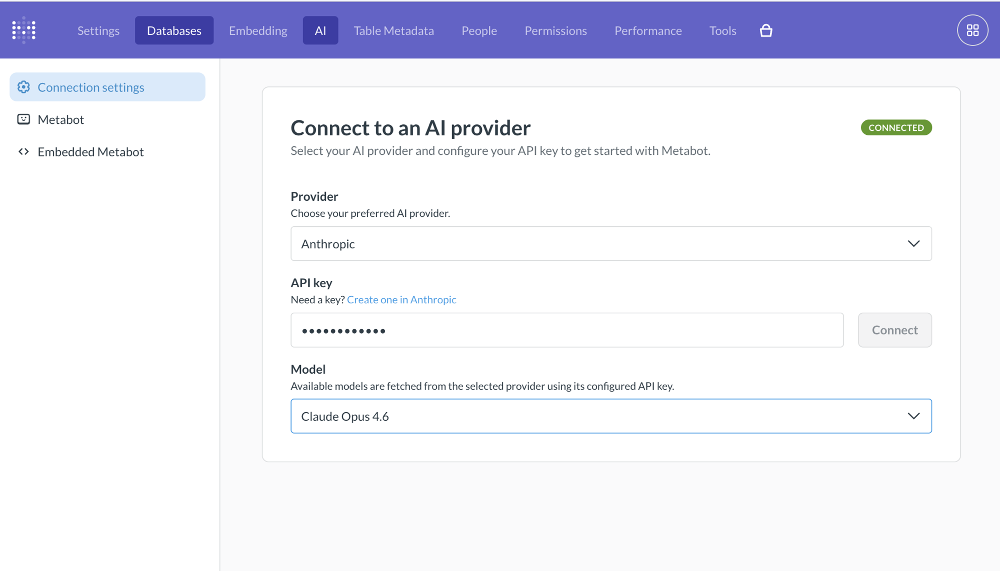
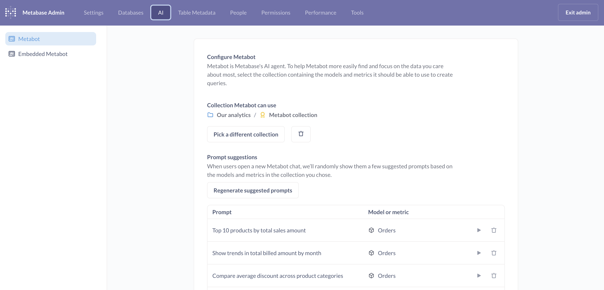

# AI settings

> AI features are available with your own AI provider API key, or as an add-on on [Metabase Cloud](https://www.metabase.com/features/metabot-ai).

_Admin > AI_

This page covers admin settings for AI features in Metabase, including [Metabot](./metabot.md).

On **Metabase Cloud** you can either:

- [Purchase the Metabot add-on](#add-metabot-from-the-metabase-store) from the Metabase Store, or
- [Bring your own API key](#bring-your-own-api-key) from a supported AI provider.

On **self-hosted Metabases**: you can [bring your own API key](#bring-your-own-api-key) from a supported AI provider.

## Add Metabot from the Metabase Store

If you're on [Metabase Cloud](https://www.metabase.com/cloud/), you can add Metabot from the Metabase Store:

1. Go to [store.metabase.com](https://store.metabase.com).
2. Log in with your **Metabase Store account** (distinct from the account you use to log in to your Metabase).
3. In the **Instances** tab, find the instance you'd like to add Metabot to, and click "Add Metabot AI".
4. Pick the plan based on the number of requests you expect you'll need.

   A "request" is any message anyone in your Metabase sends to Metabot. Several messages sent within the same chat session are counted as separate requests. Requests are added across the entire instance.

5. Read through the [terms of service](https://www.metabase.com/license/hosting) and click **Add Metabot AI**.

Once you've added Metabot AI in the Metabase store, you can log in to your Metabase and configure it in _Admin > AI_.

## Bring your own API key

_Admin > AI > Connection settings_



To enable AI features with your own API key:

1. Go to **Admin > AI > Connection settings**.
2. Select your **Provider**.
3. Enter your **API key**.
4. Click **Connect**.
5. Select a **Model** from the dropdown. Available models are fetched from the provider using your API key.

When your connection is active, you'll see a **CONNECTED** badge. With your key connected, you get access to [Metabot](./metabot.md), [inline SQL generation](./metabot.md#inline-sql-editing), the [MCP server](./mcp.md), and the [Agent API](./agent-api.md).

### Supported providers

Currently, Metabase only supports models from Anthropic.

## Configure Metabot

_Admin > AI > Metabot_



You can configure Metabot for your internal Metabase separately from [embedded](../embedding/introduction.md) Metabase contexts. That way you can, for example, use Metabot in your Metabase while not granting access to Metabot in your embedded Metabase.

### Enable Metabot

Toggle [Metabot](./metabot.md) on or off for your Metabase. Metabot is enabled by default.

When enabled, Metabot is available to help people create questions, analyze data, and answer questions about your data. When disabled, the Metabot icon and keyboard shortcuts are hidden. Currently, Metabot is available to everyone who uses your Metabase. There's no way to scope Metabot usage per person.

Toggling off Metabot only turns off in-app Metabot features. People can still use the [MCP server](./mcp.md) and [Agent API](./agent-api.md).

### Enable MCP server

Use the **MCP server** toggle to turn external access to the [MCP server](./mcp.md) on or off.

### Enable Agent API

Use the **Agent API** toggle to turn external access to the [Agent API](./agent-api.md) on or off.

### Embedded Metabot

_Admin > AI > Embedded Metabot_

The toggle turns embedded Metabot on or off. The toggle affects both full-app embeds and modular embeds.

- [Full-app embedding](../embedding/full-app-embedding.md): The Metabot icon and keyboard shortcuts are only available when Metabot is enabled. Turning off Embedded Metabot will hide these icons and disable the keyboard shortcuts.
- [Modular embedding](../embedding/modular-embedding.md): The toggle doesn't add Metabot anywhere; you have to explicitly include a chat component (like the SDK's [`MetabotQuestion`](../embedding/sdk/ai-chat.md)) in your application. If, however, you've added a component, and you turn off the Embedded Metabot toggle, your chat component will stop working, so you should also remove or hide the component in your application.

### Verified content

Admins on Pro and Enterprise plans can tell Metabot to only work with [models](../data-modeling/models.md) and [metrics](../data-modeling/metrics.md) that have been [verified](../exploration-and-organization/content-verification.md).

Restricting Metabot to verified models and metrics (and only models and metrics) helps Metabot produce more reliable answers, since you know someone has at least vetted the data Metabot can use.

### Collection for natural language querying

Select a collection (including its subcollections) to limit which collections Metabot searches during [AI exploration](../ai/metabot.md#ai-exploration).

This setting only affects conversations started from **+ New > AI exploration**.

People can still @-mention items outside of this collection when prompting in AI exploration. Metabot can also see the person's current context (for example, Metabot will know about the dashboard they're currently viewing, even if the dashboard is outside the selected collection).

### Prompt suggestions

When people open a new Metabot chat, Metabase shows a few suggested prompts.

Click **Regenerate suggested prompts** to generate a fresh set of prompts. You can also run individual prompts to test Metabot's answers, or delete prompts that aren't useful.

## Tips for making the most of Metabot

The best thing you can do to improve Metabot's performance is to prep your data like you would for onboarding a new (human) hire to your data. In practice, this means you should:

- [Add descriptions for your data and content](#add-descriptions-for-your-data-and-content)
- [Make sure the semantic types for each field are correct](#make-sure-the-semantic-types-for-each-field-are-correct)
- [Define domain-specific terms in the glossary](#define-domain-specific-terms-in-the-glossary)

### Add descriptions for your data and content

Add descriptions to your [models](../data-modeling/models.md#add-metadata-to-columns-in-a-model), [metrics](../data-modeling/metrics.md), [dashboards](../dashboards/introduction.md), and [questions](../questions/introduction.md). Write descriptions to provide context, define terms, and explain business logic.

Admins can also curate [table metadata](../data-modeling/metadata-editing.md) by adding descriptions for tables and their fields.

For example, here's a decent description for an ID field that provides additional context for the data:

```txt
This is a unique ID for the product. It is also called the "Invoice number" or "Confirmation number" in customer facing emails and screens.
```

You can even ask Metabot to write descriptions for you. But Metabot will only have access to the data in the database. It can't know things like "this ID is called the 'Invoice number' in the web app", which is the kind of contextual information worth documenting.

### Make sure the semantic types for each field are correct

Make sure the semantic types for each field accurately describe the field's "meaning". For example, if you have a field like `created_at`, you'd want the column type to be Creation date.

Metabase will try to set semantic types automatically, but you should confirm that each field has the relevant semantic type. See [Data types and semantic types](../data-modeling/semantic-types.md). You can also set semantic types for [models](../data-modeling/models.md#add-metadata-to-columns-in-a-model).

### Define domain-specific terms in the glossary

Add your organization's terminology, acronyms, and business-specific terms to the [glossary](../exploration-and-organization/data-model-reference.md#glossary). When you submit a prompt, Metabot can look up terms in the glossary to better understand your request.

For example, if you define "MRR" as "Monthly Recurring Revenue" in your glossary, Metabot will know what you mean when you ask "What's our MRR for Q4?" This is especially helpful for industry-specific jargon, internal product names, or abbreviations unique to your organization.

## Metabot permissions are Metabase permissions

Metabot inherits the permissions of the person it's chatting with, so you don't need to set permissions specifically for Metabot. Whenever someone uses Metabot, Metabot can only see what that person has permissions to see and do.

In other words, to restrict what data Metabot can see for each person, simply apply [data](../permissions/data.md) and [collection](../permissions/collections.md) permissions to their groups as you would normally, and those permissions will apply to their use of Metabot as well.

## Viewing Metabot usage

If you're on Metabase Cloud with the Metabot add-on, you can see how many Metabot requests people have made this month by going to **Admin > Settings > License**.

If you aren't logged into the [Metabase Store](../cloud/accounts-and-billing.md), you'll need to log in to the store before you can view the usage. Once logged in to the store, go back to your Metabase and view the license page.

The **Metabot AI requests used, this month (updated daily)** field shows how many requests your Metabase has used this month. Each message sent to Metabot counts as a request.

If you're using your own API key, you can track usage and costs through your AI provider's dashboard.

## Choosing the AI model

If you're using your own API key, you can choose which AI model Metabase uses in [Connection settings](#bring-your-own-api-key).

On Metabase Cloud, Metabase's AI service selects models automatically. We use internal benchmarks to determine which AI models work best for different tasks, and we're constantly iterating to improve performance.

## Privacy

On Metabase Cloud with the Metabot add-on, your questions and conversations remain private to your Metabase -- we don't send your data to external services. We do collect some metadata to gauge and improve usage.

If you're using your own API key, your prompts and data are sent to your selected AI provider. Review your provider's data handling and privacy policies. When using the [MCP server](./mcp.md), query results are sent to the connected MCP client.

In both cases, Metabot can't create assets or write data. If you [submit feedback](./metabot.md#giving-feedback-on-metabot-responses), the form you send may contain sensitive data from your conversation.

### What Metabot can see

Metabot has access to your Metabase metadata and some data values to help answer your questions:

- **Table, Question, Model, Dashboard, and Metric metadata**: Metabot can see the structure and configuration of your content.
- **Sample field values**: When you ask questions like "Filter everyone from Wisconsin," Metabot might check the values in the state field to understand how the data is stored (like "WI" vs "Wisconsin"). See [syncs](../databases/sync-scan.md).
- **Timeseries data**: For chart analysis, Metabot might see the timeseries data used to draw certain visualizations, depending on the chart type.

This data may be included when you [submit feedback](./metabot.md#giving-feedback-on-metabot-responses).
