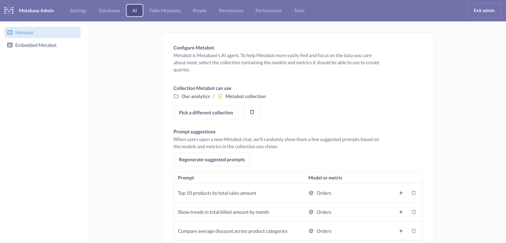

# AI settings

_Admin > AI_

This page covers admin settings for AI features in Metabase, including [Metabot](./metabot.md). To limit _who_ can use Metabot, see [AI controls](./usage-controls.md).

## Enable AI features

AI features work on both Metabase Cloud and self-hosted Metabases. Connecting your own AI provider doesn't require a paid Metabase plan. To turn AI features on:

1. Go to **Admin > AI**.
2. In **Connect to an AI provider**, click **Add a provider**.
3. Pick a provider and fill in its credentials. See [Choose AI provider](#choose-ai-provider).
4. Click **Connect**.
5. Configure [Metabot](#configure-metabot) and the other AI features below.

## Choose AI provider

_Admin > AI_

You pick which AI providers Metabase can use:

- If you're **self-hosting Metabase** and want to use Metabot, you'll need to [bring your own AI API key](#bring-your-own-api-key).
- On **Metabase Cloud**, you can [bring your own AI API key](#bring-your-own-api-key), [use the Metabase AI service](#metabase-ai-service), or both.

The providers you set up in AI settings power Metabase's built-in AI functionality, not the MCP server. With the MCP server, [your client provides the AI](mcp.md#with-the-mcp-server-your-client-provides-the-ai).

### Metabase AI service

On Metabase Cloud, you can have us manage the AI for you with our AI service.

Metabase's AI service is a good option if you don't have a preferred AI provider, or if you want to manage all your Metabase AI costs through Metabase. We (Metabase the company) select the models for you. We use internal benchmarks to determine which AI models work best for different tasks, and we're constantly iterating to improve performance.

If you use Metabase's AI service, you'll get charged based on token usage (in addition to your regular Metabase Cloud subscription fee). See [Pricing](https://www.metabase.com/pricing).

To use the Metabase AI service for Metabot:

1. Go to **Admin > AI**.
2. Click **Add a provider**, then pick **Metabase AI service**.
3. Agree to the terms of service.
4. Click **Connect**.

To remove the service: click the **...** next to **Metabase AI service** in the provider list, then click **Remove**.

### Bring your own API key

You can bring your own credentials for any [supported AI provider](./providers.md).

To connect a provider with your own API key:

1. Go to **Admin > AI**.
2. Click **Add a provider**.
3. Pick your provider.
4. Enter your **API key**. The **Where do I find this?** link opens your provider's key management page in a new tab.
5. Click **Connect**.

If you've already copied a key, one neat thing: just paste the key anywhere on the provider grid, and Metabase selects the matching provider and fills in the key for you. Check to make sure the provider matches.

Once the connection saves, its models show up in the **Models** card, where you pick which model each AI feature runs on. See [Pick the model each AI feature runs on](#pick-the-model-each-ai-feature-runs-on).

### Connect more than one provider

You can connect as many providers as you want. Once you've added your first one, the card is titled **AI providers** and the button reads **Add another provider**.

You can add more than one connection of the same type, like two Anthropic keys or two Azure deployments. Give each connection its own name so you can tell them apart: click **Advanced settings** in the connect form and fill in **Display name**. That name labels the connection in the **Default model** and **Mini model** dropdowns, so "Anthropic" and "Anthropic (evals)" can sit side by side.

The one exception is the [Metabase AI service](#metabase-ai-service), which you can only connect once.

### Edit or remove a provider connection

Each connection in the list has a **...** menu:

- **Edit**: change the connection's display name, credentials, or API base URL. You don't have to retype the API key. Metabase keeps the stored key unless you replace it.
- **Remove**: delete the connection and its saved credentials. If your **Default model** came from that connection, Metabase switches it to a model from one of your remaining connections, or reports Metabot as unconfigured if there aren't any. A **Mini model** you'd picked from that connection goes back to being derived from your default model.

The [Metabase AI service](#metabase-ai-service) connection only offers **Remove**, since there are no credentials of your own to edit.

### Connection errors and warnings

If one connection's credentials stop working, only that connection reports an error.

A connection that's missing a required setting shows a warning icon, and Metabot can't use the connection until you fill in the setting.

### Set provider credentials with environment variables

If you're self-hosting, you can configure a provider with [environment variables](../configuring-metabase/environment-variables.md) instead of the admin UI. These connections will show up in the list as read-only, along with the variable that set the connection.

An environment variable can also override a single field of a connection you manage in the UI. For example, if you set only `MB_LLM_ANTHROPIC_API_BASE_URL`, the base URL comes from the environment, and the rest of the connection stays editable.

To put the whole list under environment control, set [`MB_LLM_PROVIDERS`](../configuring-metabase/environment-variables.md#mb_llm_providers) to a JSON array of connections. The provider list is then read-only, so manage your connections by editing `MB_LLM_PROVIDERS` and restarting.

On Metabase Cloud, [contact support](https://www.metabase.com/help-premium) if you want environment variables set for your instance.

## Pick the model each AI feature runs on

_Admin > AI_

The **Models** card sets which model each AI feature runs on. It lists the models from each working connection, grouped by connection and labeled with both the connection and the model, like "Anthropic · Claude Sonnet 4.6".

### Default model

Metabot, [AI explorations](./metabot.md#ai-exploration), and [SQL generation](./metabot.md#inline-sql-editing) all run on the **Default model**.

Embedded Metabot runs on the **Default model** too. There's no separate model setting on the **Embedded** tab, so both Metabots use whatever you pick here.

### Mini model

Quick, high-volume tasks run on the **Mini model**, which should be a cheaper, faster model than your default.

You don't have to pick a mini model. By default, Metabase uses the fastest model from the same connection as your default model. Some providers don't offer a smaller model; in those cases, the mini model falls back to your default model.

## Configure Metabot

_Admin > AI_



The **Metabot settings** card has two tabs — **Internal** and **Embedded** — so you can configure Metabot for your internal Metabase separately from [embedded](../embedding/introduction.md) Metabase contexts. That way you can, for example, use Metabot in your Metabase while not granting access to Metabot in your embedded Metabase. Each tab has its own enable toggle, verified-content setting, allowed collection, and prompt suggestions, all configured independently.

### Enable Metabot

_Internal tab._

Toggle [Metabot](./metabot.md) on or off for your Metabase. Metabot is enabled by default.

When enabled, Metabot is available to help people create questions, analyze data, and answer questions about your data. When disabled, the Metabot icon and keyboard shortcuts are hidden. To scope Metabot to specific user or tenant groups, or to cap token usage, see [AI controls](./usage-controls.md).

Toggling off Metabot only turns off in-app Metabot features. People can still use the [MCP server](./mcp.md) and [Agent API](./agent-api.md) if those are enabled.

### Enable Embedded Metabot

_Embedded tab._

The **Enable Embedded Metabot** toggle turns embedded Metabot on or off. The toggle affects both full-app embeds and modular embeds.

- [Full-app embedding](../embedding/full-app-embedding.md): The Metabot icon and keyboard shortcuts are only available when Metabot is enabled. Turning off Embedded Metabot will hide these icons and disable the keyboard shortcuts.
- [Modular embedding](../embedding/modular-embedding.md): The toggle doesn't add Metabot anywhere; you have to explicitly include a chat component (like the SDK's [`MetabotQuestion`](../embedding/ai-chat.md)) in your application. If, however, you've added a component, and you turn off the Embedded Metabot toggle, your chat component will stop working, so you should also remove or hide the component in your application.

### Verified content

_Available on both the Internal and Embedded tabs, configured independently._

Admins on Pro and Enterprise plans can tell Metabot to only work with [models](../data-modeling/models.md) and [metrics](../data-modeling/metrics.md) that have been [verified](../exploration-and-organization/content-verification.md).

Restricting Metabot to verified models and metrics (and only models and metrics) helps Metabot produce more reliable answers, since you know someone has at least vetted the data Metabot can use.

### Collection for natural language querying

_Internal tab._

Select a collection (including its subcollections) to limit which collections Metabot searches during [AI exploration](../ai/metabot.md#ai-exploration). Click **Pick a different collection** to change the selection.

This setting only affects conversations started from **+ New > AI exploration**.

People can still @-mention items outside of this collection when prompting in AI exploration. Metabot can also see the person's current context (for example, Metabot will know about the dashboard they're currently viewing, even if the dashboard is outside the selected collection).

### Collection Embedded Metabot can use

_Embedded tab._

If you're embedding the Metabot component in an app, you can point embedded Metabot at a different collection to use for creating queries. Click **Pick a different collection** to choose the collection (and its subcollections) that embedded Metabot searches for metrics, models, and saved questions.

Picking **Our analytics** is the same as picking no collection at all, so pick something narrower if you want the scoping to do anything. And once you set a collection, tables drop out of embedded Metabot's search results, so pick a collection with the metrics and models you want people building on.

This setting narrows where embedded Metabot searches; it's _not_ a substitute for setting permissions. Embedded Metabot can still read and query anything the person using it has permissions for. Embedded Metabot can also see the items that person viewed recently, whichever collection those live in. Restricting Metabot to [verified content](#verified-content) narrows those recent items to verified, official, and [Library](../data-studio/library.md) content, but it doesn't confine them to the collection you picked. To control what data people can get to in an embed, set [data permissions](../permissions/embedding.md). See also [Set up AI chat in Metabase](../embedding/ai-chat.md#set-up-ai-chat-in-metabase).

### Prompt suggestions

_Available on both the Internal and Embedded tabs, configured independently._

When people open a new Metabot chat, Metabase shows a few suggested prompts based on popular models and metrics in your instance.

Click **Regenerate suggested prompts** to generate a fresh set of prompts. You can also run individual prompts to test Metabot's answers, or delete prompts that aren't useful. The Internal and Embedded tabs each maintain their own set of suggestions, so regenerating on one tab doesn't affect the other.

## Disable all AI features

The **Disable all AI features** toggle at the bottom of the AI features page is a master kill switch. When turned on, it hides all AI features across your instance — Metabot, inline SQL generation, the MCP server, the Agent API, and any embedded chat components — regardless of the individual toggles above.

Use this toggle for an instance-wide shut-off without having to disconnect your provider or change each feature's own toggle. Turn it off again to restore your previous configuration.

For more granular options, check out [AI usage controls](./usage-controls.md).

## Tips for making the most of Metabot

The best thing you can do to improve Metabot's performance is to prep your data like you would for onboarding a new (human) hire to your data. In practice, this means you should:

- [Add descriptions for your data and content](#add-descriptions-for-your-data-and-content)
- [Make sure the semantic types for each field are correct](#make-sure-the-semantic-types-for-each-field-are-correct)
- [Define domain-specific terms in the glossary](#define-domain-specific-terms-in-the-glossary)

### Add descriptions for your data and content

Add descriptions to your [models](../data-modeling/models.md#add-metadata-to-columns-in-a-model), [metrics](../data-modeling/metrics.md), [dashboards](../dashboards/introduction.md), and [questions](../questions/introduction.md). Write descriptions to provide context, define terms, and explain business logic.

Admins can also curate [table metadata](../data-modeling/metadata-editing.md) by adding descriptions for tables and their fields.

For example, here's a decent description for an ID field that provides additional context for the data:

```txt
This is a unique ID for the product. It is also called the "Invoice number" or "Confirmation number" in customer facing emails and screens.
```

You can even ask Metabot to write descriptions for you. But Metabot will only have access to the data in the database. It can't know things like "this ID is called the 'Invoice number' in the web app", which is the kind of contextual information worth documenting.

### Make sure the semantic types for each field are correct

Make sure the semantic types for each field accurately describe the field's "meaning". For example, if you have a field like `created_at`, you'd want the column type to be Creation date.

Metabase will try to set semantic types automatically, but you should confirm that each field has the relevant semantic type. See [Data types and semantic types](../data-modeling/semantic-types.md). You can also set semantic types for [models](../data-modeling/models.md#add-metadata-to-columns-in-a-model).

### Define domain-specific terms in the glossary

Add your organization's terminology, acronyms, and business-specific terms to the [glossary](../exploration-and-organization/data-model-reference.md#glossary). When you submit a prompt, Metabot can look up terms in the glossary to better understand your request.

For example, if you define "MRR" as "Monthly Recurring Revenue" in your glossary, Metabot will know what you mean when you ask "What's our MRR for Q4?" This is especially helpful for industry-specific jargon, internal product names, or abbreviations unique to your organization.

## Metabot permissions are Metabase permissions

Metabot inherits the permissions of the person it's chatting with, so you don't need to set permissions specifically for Metabot. Whenever someone uses Metabot, Metabot can only see what that person has permissions to see and do.

In other words, to restrict what data Metabot can see for each person, simply apply [data](../permissions/data.md) and [collection](../permissions/collections.md) permissions to their groups as you would normally, and those permissions will apply to their use of Metabot as well.

## Viewing Metabot usage

If you're using the Metabase AI service, you can see how many Metabot requests people have made this month by going to **Admin > AI**.

If you aren't logged into the [Metabase Store](../cloud/accounts-and-billing.md), you'll need to log in to the store before you can view the usage. Once logged in to the store, go back to your Metabase and view the license page.

If you're using your own API key, you can track usage and costs through your AI provider's dashboard.

On Metabase Pro/Enterprise, you also get access to detailed [AI usage auditing](usage-auditing.md) with detailed breakdown of AI usage by user, tool, feature etc.

## Further reading

- [Using Metabot](metabot.md)
- [Supported AI providers](providers.md)
- [MCP server](mcp.md)
- [AI privacy](privacy.md)
- [AI access and usage controls](usage-controls.md)
- [AI usage auditing](usage-auditing.md)
- [Metabot customization](customization.md)
- [Metabot system prompts](system-prompts.md)
