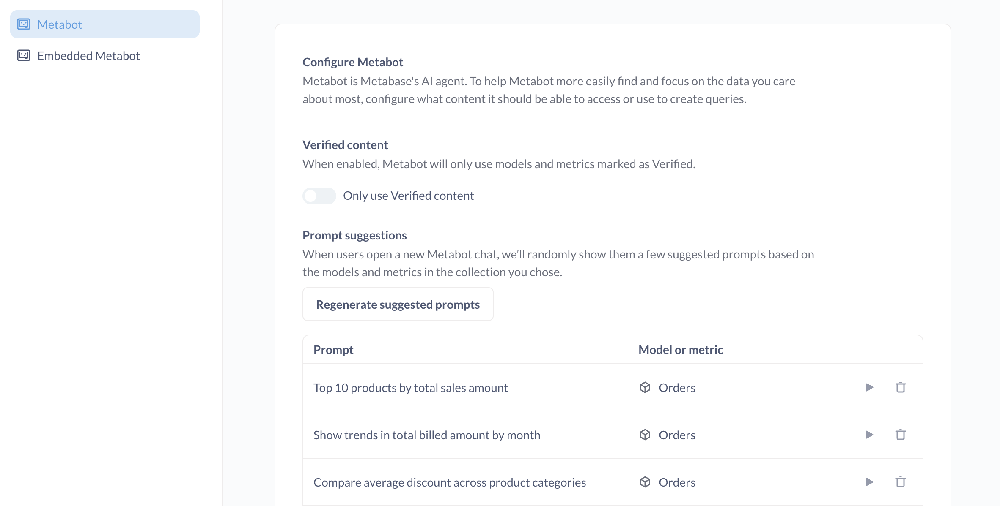

# Metabot AI settings

> Metabot is only available as an add-on on Metabase Cloud.

_Settings > Admin settings > AI_

This page covers admin settings for Metabase's AI assistant, [Metabot](./metabot.md).



Before using Metabot in your Metabase, you'll need to add the Metabot add-on to your instance in Metabase Store.

## Add Metabot from the Metabase Store

For now, Metabot is only available for Metabase Cloud. Before you can set up Metabot in your Metabase, you'll need to add Metabot to your subscription from the Metabase Store.

1. Go to [store.metabase.com](https://store.metabase.com).
2. Log in with your **Metabase Store account** (distinct from the account you use to log into your Metabase).
3. In the **Instances** tab, find the instance you'd like to add Metabot to, and click "Add Metabot AI".
4. Pick the plan based on the number of requests you expect you'll need.

   A "request" is any message anyone in your Metabase sends to Metabot. Several messages sent within the same chat session are counted as separate requests. Requests are added across the entire instance.

5. Read through the [terms of service](https://www.metabase.com/license/hosting) and click **Add Metabot AI**.

Once you've added Metabot AI in the Metabase store, you can log into your Metabase and configure it in _Admin settings > AI_.

## Verified content

Admins on Pro and Enterprise plans can tell Metabot to only work with [models](../data-modeling/models.md) and [metrics](../data-modeling/metrics.md) that have been [verified](../exploration-and-organization/content-verification.md).

Restricting Metabot to verified models and metrics (and only models and metrics) helps Metabot produce more reliable answers, since you know someone has at least vetted the data Metabot can use.

## Collection for natural language querying

Select a collection (including its subcollections) to limit which collections Metabot searches during [AI exploration](../ai/metabot.md#ai-exploration).

This setting only affects conversations started from **+ New → AI exploration**.

People can still @-mention items outside of this collection when prompting in AI exploration. Metabot can also see the person's current context (for example, Metabot will know about the dashboard they're currently viewing, even if the dashboard is outside the selected collection).

## When embedding Metabot, you can pick a collection for Metabot to have access to

When embedding Metabot in your app, you can select a collection for Metabot:

2. Click **Embedded Metabot**.
3. In the **Collection Embedded Metabot can use** section, click **Pick a collection**.
4. Select the collection that contains the models and metrics you want Metabot to use.

Metabot will use the models and metrics in that collection to help answer questions and generate queries. You can change this collection at any time. To give Metabot access to all collections, you can set the collection to the root collection, called "Our Analytics" (the default).

Alternatively (or additionally), you can restrict Metabot to [verified content](#verified-content).

## Tips for making the most of Metabot

The best thing you can do to improve Metabot's performance is to prep your data like you would for onboarding a new (human) hire to your data. In practice, this means you should:

- [Add descriptions for your data and content](#add-descriptions-for-your-data-and-content)
- [Make sure the semantic types for each field are correct](#make-sure-the-semantic-types-for-each-field-are-correct)
- [Define domain-specific terms in the glossary](#define-domain-specific-terms-in-the-glossary)
- [Curate prompt suggestions](#curate-prompt-suggestions)

### Add descriptions for your data and content

Add descriptions to your [models](../data-modeling/models.md#add-metadata-to-columns-in-a-model), [metrics](../data-modeling/metrics.md), [dashboards](../dashboards/introduction.md), and [questions](../questions/introduction.md). Write descriptions to provide context, define terms, and explain business logic.

Admins can also curate [table metadata](../data-modeling/metadata-editing.md) by adding descriptions for tables and their fields.

For example, here's a decent description for an ID field that provides additional context for the data:

```txt
This is a unique ID for the product. It is also called the “Invoice number” or “Confirmation number” in customer facing emails and screens.
```

You can even ask Metabot to write descriptions for you. But Metabot will only have access to the data in the database. It can't know things like "this ID is called the 'Invoice number' in the web app", which is the kind of contextual information worth documenting.

### Make sure the semantic types for each field are correct

Make sure the semantic types for each field accurately describe the field's "meaning". For example, if you have a field like `created_at`, you'd want the column type to be Creation date.

Metabase will try to set semantic types automatically, but you should confirm that each field has the relevant semantic type. See [Data types and semantic types](../data-modeling/semantic-types.md). You can also set semantic types for [models](../data-modeling/models.md#add-metadata-to-columns-in-a-model).

### Define domain-specific terms in the glossary

Add your organization's terminology, acronyms, and business-specific terms to the [glossary](../exploration-and-organization/data-model-reference.md#glossary). When Metabot receives a prompt, it can look up terms in the glossary to better understand your request.

For example, if you define "MRR" as "Monthly Recurring Revenue" in your glossary, Metabot will know what you mean when you ask "What's our MRR for Q4?" This is especially helpful for industry-specific jargon, internal product names, or abbreviations unique to your organization.

### Curate prompt suggestions

When you select a collection for Metabot to "learn", Metabot will suggest a series of prompts based on the content it finds in that collection. These prompts just give people a feel for the kinds of things people can ask Metabot to do.

Admins can run these generated prompts to test the answers, or trash the individual prompts if they're not useful or misleading. You can also regenerate all the prompts with a click.

## Metabot permissions are Metabase permissions

Metabot inherits the permissions of the current user, so you don't need to set permissions specifically for Metabot. Whenever someone uses Metabot, Metabot can only see what that person has permissions to see and do.

In other words, to restrict what data Metabot can see for each person, simply apply [data](../permissions/data.md) and [collection](../permissions/collections.md) permissions to their groups as you would normally, and those permissions will apply to their use of Metabot as well.

## Viewing Metabot usage

You can see how many Metabot requests people have made this month by going to **Admin settings > Settings > License**.

If you aren't logged into the [Metabase Store](../cloud/accounts-and-billing.md).(, you'll need to log in to the store before you can view the usage. Once logged in to the store, go back to your Metabase and view the license page.

The **Metabot AI requests used, this month (updated daily)** field shows how many requests your Metabase has used this month. Each message sent to Metabot counts as a request.

## Metabot can't be enabled per person

Currently, Metabot is available to everyone who uses your Metabase.

## Metabot uses a variety of generative AI models to answer your questions

Under the hood, Metabase powers Metabot with a variety of generative models. For now, you can't change which generative AI models Metabot uses, as Metabase's AI service handles their selection.

To get the best results, we (the Metabase team) use internal benchmarks to determine which AI models Metabot should use for different tasks. And we are constantly iterating on performance, so Metabot will continue to improve over time.

## Unless you submit feedback, we don't collect or store the prompts you send to Metabot

We've intentionally limited what Metabot can do. Metabot lacks access to API keys, and it can't create assets, write data, or send your data outside of your Metabase. Your questions and conversations remain private to your Metabase (unless you [submit feedback](./metabot.md#giving-feedback-on-metabot-responses)). We do collect some metadata to gauge and improve usage.

### What Metabot can see

Metabot has access to your Metabase metadata and some data values to help answer your questions:

- **Table, Question, Model, Dashboard, and Metric metadata**: Metabot can see the structure and configuration of your content.
- **Sample field values**: When you ask questions like "Filter everyone from Wisconsin," Metabot might check the values in the state field to understand how the data is stored (like "WI" vs "Wisconsin"). See [syncs](../databases/sync-scan.md).
- **Timeseries data**: For chart analysis, Metabot might see the timeseries data used to draw certain visualizations, depending on the chart type.

When you [submit feedback](./metabot.md#giving-feedback-on-metabot-responses), however, the form you send may contain sensitive data from your conversation.
