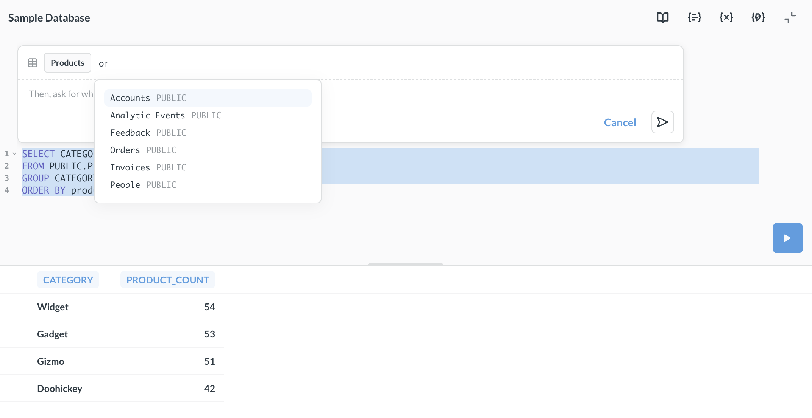
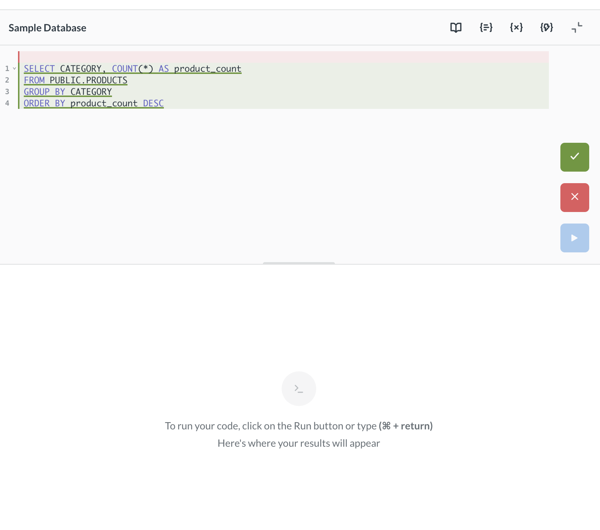

# SQL generation on OSS

> One-shot SQL generation with your own API key is only available on self-hosted open-source Metabases. For Metabase Cloud, check out [Metabot](./metabot.md).

Bring your own API key to generate SQL from natural language in the [native editor](../questions/native-editor/writing-sql.md).

## Setting up one-shot SQL generation

To enable SQL generation on a self-hosted OSS Metabase:

1. Go to **Admin settings > AI**.
2. Enter your **Anthropic API key**.
3. Select the AI model you'd like to use for SQL generation.

You'll need an API key from [Anthropic](https://www.anthropic.com/learn/build-with-claude). Once you've entered the key, anyone in your Metabase can use SQL generation in the native editor.

Currently, only Anthropic is supported.

## Generate SQL from natural language

To generate SQL from a natural language prompt:

1. Open the [native editor](../questions/native-editor/writing-sql.md).

2. Press **Cmd+Shift+I** (Mac) or **Ctrl+Shift+I** (Windows).

3. Enter one or more tables.

4. Type a prompt describing the query you want to write.

5. Click **Generate** to create the SQL.

6. Review the generated SQL before running it.

You can also edit existing SQL. Place your cursor in the query, trigger the prompt, and describe the change you want to make (like "add a filter for orders from this year"). Metabase will suggest edits that you can accept or reject. You must select at least one table for both new queries and edits.

Each prompt is independent — the AI doesn't retain context from previous generations.

Like with all generative AI, always double-check the output.

## Further reading

- [The native/SQL editor](../questions/native-editor/writing-sql.md)
- [Metabot](./metabot.md)
