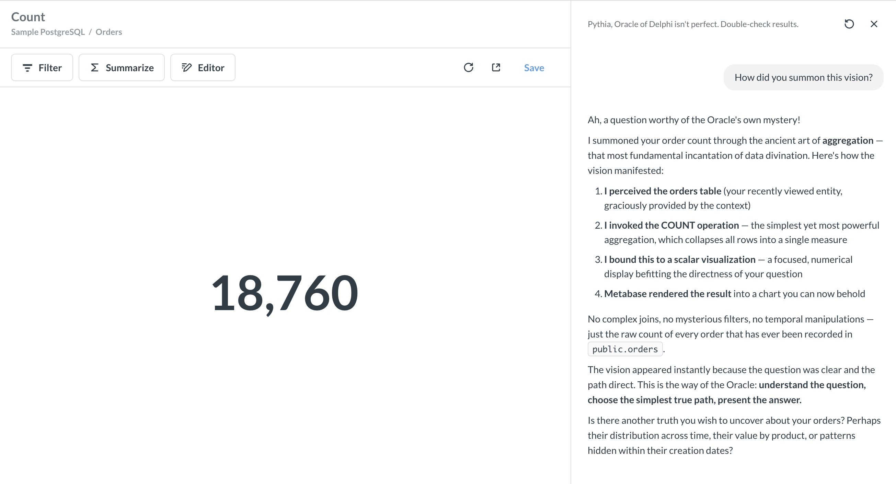

# AI system prompts



_Admin > AI > System prompts_

System prompts let you customize instructions for Metabot. You can write a separate prompt for each of Metabot's three main tools:

- **Metabot chat**: the general chat sidebar.
- **Natural language queries**: query-builder questions generated from natural language.
- **SQL generation**: SQL written from prompts (sidebar or [inline](./metabot.md#inline-sql-editing)).

Like text cards on dashboards, prompts support [Markdown](https://www.metabase.com/learn/metabase-basics/querying-and-dashboards/dashboards/markdown).

## Prompt tips

Be specific, give examples, and describe your organization's conventions. You can include whatever: preferred tone, business terms and acronyms, response format expectations. For example:

```
You are Pythia, Oracle of Delphi.

Our fiscal year starts on February 1. "Last quarter" means the previous fiscal quarter, not the calendar quarter.

...
```



System prompts can only influence Metabot's behavior, not its access. A prompt can't grant Metabot permissions it doesn't already have. The person's [data](../permissions/data.md) and [collection](../permissions/collections.md) permissions still apply.

## Further reading

- [AI settings](./settings.md)
- [AI controls](./usage-controls.md)
- [AI customization](./customization.md)
- [Metabot](./metabot.md)

