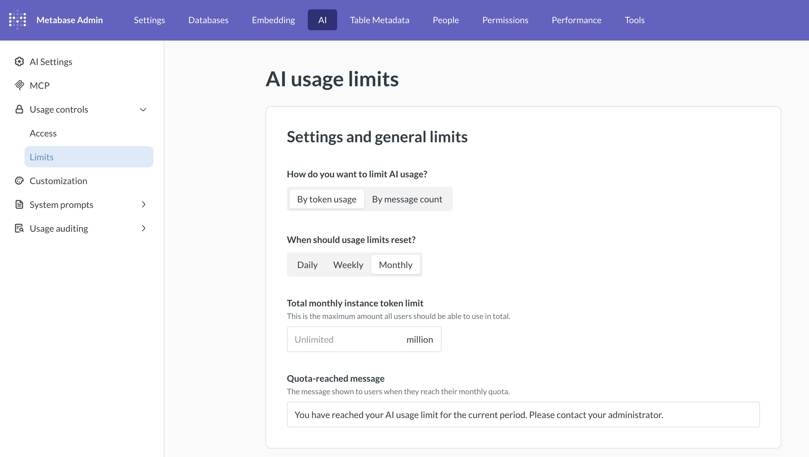

# AI usage controls



_Admin > AI > Usage controls_

Once you've connected an AI provider (see [AI settings](./settings.md)), use AI controls to decide **who** can use Metabot, **how much** they can use it, **how** it shows up, and **what** it pays attention to.

AI controls are split across four sub-sections of the admin nav:

- [AI feature access](#ai-feature-access): which groups can use Metabot, and which of its tools.
- [AI usage limits](#ai-usage-limits): token or message caps by instance, group, or tenant.
- [Customization](./customization.md): Metabot's name, icon, and illustrations.
- [System prompts](./system-prompts.md): preset instructions for each Metabot tool.

## AI feature access

_Admin > AI > Usage controls > AI feature access_

The AI feature access table lets you toggle Metabot on or off per group, and pick what Metabot can do for each group. Rows are your [user groups](../people-and-groups/managing.md) and [tenant groups](../embedding/tenants.md); columns are Metabot capabilities.

- **AI features** — the master toggle for the group. When off, people in that group won't see the Metabot icon, keyboard shortcuts, or any inline AI affordances.
- **Chat and NLQ** — access to the Metabot [chat sidebar](./metabot.md#the-metabot-chat-sidebar) and [natural language querying](./metabot.md#how-metabot-uses-the-query-builder).
- **SQL generation** — permission to have Metabot write or edit SQL ([from the sidebar](./metabot.md#metabot-in-the-native-editor) or [inline](./metabot.md#inline-sql-editing)).
- **Other tools** — other AI tools like error-fixing and chart analysis.

These controls are granular. If you uncheck SQL generation but leave Chat and NLQ checked, Metabot will try to answer SQL-shaped prompts with a [query builder](../questions/query-builder/editor.md) result.

[Tenant](../embedding/tenants.md) groups follow the same model as regular groups.

## AI usage limits

_Admin > AI > Usage controls > AI usage limits_

By default, AI usage is unlimited.

These limits let you cap how much Metabot traffic Metabase allows — either across your whole instance, or for people in specific groups.

### Settings and general limits

- **How do you want to limit AI usage?** Choose between:
  - **By token usage** in millions of tokens, so `2` would be 2 million tokens.
  - **By message count**. Each message someone sends to Metabot counts as one message (not a conversation, but a single message).
- **When should usage limits reset?** The counter resets automatically; the limit values stay put. Pick from:
  - **Daily** (resets at midnight).
  - **Weekly** (resets on Monday).
  - **Monthly** (resets the 1st).

You can also set:

- **Total instance limit**: the total pool of tokens or messages across every person and group. Once this limit is hit, Metabot stops responding to requests until the next reset.
- **Quota-reached message**: the error Metabot shows when someone hits a limit. Write whatever makes sense for your Metabase (like a Slack channel to ping, or a link to a request form).

### Group limits

Group limits set a per-_person_ cap for everyone in a user group. So, each person in the group gets the limit, not the group as a whole.

If a person belongs to multiple groups, Metabase gives them the highest limit across those groups (_not_ the cumulative number across all of their groups). So if someone is in two groups, one group capped to 100 messages per week, and another group capped to 500, that person would enjoy 500 per week (not 600).

### Tenant group limits

You can set a limit for each [tenant group](../embedding/tenants.md#create-tenant-groups). They work just like the group limits described above.

### Specific tenant limits

This specific tenant limit is an aggregate pool shared by everyone in a single tenant. When the pool is empty, no one in that tenant can use Metabot for the rest of the period, regardless of how generous their tenant-group limits are.

Per-tenant limits are handy for billing scenarios. Say you have a customer, Megafauna Analytics, who pays you for 100 million tokens a month. Set Megafauna Analytics's tenant limit to 100, and Metabase enforces that cap across every seat they provision.

## Further reading

- [AI settings](./settings.md)
- [Metabot](./metabot.md)
- [AI customization](./customization.md)
- [AI system prompts](./system-prompts.md)
- [Tenants](../embedding/tenants.md)
- [Permissions overview](../permissions/start.md)
