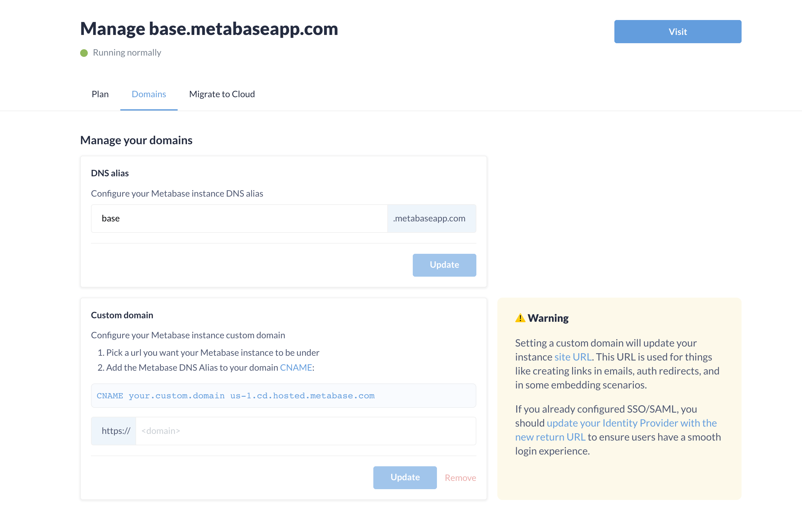

# Changing your domain name

By default, Metabase will automatically provision a domain name for your Metabase that ends in metabaseapp.com (e.g., yourcompany.metabaseapp.com).

[Pro and Enterprise](https://www.metabase.com/pricing/) plans allow you to add a custom domain. Setting a custom domain will update your instance's [Site URL](../configuring-metabase/settings.md#site-url). The Site URL is used for things like creating links in emails, auth redirects, and in some embedding scenarios.

## How to add a custom domain to your Metabase

1. Log in to your [Metabase Store account](https://store.metabase.com/).

2. Find the Metabase instance that you want to add the custom domain to, and select **Manage** on the bottom right of the instance's card. Then click on the **Domains** tab.

   You'll see something like this:

   

3. In the custom domain field (the input prefixed with `https://` in the Metabase Store), enter your custom domain (e.g., your.custom.domain).
4. Talk to whoever manages your Domain Name System (DNS) records, and have them add a CNAME to wherever you manage your DNS records. Point that CNAME to this URL:

   ```url
   us-1.cd.metabaseapp.com
   ```

   So your CNAME record would look something like:

   ```domain
   CNAME    your.custom.domain    us-1.cd.metabaseapp.com
   ```

   Just to be clear: you don't enter this record in the Metabase Store; you enter it in wherever you manage your DNS records.

5. If you've already set up SSO (like SAML or LDAP) for your Metabase, you'll need to update the return URL in your identity provider configuration to include this new custom domain.

That's it. You may need to wait a bit for the CNAME to update (this delay is specific to how DNS works, and not something Metabase has control over). Metabase will take care of the rest: we'll make sure that:

- the URL directs people to your Metabase,
- your domain has SSL certificates set up to serve your instance over HTTPS to the new domain,
- and that your [metabase.com/cloud/login](https://www.metabase.com/cloud/login) works as expected.

You'll still be able to access your original, automatically provisioned domain (e.g., yourcompany.metabaseapp.com), so existing embedded links should continue to work.

## Why you'd want to use a custom domain

- **White-labeling polish**: If you're white labeling Metabase, a custom domain adds another bit of polish that abstracts Metabase away from the experience you deliver to your customers.
- **Consistency**: you may have several internal tools that follow a pattern, e.g., crm.yourcompany.com, ops.yourcompany.com, etc., and you want something like stats.yourcompany.com for your Metabase.

## Change the name of your Metabase (your DNS alias)

Log in to your Metabase Store account and go to **Instances** > **DNS Alias**, where you can update your alias.

## Custom SMTP server

By default, Metabase Cloud manages an SMTP server for you. But if you want to change the address Metabase uses to send email, you can bring your own [custom SMTP server](../configuring-metabase/email.md#custom-smtp-server-on-metabase-cloud).
