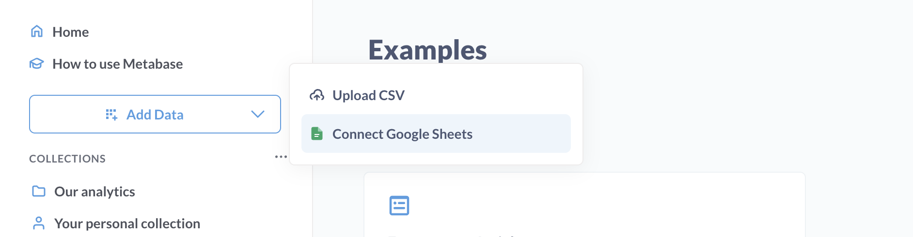

# Sync Google Sheets with Metabase

> Syncing Google Sheets is only available for Metabase Cloud instances with the [Metabase Cloud Storage](./storage.md) add-on.

If you've set up [Metabase Cloud Storage](./storage.md), an admin can set up Metabase to sync with Google Sheets in a Google Drive folder. Metabase will create tables in your Metabase Cloud Storage for the synced Google Sheets.

Currently, you can't sync Google Sheets to your own database.

## How to sync Google Sheets with Metabase

An admin can set up Metabase to sync with either:

- **A single folder in your Google Drive**. Metabase will sync all Google Sheets files saved in this folder, refreshing the data automatically every 15 minutes.
- **A single Google Sheet**. Metabase will sync with the sheet (and all its tabs), refreshing every 15 minutes.

Here's how to set it up:

1. In the left nav sidebar, click **Add Data** > **Connect Google Sheets**.
2. Select **Entire Folder** or **Single sheet**.
3. Metabase will ask you to share the Google Drive folder or sheet. You can only share a single folder or sheet with Metabase at a time.
4. In Google Drive, share the folder or sheet with the service account that Metabase provides.
5. Give the service account **Viewer** permissions. Metabase will only have access to this folder or sheet; it won't have access to any other files in your Google Drive. If you select folder, Metabase will also sync any sheets it finds in any subfolders.
6. Click **Send** to share the folder with the Metabase service account.
7. Copy the sharing link for the folder or sheet.
8. Return to Metabase and paste the sharing link into "the sharing link for this folder/file" field.

**If you synced a Google Drive folder**, Metabase will sync with the Google Drive folder (and its subfolders) and import all Google Sheets, creating a new table in your Metabase Cloud Storage database for each sheet. For sheets with multiple tabs, Metabase will create a table for each tab. Metabase will only sync Google Sheets; it'll ignore other file types in the folder. After the initial sync, Metabase will sync every 15 minutes.

**If you synced a Single sheet**, Metabase will create tables for all tabs in the sheet.

You can find your synced Google Sheets in Metabase by clicking on **Databases** in the left nav sidebar and navigating to the Metabase Cloud Storage database.

## Disconnecting from a Google Drive folder or sheet

To disconnect your Google Drive connection to a folder or sheet:

1. Go to **Databases** in the left nav sidebar.
2. Click on Metabase Cloud Storage.
3. Click on **Disconnect**.
4. Confirm the disconnection.

Disconnecting won't delete your existing tables. An admin will need to manually delete tables in [Uploads settings](../exploration-and-organization/uploads.md#deleting-tables-created-by-uploads).

## Deleting sheets

Disconnecting from the Google Drive folder won't delete your imported sheets. Admins will need to delete these tables manually in [Uploads settings](../exploration-and-organization/uploads.md#deleting-tables-created-by-uploads).

## Changing the Google Drive folder or sheet

To change the Google Drive folder, you'll need to first [disconnect the current connection](#disconnecting-from-a-google-drive-folder-or-sheet), then [connect a new folder or sheet](#how-to-sync-google-sheets-with-metabase).

If you change the sync target, Metabase will:

- Keep the tables from the previous folder/sheet
- Stop updating those tables
- Start syncing with the new folder/sheet

If you want to delete the tables from the old folder, admins will need to delete them manually in [Uploads settings](../exploration-and-organization/uploads.md#deleting-tables-created-by-uploads).

## Limitations and gotchas

Here's what you need to know when syncing Google Sheets:

- **Only Google Sheets are synced**. We can only import Google Sheets format files — other file types like CSVs or Parquet files won't work, even if they're in your Google Drive folder.
- **Column header handling**. If we run into any issues with column headers (like empty headers or duplicate names), we'll treat that row as data and use generic names like Col1, Col2 instead.
- **Special character replacement**. Some characters just don't play nice with databases (like "?"). When we find these in column names, we'll replace them with "x" to keep things running smoothly.
- **Renamed files will create new tables**. If you rename files in your folder or tabs in your sheets, we'll treat them as brand new tables and import them fresh.
- **New columns sync automatically**. Adding new columns to your sheets? No problem — they'll show up in Metabase as expected.
- **Renaming sheet columns will create new table columns**. If you rename a column in a spreadsheet, Metabase will create a new column with the new name in the synced table. The original column will remain in the table but it'll become empty. You'll be able to hide the old column in Table Metadata settings.
- **Empty sheets won't import**. We won't import completely empty sheets or sheets that only have column headers. There needs to be some actual data in there.
- **Google Sheets must have unique names**. If files in the synced Google Drive folder (and its subfolders) have the same name (e.g., one sheet is in the root folder, another sheet in a subfolder), the sheets might not sync properly.

## Metabase Cloud Storage quota management

Just like uploaded CSV data, the data from your Google Sheets counts toward your Storage quota.

To check how much storage you're using:

1. Log in to your Metabase.
2. Click on the **gear** icon in the upper right.
3. Select **Admin settings**.
4. In the **Settings** tab, click on **License and billing**.
5. Check:
   - Currently stored rows
   - Maximum stored rows

The quota numbers update every 6 hours, so there might be a slight delay. Once you hit your quota limit, you won't be able to upload/sync more data until you either free up some space or increase your storage.

To store more rows, see [increasing Metabase Cloud storage](./storage.md#increasing-metabase-cloud-storage).
