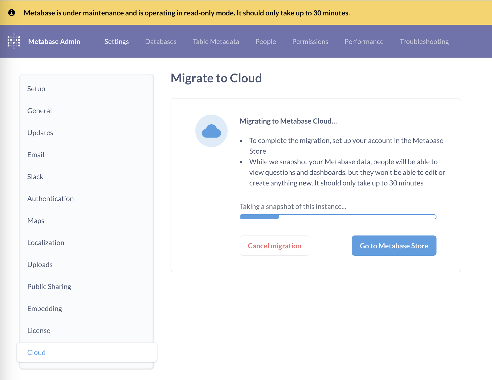
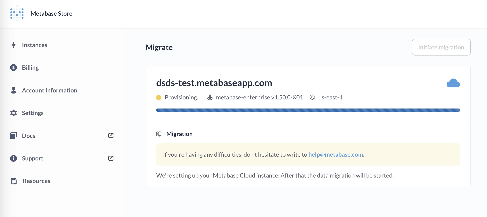

# Migrate to Metabase Cloud

> If you're running Metabase 49 or lower, see [this guide](./guide-pre-50.md)

The migration from a self-hosted Metabase to Metabase Cloud will keep all of your questions, dashboards, people, settings---everything in your existing Metabase.

And don't stress. You won't lose any of your work, and if you get stuck, we're here to help.

## How to migrate to Metabase Cloud

You'll kick off the migration process in your self-hosted Metabase, and finish up by setting up your account in the Metabase Store.

1. [Initiate your migration](#initiate-your-migration)
2. [Set up your account and choose your plan and deployment](#set-up-your-account-and-choose-your-plan-and-deployment)
3. [Follow up after the migration](#follow-up-after-the-migration)

### Initiate your migration

In your Metabase, go to **Admin settings** > **Settings** > **Cloud**.

In the **Migrate to Metabase Cloud** section, click on the **Get started** button.

Metabase will prompt you with a modal to let you know that your Metabase will be read-only while it automates the migration. Click **Migrate now**.

Metabase will take a snapshot of your application database (all your questions, models, dashboards, etc.). While it's snapshotting, it'll display a banner to let people know that they won't be able to create anything new. People will still be able to view questions and dashboards during this time.

Once the snapshot upload completes:

### Set up your account and choose your plan and deployment

While Metabase prepping the migration, click on the **Go to Metabase Store** button to sign in to or set up your account.

Choose your plan: [Starter](https://www.metabase.com/product/starter) or [Pro](https://www.metabase.com/product/pro). You can choose monthly or annual billing (annual will save you 10%).

Choose your deployment: you can specify your DNS alias and select your hosting region.

Enter your payment information.

And that's it! We'll provision your cloud instance and load all of your application data.

Your new Metabase should be ready in just a few minutes:

Welcome to Metabase Cloud!

## Note on migrations and versions

When migrating, you may get an automatic upgrade. If the current version of Metabase Cloud is higher than the version you were using, your Metabase will be upgraded automatically to the higher version.

If the default version on Metabase Cloud is the same or lower than your current version, you're migration will maintain the same version you've been running.

## Follow up after the migration

- **If you're using Google Sign-in**, you'll need to go to [Google Developers Console](https://console.developers.google.com/) and add your new Metabase Cloud URL to the Authorized JavaScript Origins of the Google Auth Client ID.
- **For Pro and Enterprise customers using SAML SSO**, you'll need to update your settings with your identity provider to change the Redirect URL and the Base URL to your new Metabase Cloud URL, otherwise your identity provider will still redirect people to your old Metabase instance. See [Authenticating with SAML](../../people-and-groups/authenticating-with-saml.md) for details on how to set these URLs.

### Tell your team about the new Metabase address

Once you've confirmed everything is working, go ahead and tell everyone the new Metabase Cloud URL address they should use to log in to Metabase. People should be able to log in as usual and pick up right where they left off.

### If you're embedding Metabase

Be sure to update your code with your new Metabase URL.

### Put your old Metabase out to pasture

If you were self-hosting via a third-party, be sure to clean up and cancel any services to avoid any unnecessary charges (like storage for old backups, for example).

## Need help?

If you run into any trouble, just [send us an email](https://www.metabase.com/help/).
