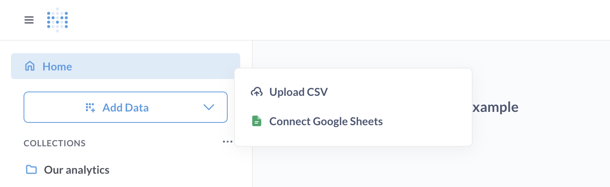

# Metabase Cloud Storage

If you have data stored in spreadsheets and don't have a data warehouse, Metabase Cloud Storage has you covered.

## How Metabase Cloud Storage works

Metabase Cloud Storage is a feature you can add to your Metabase Cloud plan (and it's only available for plans on Metabase Cloud).

Once added, you'll see an **Add data** button in the left navigation bar. Click it and select **Upload CSV**.

You can upload a `.csv` or `.tsv` file.

Learn more about [uploads](../exploration-and-organization/uploads.md).

### Metabase Cloud Storage uses ClickHouse

Under the hood, Metabase Cloud Storage uses [ClickHouse](https://www.metabase.com/data-sources/clickhouse) to store your data.

### Writing SQL queries on data stored in Metabase Cloud Storage

For the SQL dialect supported by ClickHouse, check out [ClickHouse's SQL reference](https://clickhouse.com/docs/en/sql-reference).

## How to get Metabase Cloud Storage

How you set up Metabase Cloud Storage depends on whether you already have a Metabase Cloud instance.

### New cloud customers

New customers can sign up for a [Metabase Cloud instance with storage](https://store.metabase.com/checkout?dwh=1).

### Existing cloud customers

Current customers can add storage through the Metabase Store:

1. Log in to the [Metabase Store](https://store.metabase.com/).
2. In the **Instances** section, click **Add Storage** for the instance you'd like to add storage to.
3. Choose how much storage you would like to add. You can start with 500K stored rows per month and add more storage later.

## Metabase Cloud Storage pricing

Pricing depends on how much data you need to store. See the Storage section on our [pricing page](https://www.metabase.com/pricing/).

## Increasing Metabase Cloud Storage

To increase the number of rows you can store:

1. Log in to your [Metabase Store account](https://store.metabase.com/)
2. In the **Instances** tab, navigate to the relevant instance.
3. Click on **Manage storage**.
4. Click **Edit**.
5. Click **Add storage**.

You can select from the following row counts:

- 500K
- 1M
- 5M
- 10M
- 20M

## Deleting Metabase Cloud Storage

To remove Metabase Cloud Storage (which will _permanently_ erase all its data):

1. Log in to your [Metabase Store account](https://store.metabase.com/)
2. In the **Instances** tab, navigate to the relevant instance.
3. Click **Manage storage**.
4. Click **Edit**.
5. Click **Disable storage**.
6. Click **Erase all data**, which---**WARNING**--will erase _all of its data_. We won't be able to recover the data, so only do this if you're certain you no longer need the storage and its data.

## Syncing Google Sheets with Metabase

If you set up Metabase Cloud Storage, you can [sync Google Sheets with your Metabase](./google-sheets.md).
