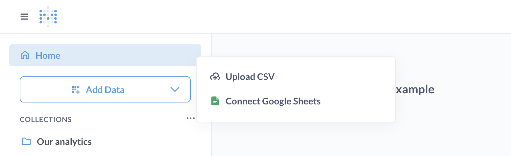

# Metabase Cloud Storage

If you have data stored in spreadsheets and don't have a data warehouse, Metabase Cloud Storage has you covered.

## How Metabase Cloud Storage works

Metabase Cloud Storage is a feature you can add to your Metabase Cloud plan (and it's only available for plans on Metabase Cloud).

Once added, you'll see an **Add data** button in the left navigation bar. Click it and select **Upload CSV**.

You can upload a `.csv` or `.tsv` file.

Learn more about [uploads](../exploration-and-organization/uploads.md).

### Metabase Cloud Storage uses ClickHouse

Under the hood, Metabase Cloud Storage uses [ClickHouse](https://www.metabase.com/data-sources/clickhouse) to store your data.

### Writing SQL queries on data stored in Metabase Cloud Storage

For the SQL dialect supported by ClickHouse, check out [ClickHouse's SQL reference](https://clickhouse.com/docs/en/sql-reference).

## How to get Metabase Cloud Storage

How you set up Metabase Cloud Storage depends on whether you already have a Metabase Cloud instance.

### New cloud customers

New customers can sign up for a [Metabase Cloud instance with storage](https://store.metabase.com/checkout?dwh=1).

### Existing cloud customers

To add storage to an existing instance, use the following steps.

1. Log in to your Metabase [Store account](https://store.metabase.com).
2. Navigate to **Instances**.
3. In the instance you want to add storage to, click **Manage plan**.
4. Find the **Manage add-ons** section.
5. In the **Storage** field, click **Enable**.
6. Use the slider to select the number of stored rows you want to add.
7. Click **Add storage**.

## Metabase Cloud Storage pricing

Pricing depends on how much data you need to store. See the Storage section on our [pricing page](https://www.metabase.com/pricing/).

### Increase Metabase Cloud Storage

To increase the number of stored rows, use the following steps:

1. Log in to your Metabase [Store account](https://store.metabase.com).
2. Navigate to **Instances**.
3. In the instance you want to increase storage for, click **Manage plan**.
4. Find the **Manage add-ons** section.
5. In the **Storage** field, click **Manage**.
6. Click **Edit**.
7. Use the slider to increase the number of stored rows.
8. Click **Add storage**.

## Delete Metabase Cloud Storage

> **WARNING:** This action permanently erases all data in your Metabase Cloud Storage.

To remove Metabase Cloud Storage, use the following steps:

1. Log in to your Metabase [Store account](https://store.metabase.com).
2. Navigate to **Instances**.
3. In the instance you want to delete storage from, click **Manage plan**.
4. Find the **Manage add-ons** section.
5. In the **Storage** field, click **Manage**.
6. Click **Edit**.
7. Click **Disable storage**.
8. To confirm, click **Erase all data**.

## Syncing Google Sheets with Metabase

If you set up Metabase Cloud Storage, you can [sync Google Sheets with your Metabase](./google-sheets.md).
