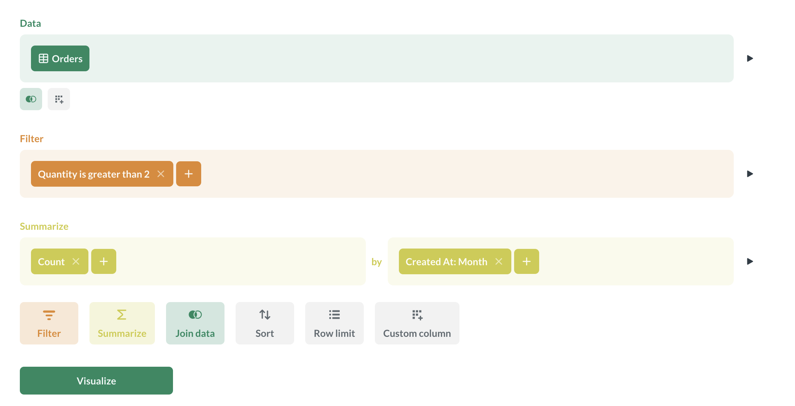
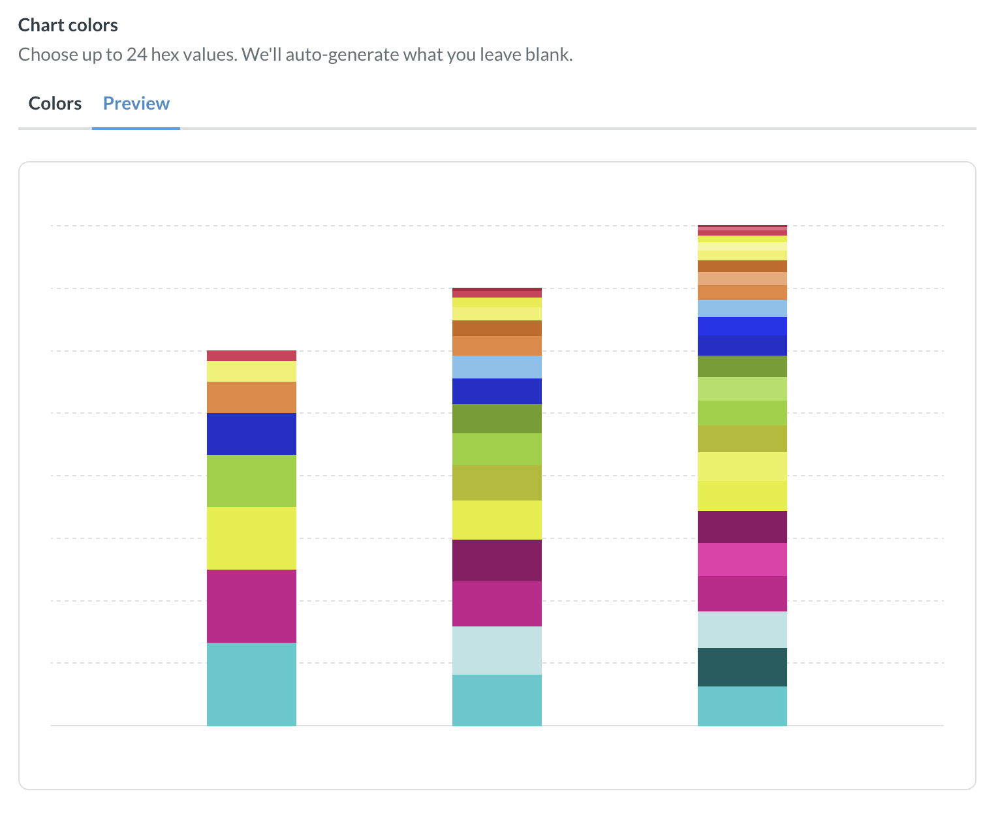
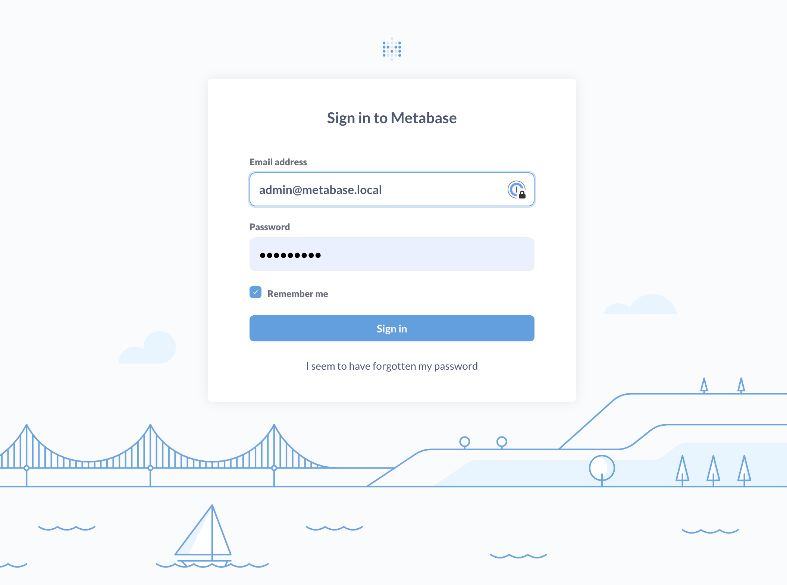

# Appearance



_Admin > Settings > Appearance_

Appearance settings give admins the option to whitelabel Metabase to match your company’s branding.

If you're looking for date, time, number, or currency formatting, see [Formatting defaults](../data-modeling/formatting.md).

## Changing Metabase's appearance

Hit cmd/ctrl + k to bring up the command palette and search for "Branding" and click on Settings -> Branding.

You can also click the **grid** icon at the bottom of the navigation sidebar and click through **Admin** > **Settings** > **Appearance**.

## Color palette

_Admin > Settings > Appearance > Branding_

You can customize colors in both the application UI and in the Metabase charts.

### User interface colors

You can customize the colors that Metabase uses throughout the app:

- **First color:** The main color used throughout the app for buttons, links, and the default chart color.
- **Second color:** The color of aggregations and breakouts in the graphical query builder.
- **Third color:** Color of filters in the query builder, buttons and links in filter widgets.

When choosing interface color, keep in mind that some users of your Metabase can choose to display the interface in [dark mode](../people-and-groups/account-settings.md#theme). Pick colors that work well both in light and dark mode.

### Chart colors

You can choose up to 24 hex values. If you choose fewer than 24 colors, Metabase will auto-generate colors to fill in the rest of the values. The order of colors doesn't apply to the order of colors for series on charts. When building a chart, Metabase will select colors to make each series easy to distinguish.

You can preview what the chart colors will look like by switching to the **Preview** tab.

Custom colors are **unavailable** for:

- [Trend charts](../questions/visualizations/trend.md)
- [Funnel charts](../questions/visualizations/funnel.md)
- [Pin and grid maps](../questions/visualizations/map.md)

Only a **limited subset** of custom colors will be used for:

- Conditional formatting in [tables](../questions/visualizations/table.md) and [pivot tables](../questions/visualizations/pivot-table.md)
- [Maps](../questions/visualizations/map.md)
- [Sunburst chart](../questions/visualizations/pie-or-donut-chart.md)

In most cases, replacing default colors with custom chart colors will not be applied to

## Icons

_Admin > Settings > Appearance > Branding_

### Logo

You can replace Metabase's familiar, tasteful, inspired-yet-not-threateningly-avant-garde dotted M logo with your very own logo. For things to work best, the logo you upload should be an SVG file that looks good when it's around 60px tall. (In other words, ask the nearest designer for help.)

### Favicon

The URL or image that you want to use as the favicon (the logo visible in browser tabs, address bars, bookmark lists, and other places).

If you use a relative path, that path isn't relative to the Metabase JAR, but to the webserver. So unless you're using a reverse-proxy, the path will be relative to the frontend resources available to the JAR.

## Dark mode

People can display their Metabase in dark mode in their [account settings](../people-and-groups/account-settings.md#theme). Options are:

- System default (which is also the default setting). Metabase will switch between light and dark mode when the system switches without having to reload the page.
- Always use dark mode.
- Always use light mode.

You can quickly toggle dark mode from anywhere in Metabase by opening the [command palette](../exploration-and-organization/exploration.md#command-palette) and searching for "light" or "dark" or "theme".

Dark mode is a user-level setting, not an instance-level setting. Currently, there's no way to change the theme to dark mode for the entire instance, but you can edit some [user interface colors](#user-interface-colors).

## Font

_Admin > Settings > Appearance > Branding_

This is the primary font used in charts and throughout the Metabase application (your "instance font"). See [Fonts](./fonts.md).

## Loading message

_Admin > Settings > Appearance > Branding_

This message is the text Metabase presents when it's loading a query. Options include:

- "Doing science..." (the default)
- "Running query..."
- "Loading results..."

## Names

_Admin > Settings > Appearance > Conceal Metabase_

### Application name

You can change every place in the app that says “Metabase” to something like “Acme Analytics,” or whatever you want to call your Metabase app.

Setting a custom application name will also hide the "How to use Metabase" section in the navi

### Documentation and references

Control the visibility of links to official Metabase documentation and other references to Metabase in your instance outside of Admin settings.

Keep in mind that if you hide documentation links, people using your Metabase might not be able to troubleshoot their problems or learn how to use Metabase features like [custom expressions](../questions/query-builder/expressions.md).

### Help link in the settings menu

The Settings menu (the "grid" menu in the upper right of your Metabase) includes a **Help** option that links to a [Metabase help page](https://www.metabase.com/help/) by default. You can change this menu Help item by selecting one of the following options:

- Link to [Metabase help](https://www.metabase.com/help/) (default)
- Hide it (the Settings menu won't display the Help option at all).
- Go to a custom destination. Enter a URL that the Settings menu's Help option should link to. Valid URLs include http, https, and mailto URLs.

## Metabase illustrations

_Admin > Settings > Appearance > Conceal Metabase_

Customize each of the illustrations in Metabase.

### Metabot greeting

Turn this guy on or off:

### Login and unsubscribe pages

What people see when Metabase prompts them to log in.

- Lighthouse
- No illustration
- Custom

### Landing page

The landing page is what people will see whenever they login. You can set the URL to a collection, question, dashboard or whatever, just make sure that everyone has access to that URL.

- Lighthouse
- No illustration
- Custom

### When calculations return no results

Metabase will display this illustration when questions or dashboard cards contain no results.

- Sailboat
- No illustration
- Custom

### When no objects can be found

Metabase will display this illustration when searches don't return any results.

- Sailboat
- No illustration
- Custom

## Further reading

- [Customer-facing analytics](https://www.metabase.com/learn/metabase-basics/embedding).
- [Embedding introduction](../embedding/start.md).
- [Brand your Metabase](https://www.metabase.com/docs/latest/configuring-metabase/appearance).
