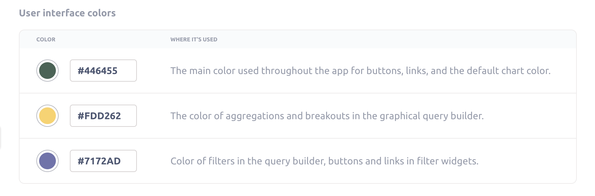

# Appearance



Appearance settings give admins the option to whitelabel Metabase to match your company’s branding.

If you're looking for date, time, number, or currency formatting, see [Formatting defaults](../data-modeling/formatting.md).

## Changing Metabase's appearance

Hit cmd/ctrl + k to bring up the command palette and search for "Appearance" and click on Settings -> Appearance.

You can also click on the **gear** icon at the bottom of the navigation sidebar and click through **Admin settings** > **Settings** > **Appearance**.

Appearance settings are split across different tabs:

- [Branding](#branding)
- [Conceal Metabase](#conceal-metabase)

## Branding

In the Branding tab, you can configure your Metabase to match your brand visuals and voice.

- [Color palette](#color-palette)
- [User interface colors](#user-interface-colors)
- [Chart colors](#chart-colors)
- [Logo](#logo)
- [Font](#font)
- [Loading message](#loading-message)
- [Favicon](#favicon)

## Color palette

You can customize colors in both the application UI and in the Metabase charts.

### User interface colors

You can customize the colors that Metabase uses throughout the app:

- **First color:** The main color used throughout the app for buttons, links, and the default chart color.
- **Second color:** The color of aggregations and breakouts in the graphical query builder.
- **Third color:** Color of filters in the query builder, buttons and links in filter widgets.

### Chart colors

You can choose up to 24 hex values. If you choose fewer than 24 colors, Metabase will auto-generate colors to fill in the rest of the values. And don't bother ordering the colors here, as their order doesn't apply to the order of colors for series on charts. When building a chart, Metabase will select colors to make each series easy to distinguish.

Custom colors are unavailable for:

- [Number charts](../questions/visualizations/numbers.md)
- [Trend charts](../questions/visualizations/trend.md)
- [Funnel charts](../questions/visualizations/funnel.md)
- Conditional formatting ([tables](../questions/visualizations/table.md) and [pivot tables](../questions/visualizations/pivot-table.md))
- [Maps](../questions/visualizations/map.md)

## Logo

You can replace Metabase’s familiar, tasteful, inspired-yet-not-threateningly-avant-garde dotted M logo with your very own logo. For things to work best, the logo you upload should be an SVG file that looks good when it’s around 60px tall. (In other words, ask the nearest designer for help.)

## Font

This is the primary font used in charts and throughout the Metabase application (your "instance font"). See [Fonts](./fonts.md).

## Loading message

This message is the text Metabase presents when it's loading a query. Options include:

- "Doing science..." (the default)
- "Running query..."
- "Loading results..."

## Favicon

The URL or image that you want to use as the favicon (the logo visible in browser tabs, address bars, bookmark lists, and other places).

If you use a relative path, that path isn't relative to the Metabase JAR, but to the webserver. So unless you're using a reverse-proxy, the path will be relative to the frontend resources available to the JAR.

## Conceal Metabase

Hide or customize pieces of the Metabase product to tailor the experience to your brand and needs.

- [Application name](#application-name)
- [Documentation and references](#documentation-and-references)
- [Help link in the settings menu](#help-link-in-the-settings-menu)
- [Metabase illustrations](#metabase-illustrations)

## Application name

You can change every place in the app that says “Metabase” to something like “Acme Analytics,” or whatever you want to call your Metabase app.

## Documentation and references

Control the visibility of links to official Metabase documentation and other references to Metabase in your instance.

This setting affects all links in the product experience that point to Metabase.com URLs (with the exception of links and references in the Admin settings).

## Help link in the settings menu

The Settings menu (the "gear" menu in the upper right of your Metabase) includes a **Help** option that links to a [Metabase help page](https://www.metabase.com/help/) by default. You can change this menu Help item by selecting one of the following options:

- Link to [Metabase help](https://www.metabase.com/help/) (default)
- Hide it (the Settings menu won't display the Help option at all).
- Go to a custom destination. Enter a URL that the Settings menu's Help option should link to. Valid URLs include http, https, and mailto URLs.

## Metabase illustrations

Customize each of the illustrations in Metabase.

### Metabot greeting

Turn this guy on or off:

### Login and unsubscribe pages

What people see when Metabase prompts them to log in.

- Lighthouse
- No illustration
- Custom

### Landing page

The landing page is what people will see whenever they login. You can set the URL to a collection, question, dashboard or whatever, just make sure that everyone has access to that URL.

- Lighthouse
- No illustration
- Custom

### When calculations return no results

Metabase will display this illustration when questions or dashboard cards contain no results.

- Sailboat
- No illustration
- Custom

### When no objects can be found

Metabase will display this illustration when searches don't return any results.

- Sailboat
- No illustration
- Custom

## Further reading

- [Customer-facing analytics](https://www.metabase.com/learn/metabase-basics/embedding).
- [Embedding introduction](../embedding/start.md).
- [Brand your Metabase](https://www.metabase.com/docs/latest/configuring-metabase/appearance).
