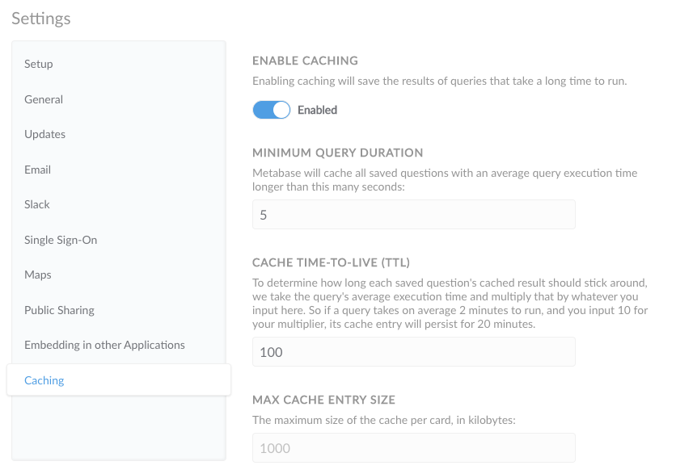

# Caching query results

Metabase now gives you the ability to automatically cache the results of queries that take a long time to run.

## Enabling caching

To start caching your queries, head to the Settings section of the Admin Panel, and click on the `Caching` tab at the bottom of the side navigation. Then turn the caching toggle to `Enabled`.

End-users will see a timestamp on cached questions in the top right of the question detail page showing the time when that question was last updated (i.e., the time when the current result was cached). Clicking on the `Refresh` button on a question page will manually rerun the query and override the cached result with the new result.

## Caching settings

In Metabase, rather than setting cache settings manually on a per-query basis, we give you two parameters to set to automatically cache the results of long queries: the minimum average query duration, and the cache TTL multiplier.

### Minimum query duration

Your Metabase instance keeps track of the average query execution times of your queries, and it will cache the results of all saved questions with an average query execution time longer than the number you put in this box (in seconds).

### Cache Time-to-live (TTL)

Instead of setting an absolute number of minutes or seconds for a cached result to persist, Metabase lets you put in a multiplier to determine the cache's TTL. Each query's cache TTL is computed by multiplying its average execution time by the number you put in this box. So if you put in `10`, a query that takes 5 seconds on average to execute will have its cache last for 50 seconds; and a query that takes 10 minutes will have a cached result lasting 100 minutes. This way, each query's cache is proportional to its execution time.

### Max cache entry size

Lastly, you can set the maximum size of each question's cache in kilobytes, to prevent them from taking up too much space on your server.

## Advanced caching controls



All Metabase editions include global caching controls. Some plans include additional caching options that let you control caching for each database, as well as individual questions.

### Caching per database

You can override your default caching options for each database connection, caching the results for more or less time than the default time-to-live (TTL) duration set by your site-wide settings. Setting caching per question is especially useful when data relevant to the question has a different natural cadence than your site-wide caching rule.

Go to **Admin settings** > **Databases** and select your database connection. Under **Advanced settings**, set the **Default result cache duration**, which determines how long to keep question results for that database. By default, Metabase will use the value you supply on the [cache settings page](#caching-settings), but if this database has other factors that influence the freshness of data, it could make sense to set a custom duration. You can also choose custom durations on individual questions or dashboards to help improve performance.

### Caching per question

You can override your default caching options for questions, caching the results for more or less time than the default time-to-live (TTL) duration set by your site-wide caching settings. Setting caching per question is especially useful when data relevant to the question has a different natural cadence than your site-wide caching rule, such as when the question queries data that doesn't change often.