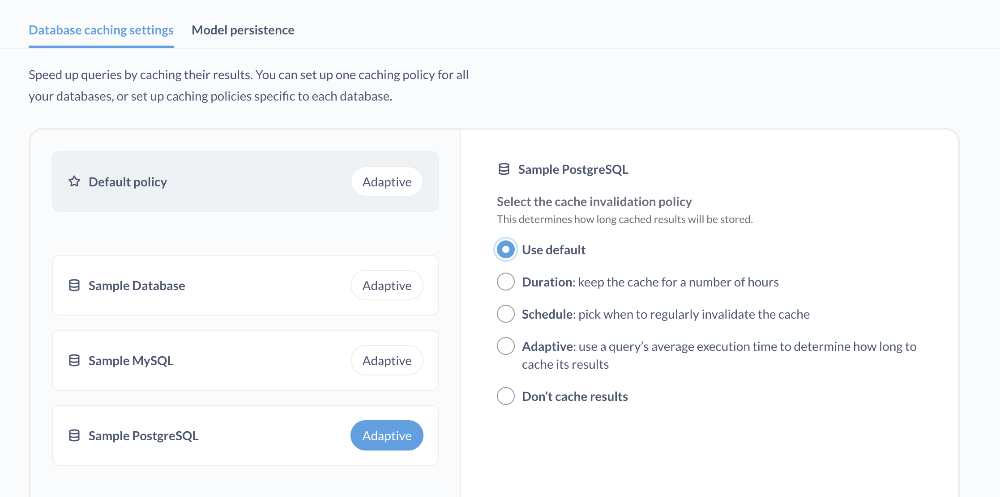

# Caching query results

If your question results don't change frequently, you may want to store the results so that the next time anyone visits the question, Metabase can retrieve the cached results rather than query the database again.

For example, if your data only updates once a day, there's no point in querying the database more than once a day, as the data won't have changed. Returning cached results can be significantly faster, as your database won't have to recompute the results to load your question.

You can set [caching invalidation policies](#cache-invalidation-policies) for [questions](#question-caching-policy), [dashboards](#dashboard-caching-policy), and [databases](#database-caching-policy).

## How caching works in Metabase

Let's say you set a caching policy for a particular question. You set a [duration](#duration-caching-policy) policy that says to invalidate the results (and clear the cache) after one hour.

When you view the question for the first time, Metabase will check for stored results. When it doesn't find any, it will query your database, return the results, and store (cache) the results. Those results will remain valid for the next hour (according to the hour-long duration policy you set).

If you run the question half an hour later, Metabase will return those stored results.

If you run the question over an hour after that initial run, Metabase will notice that the stored results are older than your caching policy allows. Metabase will delete the stored results, run the query against your database, return the results, and store them for the future queries. This cache will remain valid for the next hour, according to the duration policy you set. To always refresh the cache when results expire, see [Refresh cache automatically](#refresh-cache-automatically).

See how [different caching policies interact](#how-dashboard-question-database-and-default-caching-policies-interact).

## Cache invalidation policies

These policies determine how long cached results will remain valid.

- [Duration](#duration-caching-policy)
- [Schedule](#schedule-caching-policy)
- [Adaptive](#adaptive-caching-policy)
- [Don't cache results](#dont-cache-results)

### Duration caching policy



Invalidate and clear the cache after a certain number of hours. When someone runs a query, Metabase will first check whether it has cached the results, and whether those results are still valid. If not, Metabase runs the query against the database and caches the results. These cached results will remain valid for the duration you've set.

### Schedule caching policy



Pick when to regularly invalidate the cache. Metabase will only store results when people run a query, and it will clear the cached results according to the schedule you set here.

You can schedule the cache to invalidate:

- Hourly
- Daily
- Weekly
- Monthly

We do not yet support lunar cycles.

### Adaptive caching policy

Use a query’s average execution time to determine how long to cache the query's results.

- **Minimum query duration**: Metabase will cache this question if it has an average query execution time greater than this many seconds.
- **Multiplier**: To determine how long each cached result should stick around, we take that query's average execution time and multiply that by what you input here. The result is how many seconds the cache should remain valid for. For example, if a question takes on average 10 seconds to return results, and you set a multiplier of 100, Metabase will store the cache for 10 x 100 seconds: 1,000 seconds (~16 minutes).

Metabase will recalculate a query's average execution time whenever it runs the query against the database to refresh the cached results. So if the first time Metabase runs the query against the database, it takes 5 minutes to return results, the average execution time will be 5 minutes. If the next query against the database takes 7 minutes to return, Metabase will update the average to 6 minutes (the average of 5 and 7 is 6).

On [Pro](https://www.metabase.com/product/pro) and [Enterprise](https://www.metabase.com/product/enterprise) plans, you can view querying and caching stats in the [Usage analytics](../usage-and-performance-tools/usage-analytics.md) collection.

### Don’t cache results

If you select "Don't cache results" for a question, dashboard, or database, Metabase won't cache its results; it'll always run the query against the database to refresh results.

## Refresh cache automatically



If you turn on refresh cache automatically for a question or dashboard, Metabase will rerun the query/queries as soon as the cache is invalidated by whichever caching policy you've set. Normally, Metabase only refreshes the cache when someone views the item _after_ its cache has expired. So, normally, when the cache has expired, the next person to view the question will be stuck waiting for the query to run and refresh the cache. But by automatically refreshing results to update the cache, the loading times will always be as fast as possible, and people will always get valid, cached results.

### How Metabase handles parameter values when automatically refreshing the cache

When automatically refreshing results, Metabase will always apply the default parameter values (if any). Metabase will also cache results of up to ten of the most frequently applied parameter values that were applied _during the last caching period_ (as defined by your caching policy). If your question or dashboard has multiple parameters, Metabase will cache up to ten of the most frequently applied _combinations_ of parameter values.

For example, let's say you have a dashboard with a category filter (default value: `Doohickey`) that's set to cache results every 24 hours. During the last 24 hours, people who viewed that dashboard applied the following values to the category filter: `Widget`, `Gizmo`. When Metabase next refreshes the cache, it will cache three sets of results, each set with one of those parameters applied: `Doohickey` (the default value), `Widget`, and `Gizmo`. If, however, _no one_ runs the query in that last 24 hours, Metabase will only refresh the cache for the results with the default parameter's value applied.

### Automatic caching logs

To view the queries Metabase ran to automatically refresh the cache, check out the [query log](../usage-and-performance-tools/usage-analytics.md#query-log-model) and filter the `Query source` by `cache-refresh`.

## Set caching policies for dashboards, questions, and databases

You can set caching policies for different entities.

- [Setting a default caching policy](#default-caching-policy)
- [Database caching policy (specific to each connected database)](#database-caching-policy)\*
- [Dashboard caching](#dashboard-caching-policy)\*
- [Question caching](#question-caching-policy)\*

_\* Denotes [Pro](https://www.metabase.com/product/pro) and [Enterprise](https://www.metabase.com/product/enterprise) features._

### Default caching policy

To set a default caching policy for your Metabase: Hit Cmd/Ctrl + k to bring up the command palette and search for **Performance**. Or, click through **Gear** settings icon > **Admin settings** > **Performance** > **Database caching**.

Click on the button next to **Default policy**, and select a [cache invalidation policy](#cache-invalidation-policies).

### Database caching policy



Same as the default caching policy, though you can set a caching policy for specific databases.

If you have databases connected to Metabase that are set to **Use default** policy, Metabase will update the display to reflect whatever the default policy is set to. For example, if you set the default policy to be "Adaptive", Metabase will display "Adaptive" as the current policy for those databases set to "Use default".

### Dashboard caching policy



To set a caching policy for a dashboard, you must have [curate access](../permissions/collections.md#curate-access) to the dashboard's collection.

1. Go to your dashboard.
2. Click on the **info** icon.
3. Click **Caching policy**.
4. Select the [caching invalidation policy](#cache-invalidation-policies).
5. Optional: turn on [refresh cache automatically](#refresh-cache-automatically).
6. Save your changes.

### Question caching policy



To set a caching policy for a question, you must have [curate access](../permissions/collections.md#curate-access) to the question's collection.

1. Go to your question.
2. Click on the **info** icon.
3. Click **Caching policy**.
4. Select the [caching invalidation policy](#cache-invalidation-policies).
5. Optional: turn on [refresh cache automatically](#refresh-cache-automatically).
6. Save your changes.

## How dashboard, question, database, and default caching policies interact

If multiple caching policies affect the same question, Metabase will use the first available policy, in this order:

1. Question
2. Dashboard
3. Database
4. Default (site-wide)

A question policy overrides a dashboard policy, which overrides a database policy, which overrides a default policy.

## Clearing the cache

To clear the cache and refresh the results:

- **Questions and dashboards**: Visit the item and click through the **Info > Caching policy > Clear cache** (the "Clear cache" button is at the bottom of the sidebar).
- **Database**: Click the **Gear** icon and click through **Admin settings** > **Performance** > **Database caching**. Select your database and click the **Clear cache** button (at the bottom of the page).

## Caching location

If you're self-hosting Metabase, cached question results will be saved to your [application database](../installation-and-operation/configuring-application-database.md).

If you're using Metabase Cloud, cached question results will be saved to Metabase's servers in the United States (as our Cloud service manages your application database for you.)

## Further reading

- [Model persistence](../data-modeling/model-persistence.md)
