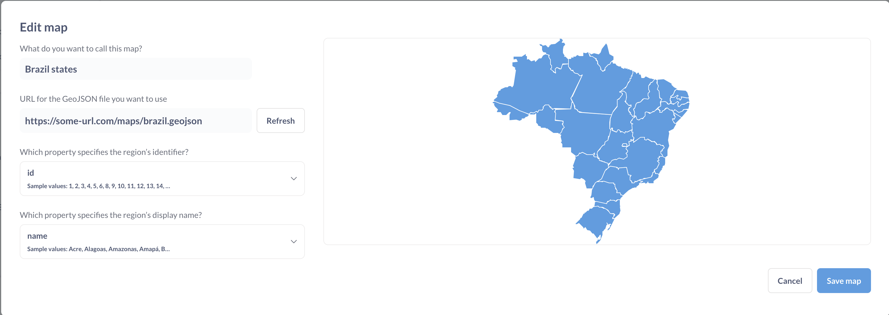

# Custom maps

By default, Metabase uses OpenStreetMaps for map visualizations, but there are a few customization options.

## Map settings

To find the map settings:

1. At the top right of the screen, click **gear** icon > **Admin settings** > **Settings**.
2. Select `Maps` from the navigation on the left.

## Map tile server

By default, Metabase uses the [OpenStreetMaps](https://www.openstreetmap.org) tile server for pin and grid maps. If your organization requires a different
look or level of detail in your map visualizations, you can change the map tile server by adding the map tile server path to the first field on the page.

The path must either be a URL that starts with `http://` or `https://` or a relative path to a local file in the JVM's classpath.

Currently, Metabase uses a single tile server per instance. You can't specify different tiles for different maps.

## Custom region maps

Metabase comes with two built-in [region maps](../questions/visualizations/map.md#region-maps): world map with countries and United States map with states.

If you need a map of other regions - like EU countries or NYC neighborhoods - you can specify a GeoJSON file containing region information. You can often find GeoJSON maps by searching online for "[Your region] + geojson", like "NYC neighborhoods GeoJSON." Many community members and government organizations have already developed map files for common regions. You can also create your own GeoJSON with a tool like [MapShaper](https://mapshaper.org/) or [GeoJSON.io](http://geojson.io/).

Your GeoJSON file should:

- Be less than 5 MB in size.
- Contain polygon features defining regions (not just points or coordinates)
- Use geographic coordinates (latitude and longitude) to define region polygons. Metabase doesn't support projected coordinates, so you'll need to convert projected coordinates to geographic coordinates.
- Accessible by a public URL. Currently, you can't upload a GeoJSON to Metabase.

To add a custom map:

1. Go to **Admin Settings > Maps > Custom Maps**.
2. Click **Add a Map**.
3. Enter a name for your map.
4. Provide the URL to your GeoJSON file.
5. Specify the JSON properties that should serve as region identifier and region name.

- **Name of the map** will be displayed in the region selector for [custom region maps](../questions/visualizations/map.md#custom-regions)
- **Region's identifier** is a GeoJSON field that identifies your region. The values in this field should match how the regions are referenced in your data. The field does not need to match the display name .
- **Region's display name** is a GeoJSON field that specifies how your region name will be displayed on a map. This field can be different from region's identifier.

To pre-load one or more region maps when Metabase starts, you can use the environment variable [`MB_CUSTOM_GEOJSON`](./environment-variables.md#mb_custom_geojson) or a [config file option](./config-file.md) `custom-geojson` .

To disable the creation of custom maps, use the [`MB_CUSTOM_GEOJSON_ENABLED`](./environment-variables.md#mb_custom_geojson_enabled) or a [config file option](./config-file.md) `custom-geojson-enabled`.
