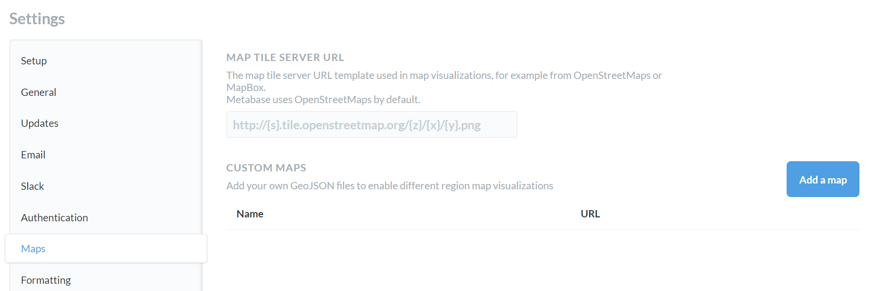

# Custom maps

By default, Metabase uses OpenStreetMaps for map visualizations, but there are a few customization options.

## Map settings

To find the map settings:

1. At the top right of the screen, click **gear** icon > **Admin settings** > **Settings**.
2. Select `Maps` from the navigation on the left.

## Map tile server

By default, Metabase uses the OpenStreetMaps tile server. If your organization requires a different
look or level of detail in your map visualizations, you can change the map tile server by adding the map tile server path to the first field on the page. The path must either be a URL that starts with `http://` or `https://` or a relative path to a local file in the JVM's classpath.

## Custom region maps

If you need a map that focuses on a specific region, you may want to upload a custom GeoJSON map.

Your GeoJSON file should:

- Be less than 5 MB in size.
- Use geographic coordinates (latitude and longitude). Metabase doesn't support projected coordinates, so you'll first need to convert projected coordinates to geographic coordinates.

To upload a GeoJSON file to add a custom region map, click the `Add a map` button. Enter:

- The name of the map
- The URL of the GeoJSON file
- The JSON property that Metabase should use as your region's identifier (a distinct way of identifying this specific region map)
- The JSON property that Metabase should use as the display name (how the name of the region map appears in the user interface)

If you lack a GeoJSON file, you can create one with a tool like [MapShaper](https://mapshaper.org/) or [GeoJSON.io](http://geojson.io/).

## Further reading

- [GeoJSON.org](https://geojson.org/).
