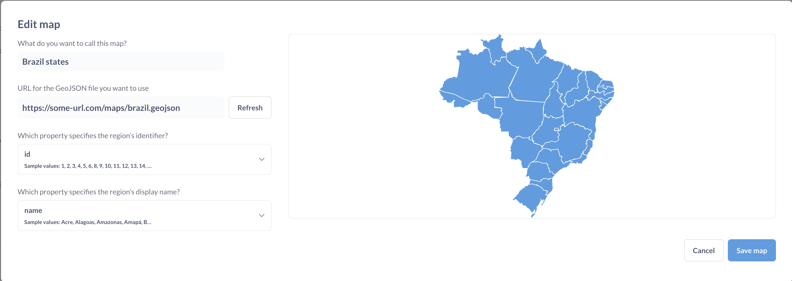

# Custom maps

_Admin > Settings > Maps_

By default, Metabase uses OpenStreetMap tiles for pin and grid map visualizations, and comes with two built-in region maps - world countries and US states. You can change the tiles used for pin and grid maps, and upload additional region maps.

To find the map settings:

1. At the top right of the screen, click **grid** icon > **Admin** > **Settings**.
2. Select `Maps` from the navigation on the left.

## Map tile server

By default, Metabase uses the [OpenStreetMap](https://www.openstreetmap.org) tile server for pin and grid maps. If your organization needs a different look or level of detail, you can point Metabase at a different tile server.

The map tile server sets the background imagery for pin and grid maps. It's not the same as a [custom region map](#custom-region-maps), which uses a GeoJSON file to draw region shapes.


To change the map tile server:

1. Go to **Admin > Settings > Maps**.
2. Under **Map tile server URL**, enter the URL template for your tile server.

### Use a raster tile URL template

Metabase renders raster tiles (PNG or JPEG).

The URL must be a template with `{z}`, `{x}`, and `{y}` placeholders, and optionally `{s}` for a subdomain. Metabase fills in the zoom level and tile coordinates as people pan and zoom around the map. The default OpenStreetMap URL is a good example:

```
https://{s}.tile.openstreetmap.org/{z}/{x}/{y}.png
```

Tile server URLs must start with `http://` or `https://`.

### Don't put a private key in the tile server URL

Metabase sends the map tile server URL to the browser, including in [embeds](../embedding/start.md) and [public links](../embedding/public-links.md). Anyone who can view a map can read the URL and any key in it.

If your tile server needs a key, use a public, client-side key and restrict it to the domains you serve Metabase from. Mapbox, for example, calls these [public tokens](https://docs.mapbox.com/help/dive-deeper/access-tokens/#public-tokens).

Metabase uses a single tile server per instance. You can't specify different tiles for different maps.

## Custom region maps

Metabase comes with two built-in [region maps](../questions/visualizations/map.md#region-maps): world map with countries and United States map with states.

If you need a map of other regions - like EU countries or NYC neighborhoods - you can specify a GeoJSON file containing region information. You can often find GeoJSON maps by searching online for "[Your region] + geojson", like "NYC neighborhoods GeoJSON." Many community members and government organizations have already developed map files for common regions. You can also create your own GeoJSON with a tool like [MapShaper](https://mapshaper.org/) or [GeoJSON.io](https://geojson.io/).

### Custom geoJSON requirements

Your GeoJSON file should:

- Be less than 5 MB in size.
- Contain polygon features defining regions (not just points or coordinates)
- Use geographic coordinates (latitude and longitude) to define region polygons. Metabase doesn't support projected coordinates, so you'll need to convert projected coordinates to geographic coordinates.
- Accessible by a public URL. Currently, you can't upload a GeoJSON to Metabase.

### Add a custom map

To add a custom map:

1. Click the **grid icon**, then go to **Admin** > **Settings** > **Maps** > **Custom Maps**.
2. Click **Add a Map**.
3. Enter a name for your map.
4. Provide the URL to your GeoJSON file.
5. Specify the JSON properties that should serve as region identifier and region name.

   

   - **Name of the map** will be displayed in the region selector for [custom region maps](../questions/visualizations/map.md#custom-regions).
   - **Region's identifier** is a GeoJSON field that identifies your region. The values in this field should match how the data refers to the regions. The field doesn't need to match the display name.
   - **Region's display name** is a GeoJSON field that specifies how maps will display region names. This field can be different from the region's identifier.

To pre-load one or more region maps when Metabase starts, you can use the environment variable [`MB_CUSTOM_GEOJSON`](./environment-variables.md#mb_custom_geojson) or a [config file option](./config-file.md) `custom-geojson` .

To disable the creation of custom maps, use the [`MB_CUSTOM_GEOJSON_ENABLED`](./environment-variables.md#mb_custom_geojson_enabled) or a [config file option](./config-file.md) `custom-geojson-enabled`.
