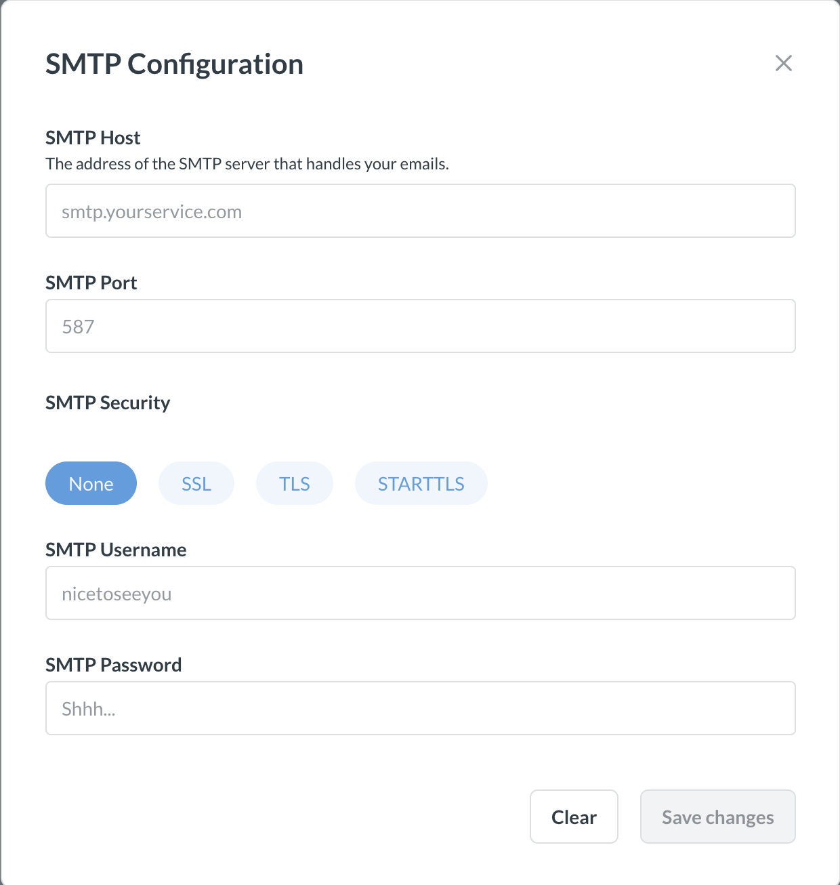

# Email

Once you connect your database to Metabase, you'll want to configure an email account to send system notifications to your organization's users. Metabase uses email to reset passwords, onboard new users, and notify you when something happens.

To edit email settings:

1. Click on the **gear** icon in the upper right.
2. Select **Admin Settings**.
3. From the default **Settings** tab, click on **Email** in the left sidebar.

## Metabase Cloud

Metabase Cloud manages an email server for you, so you don't need to set up email (and you won't see SMTP settings in your Admin console).

If you like, you can still set up:

- a name for your Cloud email account (from name)
- an email address to recieve email replies (reply-to address)

## Configuring your email account

For Metabase to send messages to your organization's users, you'll need to set up an email account to send emails via **SMTP** (simple mail transfer protocol), which is an email standard that secures emails with SSL security protection.

To start, go to the Admin Panel from the dropdown menu in the top right of Metabase, then from the Settings page, click on **Email** in the left menu.

You should see this form:

Here you'll set:

- **SMTP HOST**: The address of the SMTP server that handles your emails.
- **SMTP PORT**: The port your SMTP server uses for outgoing emails.
- **SMTP SECURITY**:
  - None
  - SSL
  - TLS
  - STARTTLS
- **SMTP Username**.
- **SMTP Password**.

You'll also need to specify your:

- **From address**: The email address you want to use for the sender of emails.
- **Reply-to address**: The email address you want the replies to go to, if different from the from address.

## Add recipients as CC or BCC

By default, Metabase will hide email recipients by including them in the BCC list (Blind Carbon Copy) of the email. But if you're having issues with your email provider blocking emails with BCC recipients, and you don't mind having people see who else has been copied on the email Metabase sends them, you can tell Metabase to CC (Carbon Copy) recipients instead.

### Recommended email settings

- SSL is strongly recommended because it’s more secure and gives your account extra protection from threats.
- If your email service has a whitelist of email addresses that are allowed to send email, be sure to whitelist the email address that you put in the **From Address** field to ensure you and your teammates receive all emails from Metabase.

## Notes for common email services

- [Google Apps](#google-apps)
- [Amazon SES](#amazon-ses)
- [Mandrill](#mandrill)

### Google Apps

1. In the **SMTP host** field, enter smtp.gmail.com
2. Fill in 465 for the **SMTP port** field
3. For the **SMTP Security** field, enter **SSL**
4. In the **SMTP username** field, enter your Google Apps email address (e.g. hello@yourdomain.com)
5. Enter your Google Apps password in the **SMTP password** field
6. Enter the email address you would like to be used as the sender of system notifications in the \*_From Address_ field.

### Amazon SES

1. Log on to [https://console.aws.amazon.com/ses](https://console.aws.amazon.com/ses).
2. Click **SMTP Settings** from the navigation pane.
3. Select **Create My SMTP Credentials** in the content pane.
4. Create a user in the **Create User for SMTP** dialog box and then click **Create**.
5. Next, select **Show User SMTP Credentials** to view the user's SMTP credentials.
6. Go back to the Metabase Admin Panel form and enter the info there.

Check if [email quotas](https://docs.aws.amazon.com/ses/latest/dg/quotas.html) apply to your Amazon SES server. You may want to manage your email recipients using groups instead.

### Mandrill

1. Log in to your Mandrill account and locate your credentials from the **SMTP & API Info** page there.
2. Your SMTP password is any active API key for your account — _not_ your Mandrill password.
3. Although Mandrill lists **port 587**, [any port supported by Mandrill](https://mailchimp.com/developer/transactional/docs/smtp-integration/#the-basics) will work for SMTP email.
4. Now you can go back to the Metabase Admin Panel form and enter the info there.

## Approved domains for notifications



Allowed email address domain(s) for new [dashboard subscriptions](../dashboards/subscriptions.md) and [alerts](../questions/sharing/alerts.md).

Adding approved domains allows you to restrict which email addresses people can send alerts and subscriptions to. This restriction only applies to sending email to people who lack an account with that Metabase. People with accounts in a Metabase who aren't [sandboxed](../permissions/data-sandboxes.md) will be able to email any other person with an account in that same Metabase.

To allow all domains, leave the field empty (allowing all domains is the default).

To specify multiple domains, separate each domain with a comma, with no space in between (e.g., "domain1,domain2").

You can also set this property using the environment variable [`MB_SUBSCRIPTION_ALLOWED_DOMAINS`](../configuring-metabase/environment-variables.md#mb_subscription_allowed_domains).

> This setting doesn't affect existing subscriptions and alerts.

## Suggest recipients on dashboard subscriptions and alerts



Control which recipients people can see when they create a new [dashboard subscription](../dashboards/subscriptions.md) or [alert](../questions/sharing/alerts.md). For example, you may want to restrict people to viewing potential recipients that belong to the same [groups](../people-and-groups/managing.md#groups) they are a member of.

Options include:

- Suggest all users
- Only suggest users in the same groups
- Don't show suggestions

People who are sandboxed won't see suggestions.

## Further reading

- [Alerts](../questions/sharing/alerts.md)
- [Dashboard subscriptions](../dashboards/subscriptions.md)
- [Notification permissions](../permissions/notifications.md)
- [Setting up Slack](./slack.md)
- [Usage Analytics](../usage-and-performance-tools/usage-analytics.md)
