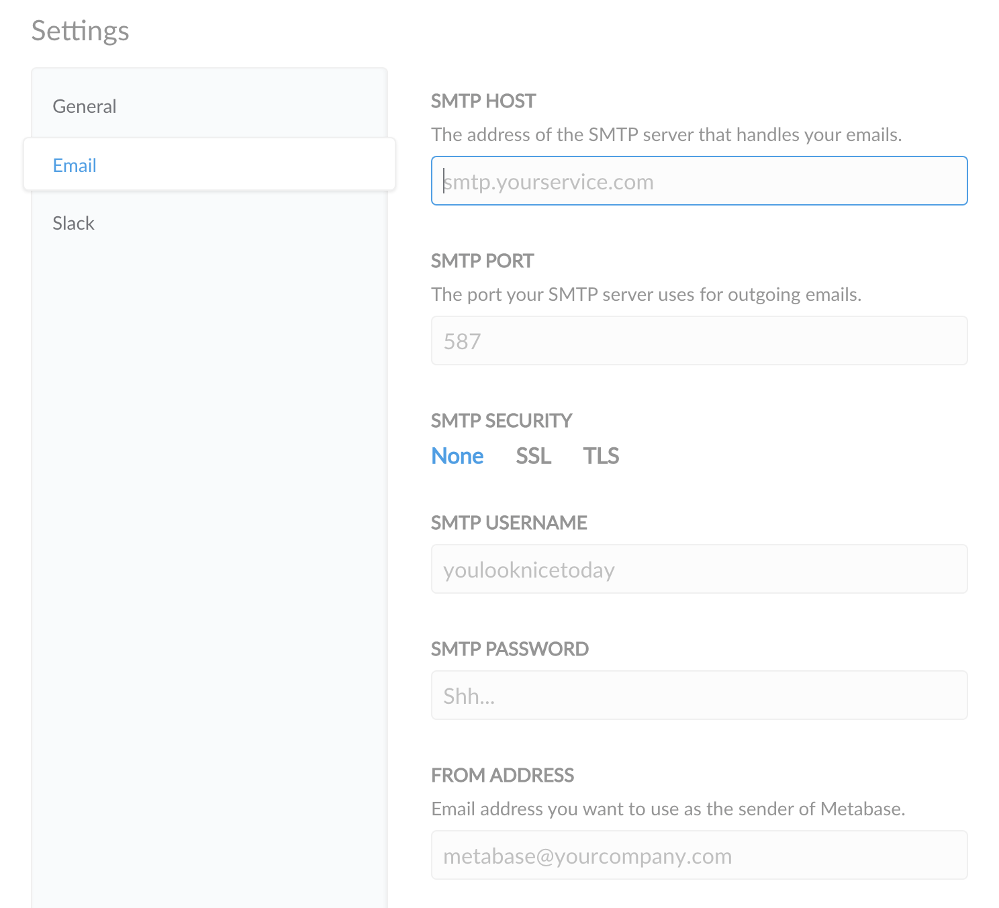

# Email

Once you connect your database to Metabase, you'll want to configure an email account to send system notifications to your organization's users. Metabase uses email to reset passwords, onboard new users, and notify you when something happens.

## Metabase Cloud

Metabase Cloud manages an email server for you, so you don't need to set up email (and you won't see SMTP settings in your Admin console).

If you like, you can still set up:

- a name for your Cloud email account (from name)
- an email address to recieve email replies (reply-to address)

## Configuring your email account

For Metabase to send messages to your organization's users, you'll need to set up an email account to send emails via **SMTP** (simple mail transfer protocol), which is an email standard that secures emails with SSL security protection.

To start, go to the Admin Panel from the dropdown menu in the top right of Metabase, then from the Settings page, click on **Email** in the left menu.

You should see this form:

You might also want to specify [approved domains for notifications](./settings.md#approved-domains-for-notifications).

## Google Apps

1. In the **SMTP host** field, enter smtp.gmail.com
2. Fill in 465 for the **SMTP port** field
3. For the **SMTP Security** field, enter **SSL**
4. In the **SMTP username** field, enter your Google Apps email address (e.g. hello@yourdomain.com)
5. Enter your Google Apps password in the **SMTP password** field
6. Enter the email address you would like to be used as the sender of system notifications in the **From Address* field.

## Amazon SES

1. Log on to [https://console.aws.amazon.com/ses](https://console.aws.amazon.com/ses).
2. Click **SMTP Settings** from the navigation pane.
3. Select **Create My SMTP Credentials** in the content pane.
4. Create a user in the **Create User for SMTP** dialog box and then click **Create**.
5. Next, select **Show User SMTP Credentials** to view the user's SMTP credentials.
6. Go back to the Metabase Admin Panel form and enter the info there.

**Note**

Check if [email quotas](https://docs.aws.amazon.com/ses/latest/dg/quotas.html) apply to your Amazon SES server. You may want to manage your email recipients using groups instead.

## Mandrill

1. Log in to your Mandrill account and locate your credentials from the **SMTP & API Info** page there.
2. Your SMTP password is any active API key for your account — *not* your Mandrill password.
3. Although Mandrill lists **port 587**, [any port supported by Mandrill](https://mailchimp.com/developer/transactional/docs/smtp-integration/#the-basics) will work for SMTP email.
4. Now you can go back to the Metabase Admin Panel form and enter the info there.

## Recommended settings

* SSL is strongly recommended because it’s more secure and gives your account extra protection from threats.
* If your email service has a whitelist of email addresses that are allowed to send email, be sure to whitelist the email address that you put in the **From Address** field to ensure you and your teammates receive all emails from Metabase.

## Further reading

- [Alerts](../questions/sharing/alerts.md)
- [Dashboard subscriptions](../dashboards/subscriptions.md)
- [Notification permissions](../permissions/notifications.md)
- [Setting up Slack](./slack.md)
- [Auditing Metabase](../usage-and-performance-tools/audit.md)

