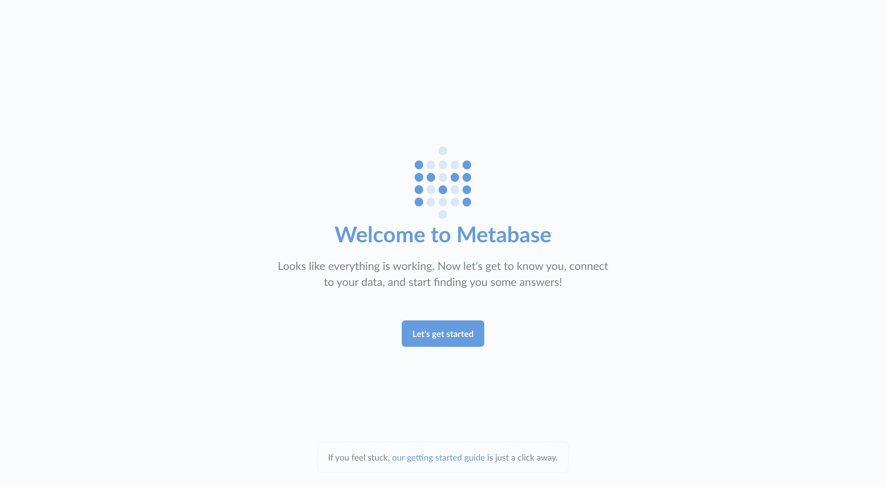
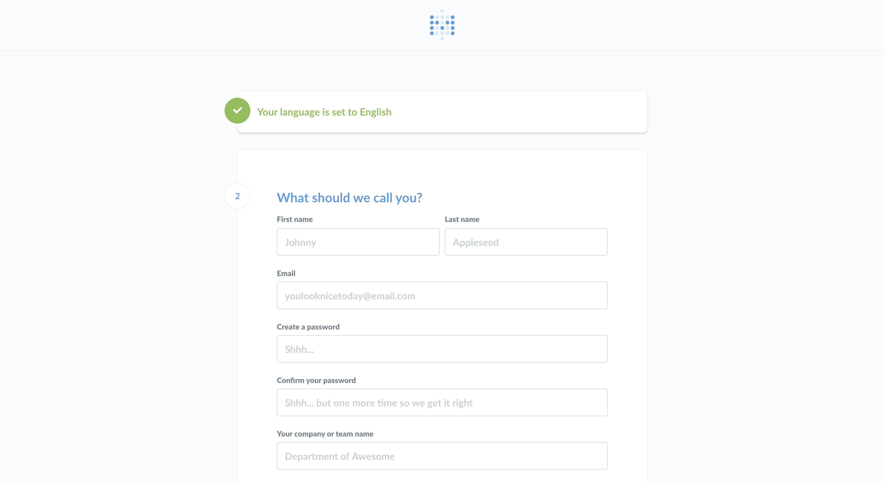
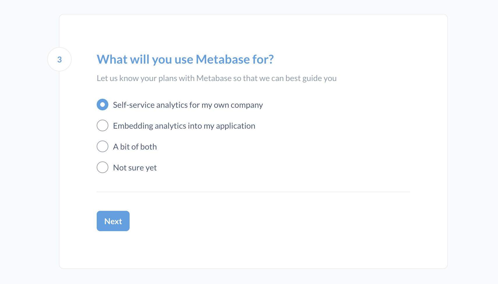
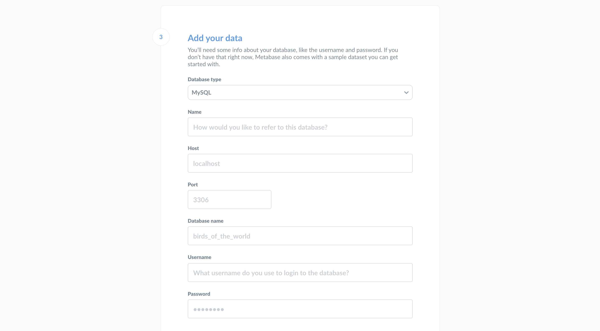
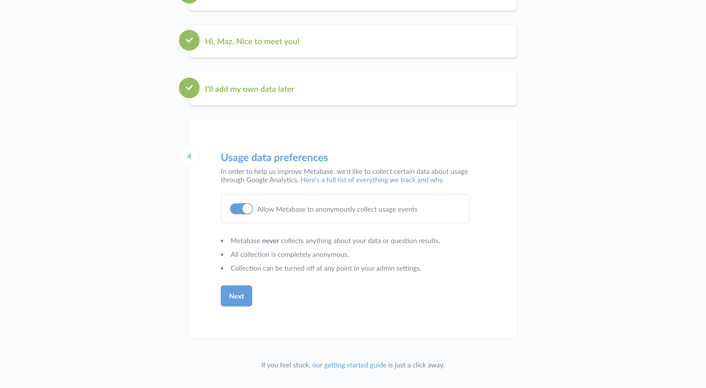
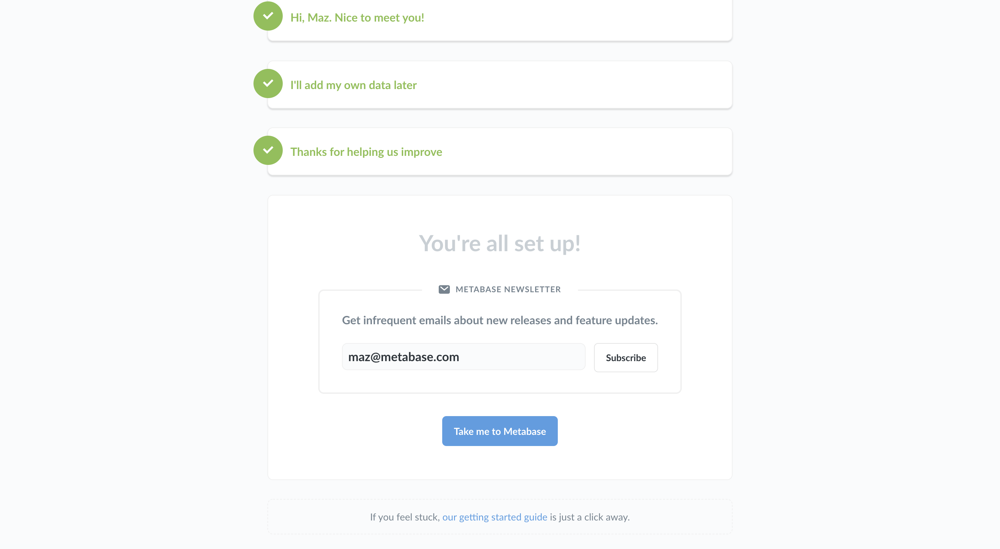

# Setting up Metabase

This guide will help you set up Metabase once you’ve gotten it installed. If you haven’t installed Metabase yet, you can [get Metabase here](https://metabase.com/pricing/).

Start Metabase up for the first time and you’ll see this screen:

Go ahead and click **Let’s get started**.

## Setting up an admin account

The first thing you’ll need to do is set up an admin account. The account you create when you first install Metabase is an admin account by default — handy! If you’ve installed Metabase on a production server, you should be really careful to remember the password for this account since it will be used to add other users, connect to databases, set up email, and more. You can also create additional admin accounts later.

For now, let's just create an account for ourselves to explore Metabase. Type in your info, and when you’re ready to continue, click the **Next** button.

## What will you use Metabase for?

Let us know your plans with Metabase so that we can best guide you.

- Self-service analytics for my own company
- Embedding analytics into my application
- A bit of both
- Not sure yet

Don't worry about picking the wrong option. If you say you're interested in embedding, Metabase will display a card with a link to the embedding settings when you (the admin) first log in to your instance. Just a little convenience thing, that's all.

## Gathering your database info

At this point you’ll need to gather some information about the database you want to use with Metabase. We won’t be able to connect to your database without it, but you’d like to deal with all of this later, that’s okay: just click **I’ll add my data later**. Metabase comes with a [Sample Database](https://www.metabase.com/glossary/sample-database) that you can play around with to get a feel for how Metabase works.

If you’re ready to connect, here’s what you’ll need:

- The **hostname** of the server where your database lives
- The **port** the database server uses
- The **database name**
- The **username** you use for the database
- The **password** you use for the database

If you don't have this information handy, the person responsible for administering the database should have it.

## Connect to your database

Now that you have your database info you can connect to your database. Sweet, sweet data at last. Just go ahead and put your info into this form and click **Next**.

For more on connecting to databases, see [Adding and managing databases](../databases/connecting.md).

## Activate your license

If you're self-hosting Metabase on the [Pro](https://www.metabase.com/product/pro) or [Enterprise](https://www.metabase.com/product/enterprise) plan, Metabase will prompt you for your license. This step is just a convenience. You don't need to enter your license here; you can [activate your license](../installation-and-operation/activating-the-enterprise-edition.md) at any time. Just know that all of your Pro and Enterprise features won't work until you've activated your license.

If you're running Pro on [Metabase Cloud](https://www.metabase.com/cloud/), we'll handle this step for you. Your Pro features should already be available.

## Usage data preferences

One last quick thing that you’ll have to decide is if it’s okay for us to collect some anonymous info about how you use the product — it helps us make Metabase better. Like the box says:

- Metabase never collects anything about your data or question results.
- All collection is completely anonymous.
- Collection can be turned off at any point in your admin settings.

If you’re ready to start using Metabase, go ahead and click **Next**.

## Staying in touch

At this point you are all set and ready to use Metabase. Since we like keeping in touch with our friends we made it easy to sign up for our newsletter (infrequent emails) with a single click!

Once you're done here simply follow the link to **Take me to Metabase**. And if you decided to skip the newsletter sign-up, it's cool, we still like you :)

## Getting started with Metabase

For a tutorial on getting up and running with questions and dashboards, head over to [Learn Metabase](https://www.metabase.com/learn/metabase-basics/getting-started/).

---

If you’d like more technical resources to set up your data stack with Metabase, connect with a [Metabase Expert](https://www.metabase.com/partners/){:target="\_blank"}.
