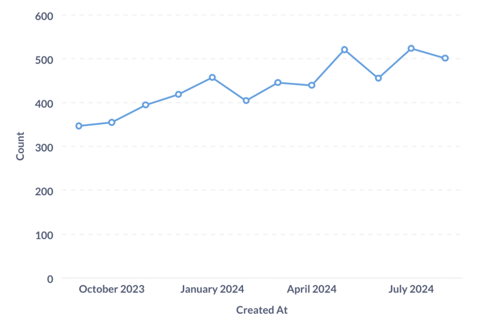
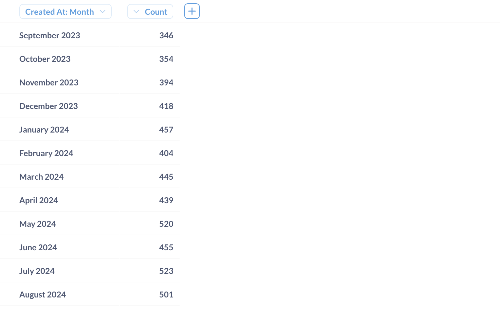

# Webhooks

Admins can set up webhooks so that people can send [alerts](../questions/alerts.md) to a particular URL. Which means you can set up an alert to send the results of a question to an endpoint of your choice: to your app, a third-party service, or wherever.

For now, webhooks are only available for [alerts](../questions/alerts.md); you can't select a webhook as the recipient of a [dashboard subscription](../dashboards/subscriptions.md).

## Creating a webhook

Before you can send an alert to a webhook, an admin will need to create a webhook to target.

Admins can create a webhook by clicking on the **gear icon** > **Admin settings** > **Notification channels**. In the **Webhooks for alerts**, click **+ Add another**. Metabase will hand you a short form to fill out:

- **Webhook URL**. Where you want Metabase to send the results of an alert. Must be a valid URL.
- **Give it a name**. You have to name the webhook so that people can pick the right hook when setting up an alert on a question.
- **Description**. You should probably tell people what the hook is for.
- **Authentication method**. See below.

## Webhook authentication method

You can specify an auth method for the webhook.

- **None**: Anything goes.
- **Basic**: Set a username and password.
- **Bearer**: Include a [secret token](https://datatracker.ietf.org/doc/html/rfc6750).
- **API key**: You can add the API key to the Header or as a Query param. Both approaches require a key and value (the API key itself).

## Webhook payload

Metabase will send the results of an alert in JSON. The JSON will include some metadata about the question, like the alert's creator and its ID (`null` in the case of test alerts).

Metabase will send the "attached" visualization as a base64-encoded PNG in the `data` key, under `visualization`.



And the data as seen in the table view, which Metabase will send as a `raw_data`.



Here's an example payload for an alert (we truncated the PNG encoding because it's long and extremely boring):

```JSON
{
  "type": "alert",
  "alert_id": null,
  "alert_creator_id": 2666,
  "alert_creator_name": "Roberto Bolaño",
  "data": {
    "type": "question",
    "question_id": 108,
    "question_name": "Sales",
    "question_url": "http://example.com/question/108",
    "visualization": "data:image/png;base64,=...LONG_ENCODED_PNG_HERE...",
    "raw_data": {
      "cols": [
        "CREATED_AT",
        "count"
      ],
      "rows": [
        [
          "2023-09-01T00:00:00Z",
          346
        ],
        [
          "2023-10-01T00:00:00Z",
          354
        ],
        [
          "2023-11-01T00:00:00Z",
          394
        ],
        [
          "2023-12-01T00:00:00Z",
          418
        ],
        [
          "2024-01-01T00:00:00Z",
          457
        ],
        [
          "2024-02-01T00:00:00Z",
          404
        ],
        [
          "2024-03-01T00:00:00Z",
          445
        ],
        [
          "2024-04-01T00:00:00Z",
          439
        ],
        [
          "2024-05-01T00:00:00Z",
          520
        ],
        [
          "2024-06-01T00:00:00Z",
          455
        ],
        [
          "2024-07-01T00:00:00Z",
          523
        ],
        [
          "2024-08-01T00:00:00Z",
          501
        ]
      ]
    }
  },
  "sent_at": "2024-09-30T20:16:15.76582Z"
}
```

## Further reading

- [Alerts](../questions/alerts.md)
