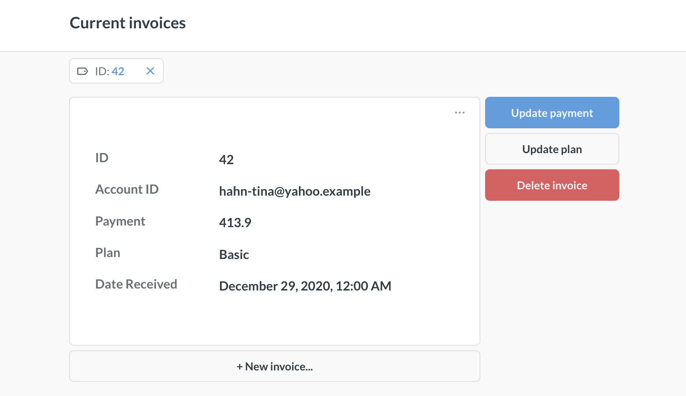
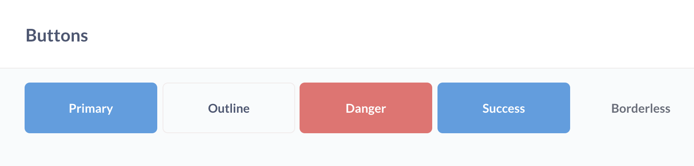
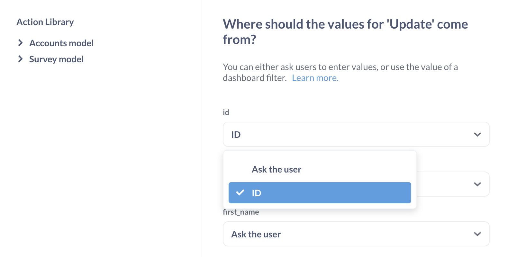
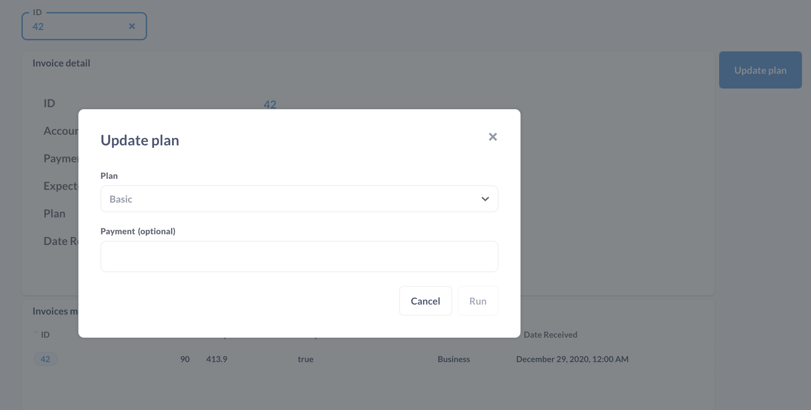

# Actions on dashboards

To put [actions](../actions/start.md) in action, you can combine them with a [model](../data-modeling/models.md) and a [filter](./filters.md) on a dashboard.

## Adding an action to a dashboard

Visit a dashboard page and click on the **pencil** icon, then click on the **box with a mouse pointer** to add an action.

Metabase will add an action button to the dashboard grid, and open a sidebar with the buttons settings.

### Button text

A label explaining what the button does, e.g., "Ignition".

### Button variant

You can select from a variety of handsome buttons:

- Primary
- Outline
- Danger
- Success
- Borderless

## Connecting an action to a dashboard filter

For most actions, when people click on a button, they'll be prompted to input values in the fields defined by that action.

Many types of actions rely on knowing the entity IDs for the model to determine which records to update or delete. To have people select the ID for the action, you'll need to:

1. Click on the pencil icon to edit the dashboard.
2. Add an action to the dashboard (if you haven't already).
3. [Add a filter](./filters.md) to a dashboard, wire it up to any cards that you want to, and click **Done** in the bottom of the sidebar.
4. Hover over the action button and click on the **gear** icon, and select **Change action**.
5. Click on the field's dropdown to select where the action should get it's value. Here you can select "Ask the user" or have it automatically populated by a dashboard filter. In this case, we'll select our "ID" filter.

If you also wire that filter up to a card with a model on the dashboard, you can filter for individual records in that model, view them in the model's card, and have the action buttons auto-populate the id.

You can add as many buttons as you want, and wire them up to one or more filters.

## Actions are unavailable for public dashboards and dashboards in static embeds

While you can add actions to dashboards and use them in your Metabase, actions won't work on dashboards accessed via [public links](./introduction.md#sharing-dashboards-with-public-links), or dashboards in static embeds.

If you want people outside of your Metabase to use an action, you can create a [public form for an action](../actions/custom.md#make-public), or expose actions via [interactive embedding](../embedding/interactive-embedding.md).

## Further reading

- [Actions](../actions/start.md)
