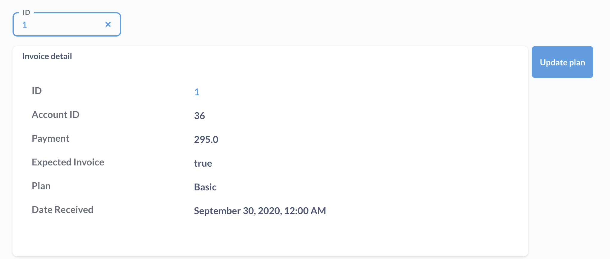

# Actions on dashboards

To put [actions](../actions/start.md) in action, you can combine them with a [model](../data-modeling/models.md) and a [filter](./filters.md) on a dashboard.

## Adding an action to a dashboard

Visit a dashboard page and click on the **pencil** icon, then click on the **box with a mouse pointer** to add an action.

Metabase will add an action button to the dashboard grid, and open a sidebar with the buttons settings.

### Button text

A label explaining what the button does, e.g., "Ignition".

### Button variant

You can select from a variety of handsome buttons:

- Primary
- Outline
- Danger
- Success
- Borderless

## Connecting an action to a dashboard filter

Many types of actions rely on knowing the entity IDs for the model to determine which records to update or delete. You can add a filter to the dashboard to filter on ID, and wire up that filter to the action button.

If you also wire that filter up to the model cards on the dashboard, you can filter for individual records, view them in the model cards, and update them with action buttons with the ID already filled in:

 You can add as many buttons as you want, and wire them up to one or more filters.

 ## Further reading

 - [Actions](../actions/start.md)