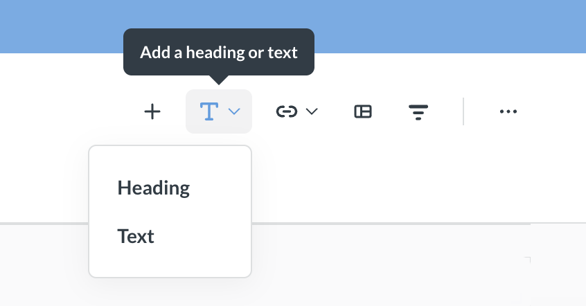
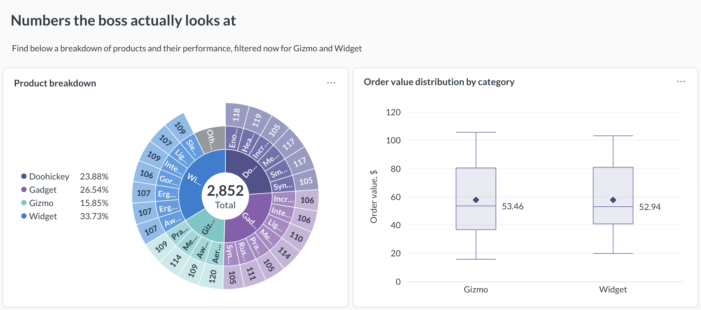
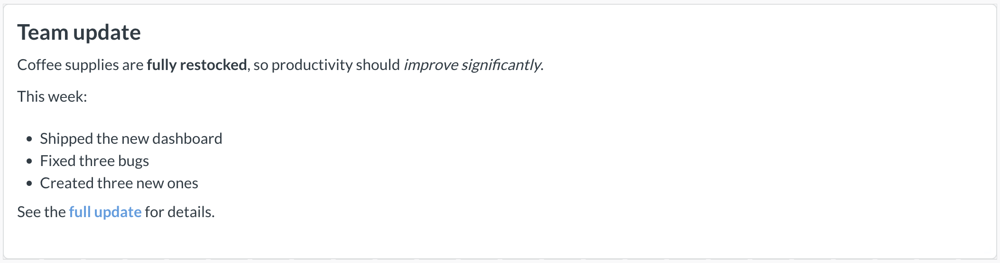
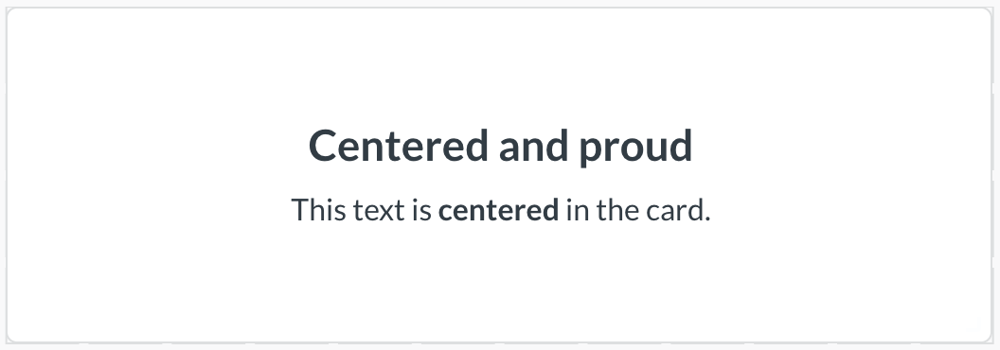
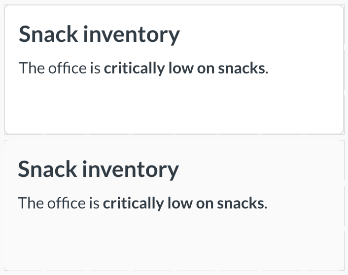

# Dashboard heading and text cards

Add heading and text cards to your dashboards to label sections, link to other content, display images, and more.

## Add a heading or text card

To add a heading or text card to a dashboard:

1. Click the **pencil icon** to edit the dashboard.
2. Click the **text card button** in the top right.
3. Choose **Heading** or **Text**.



To move a card, click and drag it. To resize a card, click and drag the handle in its bottom right corner.

Click a card to edit the text. Click away from the card to preview the text.

## Heading cards

A heading card holds a single line of text. Use a heading card to title a dashboard or label a section of charts.



A few things to know about heading cards:

- The text is always left-aligned.
- The text stays the same size, regardless of how you resize the card.
- You can't use Markdown in heading cards. Markdown syntax renders as plain text.

You can add a filter value to a heading card using a variable. See [Add filter values to a card](#add-filter-values-to-a-card).

## Text cards

A text card displays text you write in Markdown. Add formatting like bold text, lists, links, and images.



### Change a text card's alignment

You can set how text sits inside a text card. Open the card's **Visualization options** to choose its alignment:

- **Horizontal alignment:** Left, Center, or Right.
- **Vertical alignment:** Top, Middle, or Bottom.



### Remove a text card's background

By default, a text card has a white background. To remove the background, open the card's **Visualization options** and disable the **Show background** toggle.

Here's the same card with its background on (top) and off (bottom):



## Add filter values to a card

You can show the value of a dashboard filter inside a heading or text card. This lets you write text that updates when someone changes the filter.

For example, a card might contain:

```text

Our revenue over {{Date}}:

```

Then, when someone selects "Previous 30 days" in the connected filter, the card displays:


To add a filter value to a card:

1. [Add a filter](../dashboards/filters.md) to your dashboard.
2. Add a variable to your card by wrapping a name in double braces, like `{{Date}}`.
3. Connect the filter to the card's variable.

## Add an image

If your admin has [allowed domains for images](../configuring-metabase/settings.md#allowed-domains-for-images), you can add an image to a dashboard. Add a text card and use Markdown image syntax:

```text

```

You can't upload an image to Metabase, only link to images hosted elsewhere.