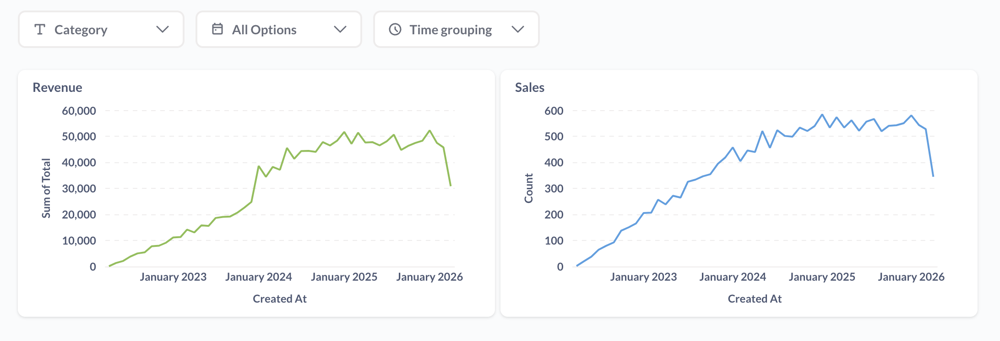
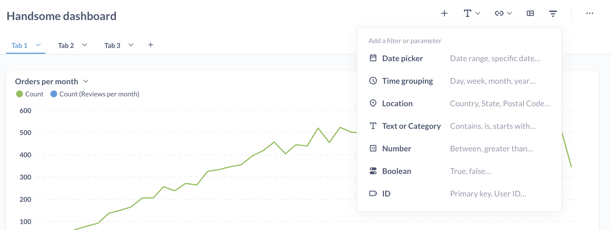
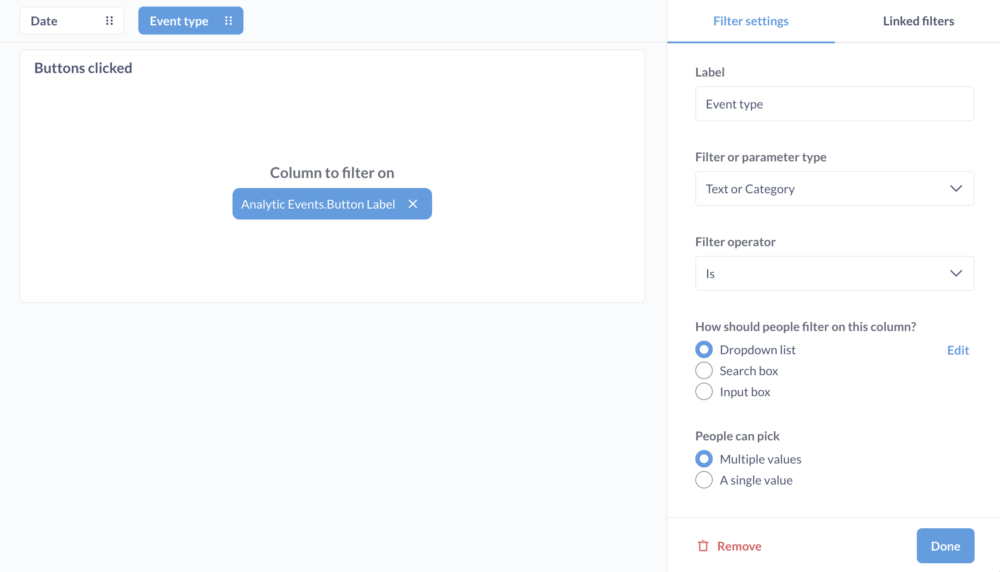
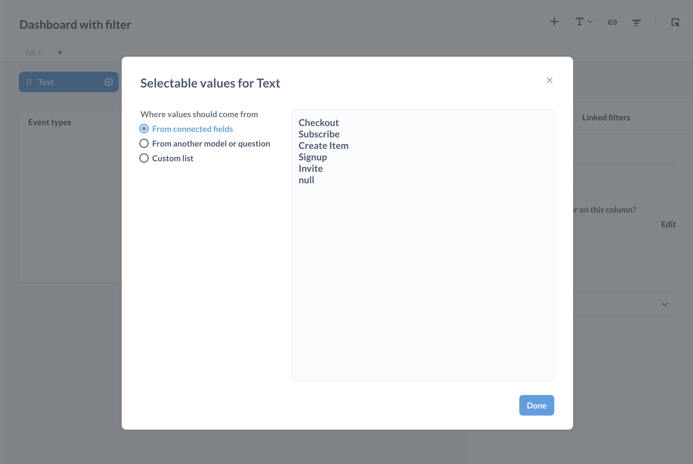
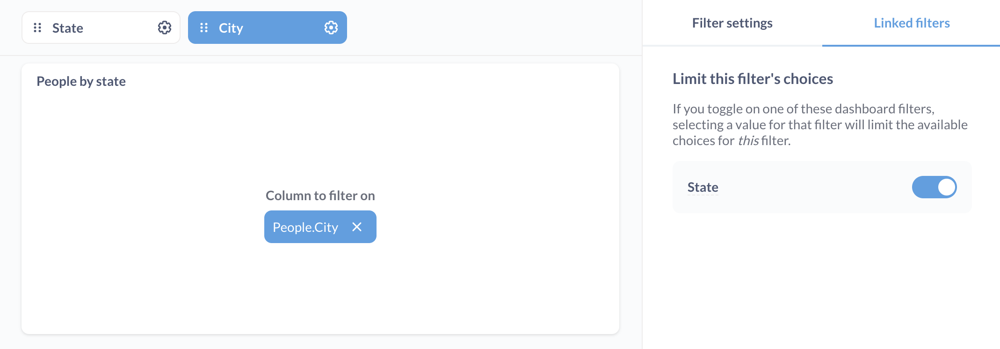
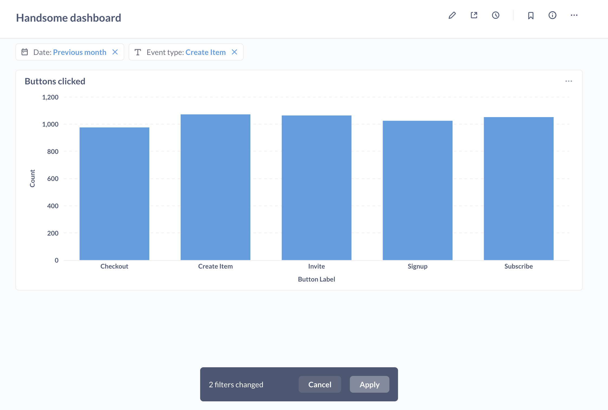
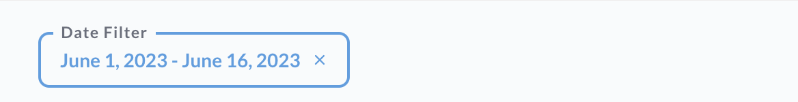

# Dashboard filters

Have you ever found yourself in a situation where it seems like you need to create nearly identical copies of the same dashboard, with just one different variable? Maybe you have an Earnings dashboard, but you want to see the data for each city your business is in, or maybe you have a KPI dashboard that you want to see broken out by month.

Instead of creating duplicate dashboards, you can add filter widgets to let people change variables for cards on a dashboard.

## Adding a new filter

- Click the **pencil icon** to enter dashboard editing mode.
- Click the **filter icon** that appears in the top-right to add a filter.
- Select a [filter type](#filter-types).
- [Connect your filter](#connecting-a-filter-to-dashboard-cards) to one or more dashboard cards on any or all tabs.
- [Configure your filter](#editing-a-filter).
- **Save** your changes.

Metabase will display the filter only if the filter is connected to a card on the current dashboard tab.

## Filter types

You can choose from a number of filter types:

- [Time](#time-filters)
- [Location](#location-filters)
- [ID](#id-filter)
- [Number](#number-filter)
- [Text or categories](#text-or-category-filter)

The type of filter you choose will determine how the filter works, as well as which fields you’ll be able to filter your cards by.

### Time filters

When picking a Time filter, Metabase will prompt you to pick a specific type of filter widget:

- Month and Year
- Quarter and Year
- Single Date
- Date Range
- Relative Date
- All Options

Single Date and Date Range will provide a calendar widget, while the other options all provide slightly different dropdown interfaces for picking values. To get a widget that's just like the time filter in the query builder, choose All options.

### Location filters

There are four types of Location filters to choose from:

- City
- State
- ZIP or Postal Code
- Country

### ID filter

The ID filter provides a simple input box where you can type the ID of a user, order, etc.

### Number filter

You can choose from:

- Equal to
- Not equal to
- Between
- Greater than or equal to
- Less than or equal to

### Text or category filter

A flexible filter type that will let you create either a dropdown menu or an input box to filter on any category field in your cards. Options include:

- **Is**. Select one or more values from a list or search box. Use **Is** when you just want to plug a value into a variable. For multiple values, the card must be either a question built using the query builder, or a native/SQL question using a [field filter](../questions/native-editor/sql-parameters.md#the-field-filter-variable-type).
- **Is not**. Exclude one or more specific values.
- **Contains**. Match values that contain the entered text.
- **Does not contain**. Filter out values that contain the entered text.
- **Starts with**. Match values that begin with the entered text.
- **Ends with**. Match values that end with the entered text.

## Connecting a filter to dashboard cards

Dashboard filters apply across all [dashboard tabs](./introduction.md#dashboard-tabs), though for each filter you add, you'll need to tell Metabase which column the filter should update for each card.

Click on a card's dropdown menu to select the field that you want the widget to filter on.

Here we've wired up a Text filter to the "Event types" card, telling Metabase that the column to filter on should be the `Analytics.Event.Button.Label` field:

## Auto-connecting filters to cards

If there are other cards that also have the field you select, Metabase will automatically connect the filter to those cards too (including to relevant cards on other tabs). If you later add a card with the selected field, Metabase will also try to connect that filter to the new card.

To undo this auto-connecting of cards, click on the toast that pops up when Metabase auto-connects the cards, or manually disconnect the cards by clicking on the "X" next to the connected field.

## Filtering dashboards with native/SQL questions

If you're trying to connect a filter to a card with a native/SQL questions, you'll need to [add a variable or field filter to your query](../questions/native-editor/sql-parameters.md). For an in-depth article, check out [Adding filters to dashboards with SQL questions](https://www.metabase.com/learn/dashboards/filters).

## Wiring up dashboard filters to text cards

You can even wire up filters to text cards, but only if [the text card includes a variable](./introduction.md#including-variables-in-text-cards).

## Requiring a filter

You can tell Metabase to require a filter so that people _must_ filter the dashboard by a certain column on a card. If you require a filter, you'll also need to supply a default value for that filter.

You might want to require a filter value if:

- Your unfiltered dashboard contains questions that pull lots of data, as enforcing filtered data can prevent people from inadvertently querying tons of data and running up your data warehouse costs.
- The questions on your dashboard don't make sense without a filter. For example, if you create a dashboard intended to view data relevant to a specific customer (as opposed to all customers), you can require a customer ID so that the dashboard only loads data for a particular customer.

## Editing a filter

To edit a filter's settings:

1. Click the **pencil** icon to enter dashboard editing mode.
2. Click the **gear** icon on the filter you want to edit.

From this filter editing view, you can wire up dashboard cards to the filter, or use the filter settings sidebar to:

- [Rename filter](#rename-filter)
- [Set filter input type](#set-filter-input-type)
- [Set a default filter value](#set-a-default-filter-value)
- [Remove a filter](#remove-a-filter)
- [Reorder filters](#reorder-filters)
- [Make a multi-select filter](#make-a-multi-select-filter)
- [Change a filter's selectable values](#change-a-filters-selectable-values)

### Rename filter

1. In dashboard edit mode, click your filter's **gear** icon.
2. Change the label text.

Renaming the filter only affects the filter's display; the label has no effect on which columns Metabase filters.

### Set filter input type

1. In dashboard edit mode, click your filter's **gear** icon.
2. From the filter settings sidebar, set **How should people filter on this column?**:

- [Dropdown list](#dropdown-list)
- [Search box](#search-box)
- [Input box](#plain-input-box)

#### Dropdown list

A list of all of the possible values in a column. People can use checkboxes to select more than one value on [multi-select filters](#make-a-multi-select-filter). You should choose the dropdown widget if you want the list of filter values to load instantly (from cache).

If you're not seeing the **Dropdown list** option, and your dashboard filter is based on a column from a:

- Table or GUI model: an admin will need to [enable the dropdown widget](../data-modeling/metadata-editing.md#changing-a-search-box-filter-to-a-dropdown-filter) for that column from Metabase's **Admin settings**.
- SQL model: go to your [model's metadata settings](../data-modeling/models.md#add-metadata-to-columns-in-a-model), find your column, and set the **Database column this maps to**.

#### Search box

A search box that suggests a list of matching filter values as you type. The suggestion list will display checkboxes for [multi-select filters](#make-a-multi-select-filter).

The search box is a good choice for most columns containing labels, categories, statuses, and so on. It's is the default filter widget for columns with less than 100 unique values.

#### Plain input box

An input box that lets people enter plain text (no suggestion list).

Useful for looking up partial matches (such as the ["contains" filter](#text-or-category-filter)) in columns that contain free text, such as comments or descriptions. The input box is the default filter widget for columns with more than 100 unique values.

### Set a default filter value

1. In dashboard edit mode, click your filter's **gear** icon.
2. From the sidebar, choose a value from the **Default value** input field.

For example, you might want to set a default filter value like "Active", so that when people load your dashboard, they only see data for "Active" records (not "Inactive", "Cancelled", etc).

### Remove a filter

1. In dashboard edit mode, click your filter's **gear** icon.
2. From the sidebar, click **Remove**.

If you accidentally remove a filter, just click **Cancel** in the top-right to exit dashboard edit mode without saving your changes.

### Reorder filters

In dashboard edit mode, click on the grabber handle (six dots) on the left side of a filter widget, then drag the widget to a different position.

### Make a multi-select filter

1. In dashboard edit mode, click your filter's **gear** icon.
2. From the sidebar, find **People can pick** and select "Multiple values".

A multi-select filter with the widget type [Dropdown list](#dropdown-list) or [Search box](#search-box) will display a list of values with checkboxes.

### Change a filter's selectable values

1. In dashboard edit mode, click your filter's **gear** icon.
2. From the sidebar, find **How should users filter on this column?**.
3. Select "Dropdown list".\*
4. Click **Edit** (to the right of "Dropdown list") to specify where the values should come from:
   - From connected fields
   - From another model or question
   - Custom list

\* If you don't see "Dropdown list" as an option, go to [Filter widgets: Dropdown list](#dropdown-list) for more info.

## Linking filters

You can also **link filters** so that a child filter knows to limit its choices based on the activation of a parent filter.

Say you have two filters, one to filter by state, the other to filter by city. You can link the city filter to the state filter so that when someone filters by California, the city filter will "know" to only show cities in California. In this case, state is the parent filter, and city is the child filter.

To link filters, you'll need to set up this parent-child relationship. And you set up this relationship through the child filter. In the above scenario, with a state and city filter, we'd edit the child filter, city, by clicking on the **gears** icon on the city filter. From the filter sidebar on the right, select the **Linked filters** tab.

Here you can limit the current filter's choices. If you toggle on one of these dashboard filters, selecting a value for that filter will limit the available choices for this filter. In this case, we toggle on the state filter (the parent), to limit the choices for the city filter. When states are selected, the city filter will limit its choices to cities in those states. Click **Done**, then **Save** to save the dashboard.

### Limitations of linking filters

- Native/SQL questions must have a [field filter](../questions/native-editor/sql-parameters.md#the-field-filter-variable-type) variable in order to be linked. Regular SQL variables won't work.
- You can't link filters that use "Custom List" or "From another model or question" as their value's source.

To learn more about linked filters, check out [Linking filters in dashboards](https://www.metabase.com/learn/dashboards/linking-filters).

## Auto-apply filters

By default, each time you change the value in a filter on a dashboard, the dashboard will refresh to get the results of each card with that new filter value applied.

If a dashboard is particularly large or slow, or you have multiple filters that you want to adjust before the dashboard refreshes its results, you may want to tell Metabase when to apply those filters and refresh the dashboard.

To turn off the automatic application of filters, click on the info **i** icon, and toggle the **Auto-apply filters** option. With auto-apply turned off, each time you change a value in a filter, you'll need to click the **Apply** button to refresh the dashboard with the new filter value.

## Using filter widgets

Once you’ve added a filter to your dashboard, just click on the filter widget to select a value and activate the filter. To stop filtering, just click the blue X.

Your active filter will only apply to your view of the dashboard. If someone else is viewing the same dashboard link at the same time, they won't see your filter.

You can also set up a dashboard question to [update a filter on click](./interactive.md#use-a-chart-to-filter-a-dashboard).

## Further reading

- [Introduction to dashboards](./introduction.md)
- [Interactive dashboards](./interactive.md)
- [Dashboard subscriptions](./subscriptions.md)
- [Charts with multiple series](./multiple-series.md)
- [Learn dashboards](https://www.metabase.com/learn/dashboards)
