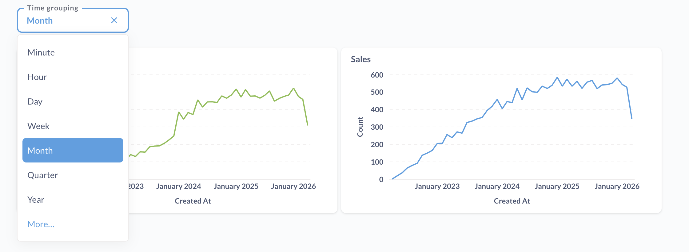

# Dashboard filters and parameters

Instead of creating duplicate dashboards to show different cuts of the same data (like a different dashboard for each quarter), you can add filter or parameter widgets to let people change _what_ data is displayed (filter the data), or _how_ it's displayed (parameterize the data).

## Filter and parameter widgets

There are two basic types of widgets you can add. The type of filter or parameter widget you choose determines how the widget works, including which fields you can connect to the widget.

### Filter widgets

**Filters** determine _what_ data to show. For example, a date filter might show only data from the last 30 days, or a category filter might show only specific product categories.

- [Date picker](#date-picker-filters)
- [Location](#location-filters)
- [ID](#id-filter)
- [Number](#number-filter)
- [Text or category](#text-or-category-filter)
- [Boolean](#boolean-filter)

### Parameter widgets

**Parameters** determine _how_ to show the data. The time grouping parameter, for example, changes the granularity of time-based visualizations (like showing data by month instead of by day) without removing any data points.

- [Time grouping](#time-grouping-parameter)

## Adding a filter or parameter widget

1. Click the **pencil icon** to enter dashboard editing mode.
2. You can add a filter or parameter widget to:

   - **The whole dashboard**. You'll need to connect these dashboard-level filters to individual cards. Metabase will only display dashboard-level widgets if they're connected to a card on the current tab.
   - **Heading cards**. Not text cards, only [heading cards](./introduction.md#adding-headings-or-descriptions-with-text-cards). Can only be connected to cards on the current tab.
   - **Question cards**. Can only be connected to cards on the current tab.

   Go to where you want to add a filter and click the **filter icon**.

3. Select a [filter type](#filter-and-parameter-widgets).
4. [Connect your filter or parameter widget to one or more dashboard cards](#connecting-a-filter-or-parameter-widget-to-dashboard-cards). Only dashboard-level widgets can be connected to cards on multiple tabs.
5. [Configure your filter](#editing-a-filter).
6. **Save** your changes.

If the filter isn't connected to any of the cards on the current tab, Metabase won't display the filter.

### When to add a widget to a heading or card

These are just rules of thumb to keep the user experience predictable. Do whatever works for your use case.

By default, you should add widgets to the dashboard itself.

If, however, your dashboard grows larger, and it doesn't make sense to break the dashboard up into multiple dashboards, you can add widgets to headings and cards so people can filter in place as they scroll through sections. In these cases, you should scope the effects of a heading widget to the section immediately below. Filters on cards should generally only update the card itself.

If you want tab-specific widgets, you could either:

- Add them to the dashboard itself, but only connect the widget to cards on a specific tab.
- Use a heading filter.

## Date picker filters

When picking a Date picker filter, Metabase will prompt you to pick an operator:

- Month and Year
- Quarter and Year
- Single Date
- Date Range
- Relative Date
- All Options

Single Date and Date Range will provide a calendar widget, while the other options provide slightly different dropdown interfaces for picking values. To get a widget that's just like the date picker in the query builder, choose "All Options".

### Issues with connecting to a date variable

If you get a message like "A date variable in this card can only be connected to a time type with the Single date option," you can handle it in a couple of ways.

- **If you want a date picker where people can select multiple dates**, you'll need to change the variable in your SQL code to a [field filter](../questions/native-editor/field-filters.md).
- **If you want the filter widget to just take a single date**, you'll need to change the dashboard filter widget's type to "Single date".

## Time grouping parameter

You can add a time grouping widget to a dashboard to change how charts are grouped by time. This widget won't filter the data; it'll change how Metabase aggregates the data. For example, you may want to look at the time series charts grouped by month by default, but give people the option to view the same results by other groupings: by week, by quarter, and so on.

This widget doesn't filter data in the charts; the widget just changes the time granularity for any cards that have a datetime field connected to the widget.

Grouping options include:

- Minute (or minute of hour)
- Hour (or hour of day)
- Day (or day of week, month, or year)
- Week (or week of year)
- Month (or month of year)
- Quarter (or quarter of year)
- Year

To connect a time grouping widget to a SQL question, you'll need to insert time grouping parameters in your code. See [time grouping parameters](../questions/native-editor/time-grouping-parameters.md).

## Location filters

There are four types of Location filters to choose from.

- City
- State
- ZIP or Postal Code
- Country

Additionally, you can select an operator for the location filter:

- **Is**. Select one or more values from a list or search box. Use **Is** when you just want to plug a value into a variable. For multiple values, the card must be either a question built using the query builder, a native/SQL question using a [field filter](../questions/native-editor/field-filters.md), or a basic variable set to accept [multiple values](../questions/native-editor/basic-sql-parameters.md#basic-variable-that-allows-people-to-select-multiple-values).
- **Is not**. Exclude one or more specific values.
- **Contains**. Match values that contain the entered text.
- **Does not contain**. Filter out values that contain the entered text.
- **Starts with**. Match values that begin with the entered text.
- **Ends with**. Match values that end with the entered text.

## ID filter

The ID filter provides a simple input box where you can type the ID of a user, order, and so on.

You can give people the option to pick one value or multiple values.

## Number filter

You can choose from:

- Equal to
- Not equal to
- Between
- Greater than or equal to
- Less than or equal to

## Text or category filter

A flexible filter type that lets you create either a dropdown menu or an input box to filter on any text or category field in your cards. Options include:

- **Is**. Select one or more values from a list or search box. Use **Is** when you just want to plug a value into a variable. For multiple values, the card must be a question built using the query builder, a native/SQL question using a [field filter](../questions/native-editor/field-filters.md), or a basic variable set to [multiple values](../questions/native-editor/basic-sql-parameters.md#basic-variable-that-allows-people-to-select-multiple-values).
- **Is not**. Exclude one or more specific values.
- **Contains**. Match values that contain the entered text.
- **Does not contain**. Filter out values that contain the entered text.
- **Starts with**. Match values that begin with the entered text.
- **Ends with**. Match values that end with the entered text.

You can also select how people should filter on this column:

- Dropdown list
- Search box
- Input box

## Boolean filter

A boolean filter allows people to filter data based on true/false values.

## Connecting a filter or parameter widget to dashboard cards

For each widget that you add, you'll need to tell Metabase which column the filter should update for each card.

Click a card's dropdown menu to select the field that you want the widget to filter on.

Here we've wired up a text filter to the "Event types" card, telling Metabase that the column to filter on should be the `Analytics.Event.Button.Label` field:

Which cards you can connect a filter or parameter widget to depends on:

- Whether the card has a relevant field (i.e., the field the widget is filtering).
- Where the widget is located: on the dashboard, heading card, or question card. Only dashboard widgets can be connected to cards across all [dashboard tabs](./introduction.md#dashboard-tabs). Widgets on heading and question cards are restricted to the cards on their respective tabs.

For cards built in the query builder, _filters_ can be connected to fields at any stage of the query. _Time grouping parameters_ can only be connected to fields in the last stage of the query, and so to make use of time grouping parameters, your query should have a summary by a datetime field as the last stage. For example, if you have a query that's just computing `Count` of products by `Category` and `Created At`, you'll be able to connect the time grouping parameter to the `Created At` grouping, but if you modify the query to filter for results with `Count > 100`, you won't be able to connect time grouping parameter on a dashboard to that query because the last stage is now a filter.

## Filtering dashboards with native/SQL questions

To connect a dashboard filter widget to a card with a question created with the native editor, you'll need to [add a field filter or basic variable to your query](../questions/native-editor/sql-parameters.md).

For parameters, check out [Time grouping parameters](../questions/native-editor/time-grouping-parameters.md).

## Auto-connecting filters to cards

If there are other cards that also have the field you select, Metabase will offer to automatically connect the filter to those cards too (including relevant cards on other tabs). If you later add a card with the selected field, Metabase will also try to connect that filter to the new card.

To undo this auto-connecting of cards, click the notification that pops up when Metabase auto-connects the cards, or manually disconnect the cards by clicking the "X" next to the connected field.

## Wiring up dashboard filters to text cards

You can even wire up filters to text cards, but only if [the text card includes a variable](./introduction.md#including-variables-in-text-cards).

## Requiring a filter or parameter

You can tell Metabase to require a filter so that people _must_ filter the dashboard by a certain column on a card. If you require a filter, you'll also need to supply a default value for that filter.

You might want to require a filter value if:

- Your unfiltered dashboard contains questions that pull lots of data, as enforcing filtered data can prevent people from inadvertently querying tons of data and running up your data warehouse costs.
- The questions on your dashboard don't make sense without a filter. For example, if you create a dashboard intended to view data relevant to a specific customer (as opposed to all customers), you can require a customer ID so that the dashboard only loads data for a particular customer.

## Editing a filter

To edit a dashboard filter's settings:

1. Click the **pencil** icon to enter dashboard editing mode.
2. Click the filter you want to edit.

From this filter editing view, you can wire up dashboard cards to the filter, or use the filter settings sidebar to:

- [Rename filter](#rename-filter)
- [Set filter input type](#set-filter-input-type)
- [Set a default filter value](#set-a-default-filter-value)
- [Remove a filter](#remove-a-filter)
- [Reorder filters](#reorder-filters)
- [Make a multi-select filter](#make-a-multi-select-filter)
- [Change a filter's selectable values](#change-a-filters-selectable-values)

### Rename filter

1. In dashboard edit mode, click the filter you want to edit.
2. Change the label text.

Renaming the filter only affects the filter's display; the label has no effect on which columns Metabase filters.

### Set filter input type

1. In dashboard edit mode, click the filter you want to edit.
2. From the filter settings sidebar, set **How should people filter on this column?**:

- [Dropdown list](#dropdown-list)
- [Search box](#search-box)
- [Input box](#plain-input-box)

#### Dropdown list

A list of all the possible values in a column. People can use checkboxes to select more than one value on [multi-select filters](#make-a-multi-select-filter). If you want the list of filter values to load instantly (from cache), you should choose the dropdown widget.

If you're not seeing the **Dropdown list** option and your dashboard filter is based on a column from a:

- Table or model built with the query builder: an admin will need to [enable the dropdown widget](../data-modeling/metadata-editing.md#changing-a-search-box-filter-to-a-dropdown-filter) for that column from Metabase's **Admin settings**.
- Model built with a SQL query: go to your [model's metadata settings](../data-modeling/models.md#add-metadata-to-columns-in-a-model), find your column, and set the **Database column this maps to**.

#### Search box

A search box that suggests a list of matching filter values as you type. The suggestion list will display checkboxes for [multi-select filters](#make-a-multi-select-filter).

The search box is a good choice for most columns containing labels, categories, statuses, and so on. It's the default filter widget for columns with fewer than 100 unique values.

#### Plain input box

An input box that lets people enter plain text (no suggestion list).

Useful for looking up partial matches (such as the ["contains" filter](#text-or-category-filter)) in columns that contain free text, such as comments or descriptions. The input box is the default filter widget for columns with more than 100 unique values.

### Set a default filter value

1. In dashboard edit mode, click the filter you want to edit.
2. From the sidebar, choose a value from the **Default value** input field.

For example, you might want to set a default filter value like "Active," so that when people load your dashboard, they only see data for "Active" records (not "Inactive," "Canceled," and so on).

### Remove a filter

1. In dashboard edit mode, click the filter you want to edit.
2. From the sidebar, click **Remove**.

If you accidentally remove a filter, just click **Cancel** in the top-right to exit dashboard edit mode without saving your changes.

### Reorder filters

In dashboard edit mode, click the grabber handle (six dots) on the left side of a filter widget, then drag the widget to a different position.

### Make a multi-select filter

1. In dashboard edit mode, click the filter you want to edit.
2. From the sidebar, find **People can pick** and select "Multiple values".

A multi-select filter with the widget type [Dropdown list](#dropdown-list) or [Search box](#search-box) will display a list of values with checkboxes.

### Change a filter's selectable values

1. In dashboard edit mode, click the filter you want to edit.
2. From the sidebar, find **How should users filter on this column?**.
3. Select "Dropdown list".\*
4. Click **Edit** (to the right of "Dropdown list") to specify where the values should come from:
   - From connected fields
   - From another model or question
   - Custom list

\* If you don't see "Dropdown list" as an option, go to [Filter widgets: Dropdown list](#dropdown-list) for more info.

## Linking filters

See [Linked filters](linked-filters.md).

## Auto-apply filters

By default, each time you change the value in a filter on a dashboard, the dashboard will refresh to get the results of each card with that new filter value applied.

If a dashboard is particularly large or slow, or you have multiple filters that you want to adjust before the dashboard refreshes its results, you may want to tell Metabase when to apply those filters and refresh the dashboard.

To turn off the automatic application of filters:

1. View the dashboard (not in edit mode) and click the three-dot menu **...**.
2. Select **Edit settings**.
3. In the **General** section, toggle off **Auto-apply filters**.

With auto-apply turned off, each time you change a value in a filter, you'll need to click the **Apply** button to refresh the dashboard with the new filter value.

## Using filter widgets

Once you've added a filter to your dashboard, click the filter widget to select a value and activate the filter. To stop filtering, click the blue X.

Your active filter will only apply to your view of the dashboard. If someone else is viewing the same dashboard link at the same time, they won't see your filter.

You can also set up a dashboard question to [update a filter on click](./interactive.md#use-a-chart-to-filter-a-dashboard).

## Further reading

- [Introduction to dashboards](./introduction.md)
- [Interactive dashboards](./interactive.md)
- [Dashboard subscriptions](./subscriptions.md)
- [Charts with multiple series](./multiple-series.md)
- [Learn dashboards](https://www.metabase.com/learn/metabase-basics/querying-and-dashboards/dashboards)
