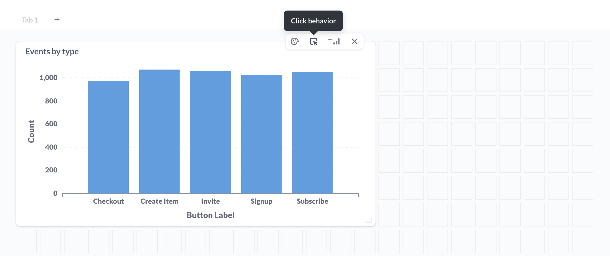
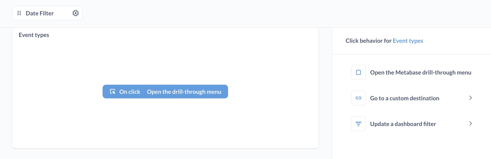
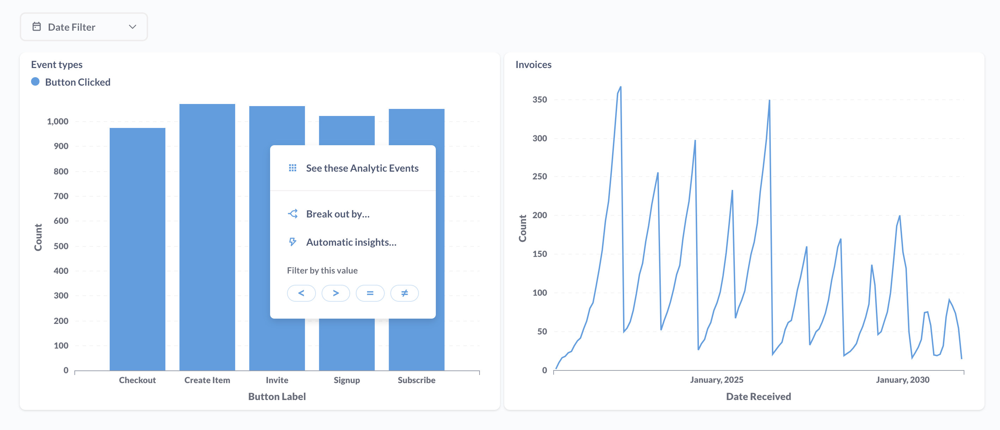
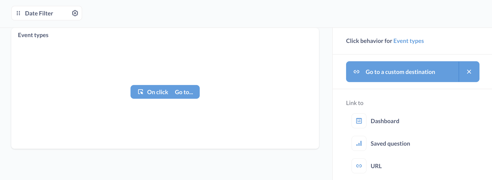
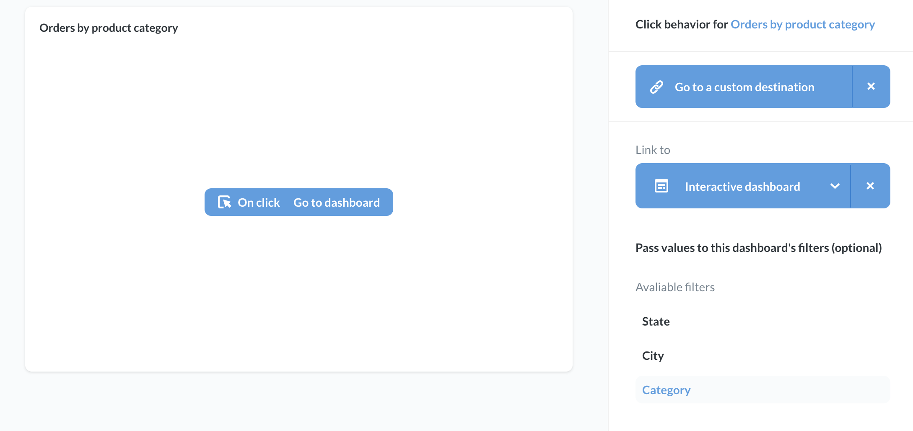
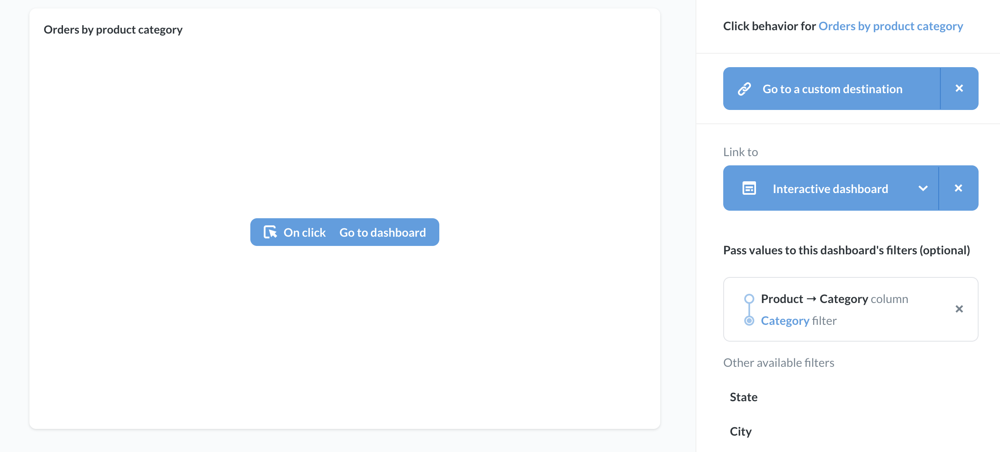
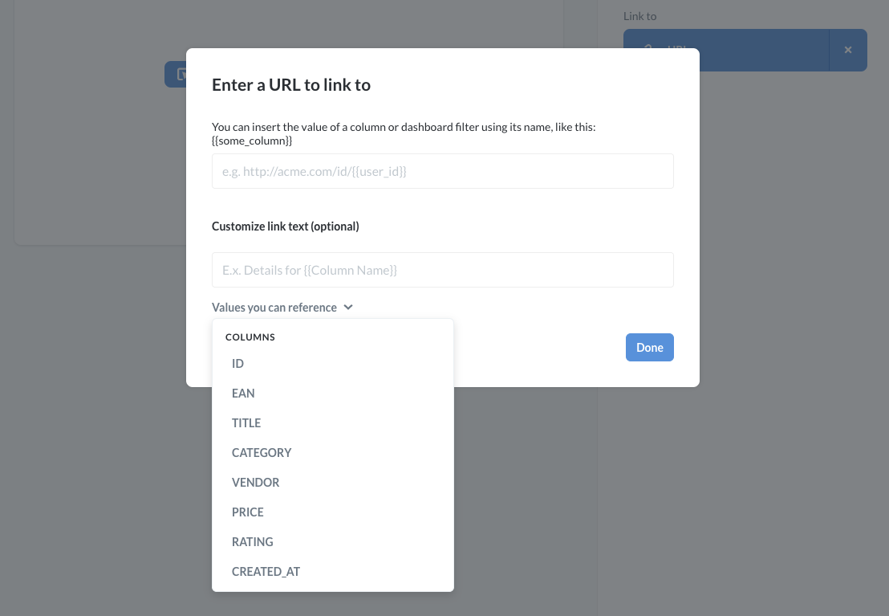
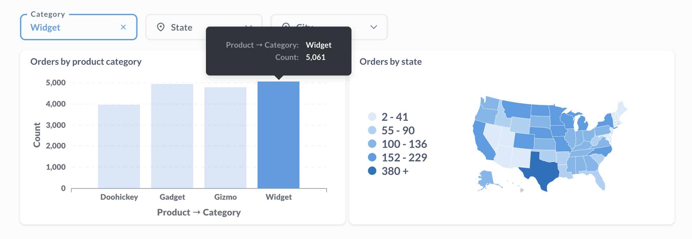
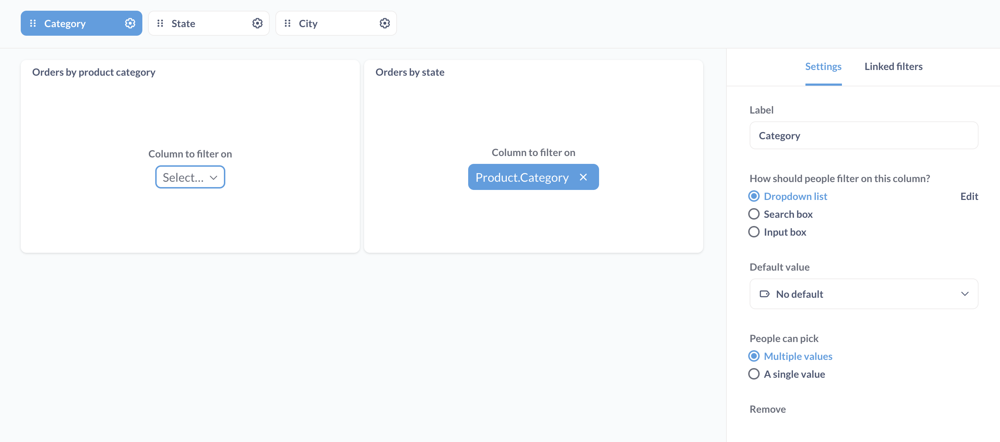
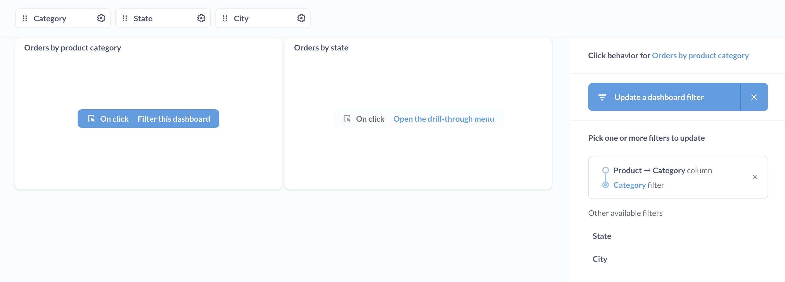

# Interactive dashboards

You can customize what happens when people click on questions in your dashboard.

By default, when you create charts using Metabase's graphical query builder, your charts automatically come with [drill-through capabilities](https://www.metabase.com/learn/questions/drill-through), which let folks click on a chart to explore further. But if you have a more customized click path in mind, Metabase allows you to customize what happens when a user clicks on a chart or table in your dashboard.

You can set up a dashboard card to:

- Send the user to a [custom destination](#custom-destinations): a dashboard, question, or custom URL.
- [Update a dashboard filter](#use-a-chart-to-filter-a-dashboard).

To configure this interactivity, you'll use the **click behavior** option on a dashboard card.

## Customizing click behavior

From your dashboard, first click on the **pencil** icon to enter dashboard edit mode.

If you hover over the card that contains question you want to customize, Metabase will display a menu at the top right of that card containing these options, from left to right:

- **Visualization options**: This icon looks like a painter's palette.
- **Click behavior**: This is the icon with the mouse cursor clicking on a card.
- **Add series**: If your question has a visualization to which you can add an [additional series](./multiple-series.md) (like a line or bar chart), you'll see this icon as a **+** next to a small representation of that chart type. Not all cards will show this option.
- **Remove**: This icon is an **X**. Selecting this will remove your question from the dashboard.

Select the **Click behavior** option.



Metabase will slide out the **Click behavior sidebar**:



For questions composed using the query builder, you can select from three options:

- Open the Metabase drill-through menu.
- Go to a custom destination.
- Update a dashboard filter (if the dashboard has a filter).

SQL questions will only have the option to **Go to a custom destination**, and **Update a dashboard filter**, as the drill-through menu is only available to questions composed with the query builder.

If your dashboard has a filter, you'll also see an option to [update the filter](#use-a-chart-to-filter-a-dashboard).

## Open the drill-through menu

For questions composed using the query builder, the default click behavior is to open the **drill-through menu**, which presents people with the option to [drill through the data](https://www.metabase.com/learn/questions/drill-through):



## Custom destinations

You can set custom destinations for all questions, including SQL questions.



Possible destinations include:

- Dashboards
- Saved questions
- URLs

Internal Metabase destinations (dashboards or saved questions) will load in the same browser tab or window. External URLs will open in a new tab or window.

## Passing values to the destination

If you're linking to a dashboard or a SQL question that has filters, you can pass values from the current dashboard to filters in the destination.

For example, if you link to a dashboard that has a filter for `Category`, you can pass a value for `Category` from the origin question to the destination dashboard:



Once you select the column that contains the value you want to pass, the sidebar will display the column used to pass the value, as well as the target filter at the destination that Metabase will pass the value to:



In the example above, when a user clicks on the **Orders by product category** card, Metabase will pass the clicked `Product -> Category` to the destination dashboard ("Interactive Dashboard"), which will then filter its cards by that `Category`.

You can also send the currently selected value of a dashboard filter on the current dashboard to the destination. In [some plans](https://www.metabase.com/pricing), you can pass a user attribute provided by SSO to the destination, too. Those user attributes will show up as options when you click on one of the destination's filters (provided the values are compatible with that filter).

When displaying questions as tables, you can select different click behaviors for different columns in the table. You can also modify the contents of the cells in a given column, replacing the value with custom text. For example, if you had a column that listed categories, you could change the text in the cell to read: "Click for details about {{Category}}", where `Category` is the name of your column.

You can also use values to construct URLs to external resources.



From the **Click behavior** sidebar, select **Go to a custom destination** and link to **URL**. The **Enter a URL to link to** modal will pop up, allowing you to specify a URL, as well as a column or dashboard filter.

What we need to do here is to type in the full URL of where a user should go when they click on a value in a card. But the really powerful thing we can do is to include variables in the URL. These variables will insert the value that the user clicks on into the URL.

For example, we could type a URL like this:

 ```
 https://www.metabase.com/search.html?query={{Category}}
 ```

 The important part is the `{{Category}}` bit. What we’re doing here is referring to the `Category` that the user clicked on. So if a user clicks on the `Widget` bar in our chart, the value of the `Category` column for that bar (`Widget`) would be inserted into our URL: `https://www.metabase.com/search.html?query=Widget`. Your URL can use as many column variables as you want - you can even refer to the same column multiple times in different parts of the URL. Click on the dropdown menu **Values you can reference** to see your options for which variables you can include in the URL.

Next we’ll click **Done**, then **Save** our dashboard. Now when we click our chart, we’ll be taken to the URL that we entered above, with the value of the clicked bar inserted into the URL.

To learn more, check out [Custom destinations: choose what happens when people click on charts in your dashboard](https://www.metabase.com/learn/building-analytics/dashboards/custom-destinations.html).

## Use a chart to filter a dashboard

If your dashboard contains at least one filter, you can set things up so that clicking on a chart in the dashboard will update a filter.

When a user clicks on, say, a bar in a bar chart, you could send the value of the clicked bar to the filter, and update cards across the dashboard. We call this functionality **cross-filtering**. You can use this cross-filtering to make a chart behave as kind of "navigation question" that filters data across other cards.

For example, clicking on the `Widget` bar will update the current dashboard's **category** filter to filter for `Widget`:



To set up cross-filtering, choose a dashboard filter that you'd like to update on click, and a question to use to update that filter. You can think of this question as your "navigation question." Instead of wiring this navigation question up to the filter, you'll [wire up every other question on the dashboard to the filter](./filters.md).

Below, we'll use the **Orders by product category question** as our navigation question, so we'll leave this question disconnected from the filter, and connect all the other questions to the **Category** filter.



With your filter wired up, stay in dashboard edit mode, and hover over the question you want to use as your navigation question to filter the dashboard. Click on the **click behavior** icon, then select the **Update a dashboard filter**.

Metabase will list the filters you can update. Here we select the **Category** filter, and supply the value to that filter from the question's `Product -> Category` column.



Click **Done** in the sidebar, then **Save** your dashboard.

Now we can use our navigation question (Orders by product category) to interactively filter the data across your dashboard. When people click on a value in the navigation question, Metabase will send the clicked value to the filter, and update every card on the dashboard by filtering them for the clicked value - every card except for the navigation question: Orders by product category. The reason we don't want the navigation question to update is so that we can click on other bars to update the filter with a different value.

To learn more, check out [Cross-filtering: using a chart to update a dashboard filter](https://www.metabase.com/learn/building-analytics/dashboards/cross-filtering.html).
