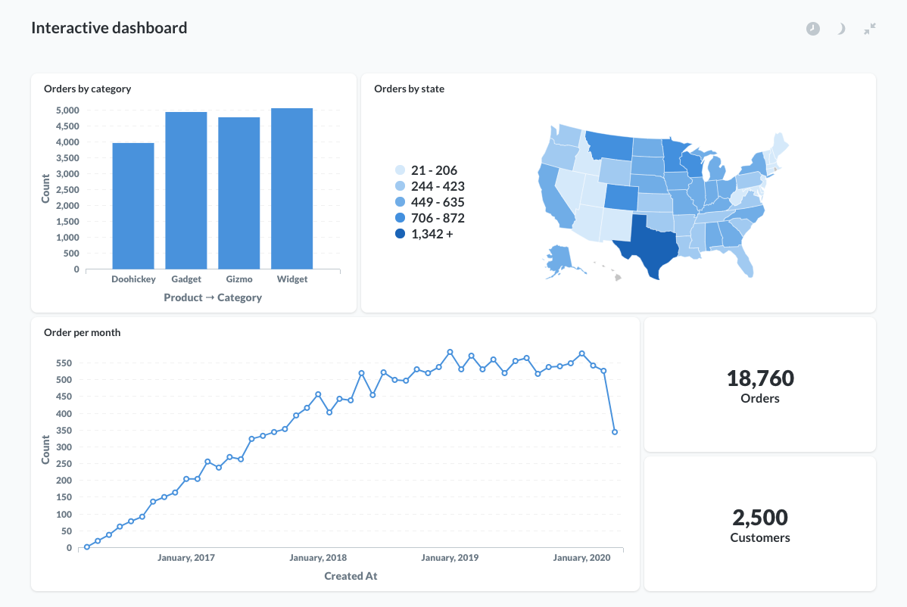
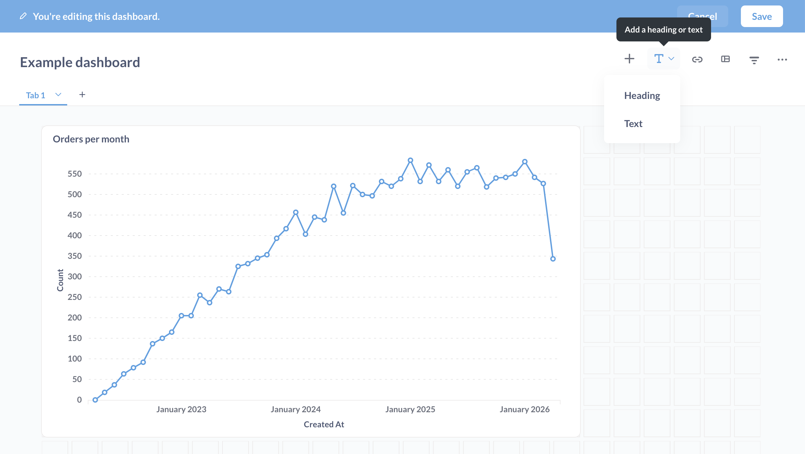
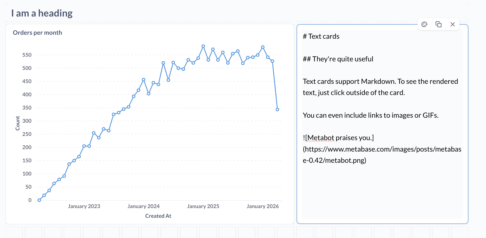
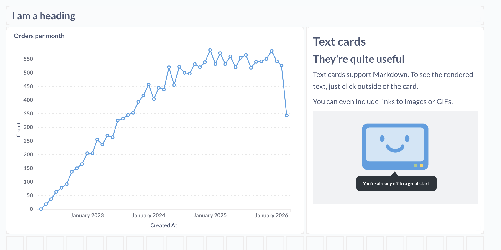
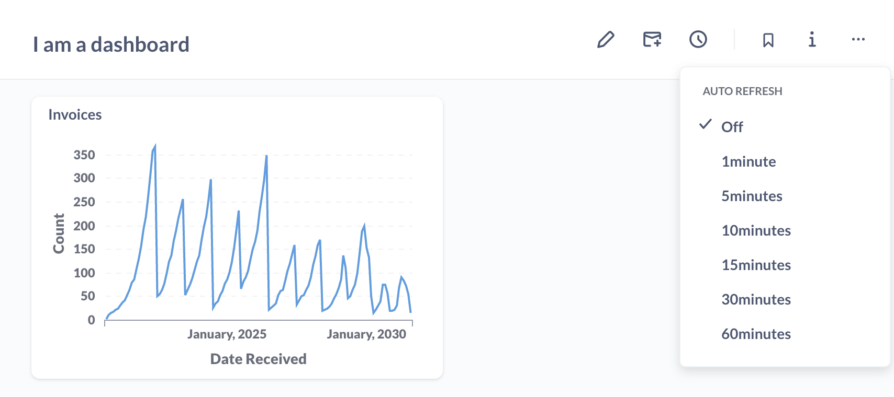
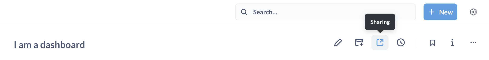

# Introduction to dashboards



## What is a dashboard?

**Dashboards** group questions and present them on a single page. You can think of dashboards as shareable reports that feature a set of related questions. You can set up [subscriptions to dashboards](./subscriptions.md) via email or Slack to receive the exported results of the dashboard's questions.

A dashboard comprises a set of cards arranged on a grid. These cards can be questions - such as [tables, charts, or maps](../questions/sharing/visualizing-results.md) - or they can be [text boxes](https://www.metabase.com/learn/dashboards/markdown).

You can add [filter widgets to dashboards](./filters.md) that filter data identically across multiple questions, and [customize what happens when people click on a chart or a table](./interactive.md).

You can make as many dashboards as you want. Go nuts.

## How to create a dashboard

In the top right of the screen, click the **+** icon to open the **Create** menu, and select **New Dashboard**. Give your new dashboard a name and a description, choose which [collections](../exploration-and-organization/collections.md) the dashboard should go in, then click **Create**, and Metabase will take you to your shiny new dashboard.

## Dashboard tabs

You can add multiple tabs to a dashboard to keep your cards organized.


Currently, you can't drag cards from tab to tab. If you want to move a card from one tab to the other, you'll need to remove the card from one tab, and then add the card to the other tab.

## Duplicating a dashboard

If you don't want to build a dashboard from scratch, or want to experiment by making changes to an existing dashboard without affecting the original, you can **duplicate** an existing dashboard.

To duplicate a dashboard, click on the **...** menu in the upper right of the dashboard, and select **Duplicate**.

By default, Metabase will create a new dashboard, with copies of the questions in the original dashboard (including the dashboard's tabs), and save everything to the collection you specify.

If you don't wish to copy the dashboard's underlying questions, check the box that says **Only duplicate the dashboard**. Metabase will copy the dashboard and refer to the original questions.

In both cases, duplication only includes the dashboard, its card layout, filters, and (optionally) the questions. What's not copied: dashboard subscriptions, or any sharing or embedding data settings. For example, if you copy a dashboard that has been made public, that copied dashboard will not be public by default.

## Adding saved questions to a dashboard

There are two ways to add questions to a dashboard: from the dashboard, or from the question you want to add.

- **From a question**: You can add a newly saved question to a dashboard directly from the modal that pops up after you save the question for the first time. You can also add a question to a dashboard by clicking on the ellipsis (**...**) at the top right of a question and selecting **Add to dashboard**.
- **From a dashboard**: Click on the **pencil** icon to **edit the dashboard**. Then click the **+** icon in the top right of the dashboard editing interface (not the **+** in the main navigation bar) to add any of your saved questions to the dashboard, regardless of which collection the questions are in.

> If your question is saved to your personal collection, you'll only be able to add that question to dashboards in your personal collection. If you want to add the question to a dashboard in a public collection, you'll need to move your question to that collection (or any other public collection).

Once you add a question to your dashboard, it’ll look something like this:


## Adding headings or descriptions with text cards

Another neat thing you can do is add heading and text cards to your dashboards. Text cards allow you to include descriptions, explanations, notes, or even images and GIFs to your dashboards. You can also use text cards to create separations between sections of charts in your dashboards, or include links to other dashboards, questions, or websites.

To add a new text card, create a new dashboard (or edit an existing one) and click on the text card button, **T**, in the top-right:



You have two options:

- **Heading**: a preformatted heading text card that spans the width of the dashboard.
- **Text**: a customizable text card that will render Markdown-formatted text.

Each text card has two modes: writing and previewing. When you click to focus on the card, the card will enter editing mode. When you click away from the card, Metabase will render the card to show you what it will look like on the live dashboard.



You can use [Markdown](http://commonmark.org/help/) to format the text in your text card, create inline tables or code snippets, or even embed linked images (easy on the GIFs, friends). To preview the rendered card, just click away from the card.



To learn more, see [Fun with Markdown in your dashboards](https://www.metabase.com/learn/dashboards/markdown).

### Including variables in text cards

You can include a variable in a text card, then wire that variable up to a dashboard filter. All you need to do to create a variable is to wrap a word in double braces, `{{` and `}}` (the variable can't contain any spaces). For example, you could add a text card with the following text:

```

# {{state}} orders

```

And connect that variable to a dashboard filter widget that filters for states. If someone selected `WI` in the state filter, the text in the markdown card would read: **WI orders**.

You can also make text options by wrapping the text in double brackets, `[[` and `]]`:

```

# Orders [[from {{state}}]

```

In this case, the phrase `from {{state}}` would only display if someone selected a value (or values) in the filter widget.

To see how to wire up a filter to a card, see [dashboard filters](./filters.md).

## Link cards


Link cards are specialized cards that let you search and link to other items in your Metabase. You can also use them for external links. Useful for pointing people to other resources relevant to your dashboard.

To add a link card to a dashboard, click the **pencil** icon to enter dashboard editing mode, then click on the **link** icon. Click on the input field in the link card to search your Metabase for an item to link to, or paste an external link.

## Arranging cards

Each question on a dashboard is in its own card that you can move around or resize as you see fit. Just click the **pencil** icon in the top right of a dashboard to enter the dashboard's editing interface.

Once you're in edit mode, you'll see a grid appear. You can move and resize the cards in the dashboard to your liking and they'll snap to the grid.


- **To move a card**, just click and drag the card. Other cards will move out of the way.
- **To resize a card**, click the handle at the bottom right corner of the card, and drag to resize. Nearby cards will move away to accommodate the new size.
- **To remove a card**, hover over the card, and click the X icon in the top right corner.

Metabase will automatically update a question's display to make sure your data looks great at any size you choose.

## Changing a card's visualization settings

You can change a card's visualization settings (to add a goal line, for example,). Changing a card's visualization settings will only affect how the question appears on that dashboard card; these changes won't affect the original question's visualization settings.

Click on the **pencil** icon to enter dashboard edit mode, hover over the question you want to edit, and click on the **palette** icon to edit a card's visualization's settings.


### Hiding a card when it doesn't return results

One neat thing to call out: if you have a question card that rarely returns results, but you still want to include it in your dashboard because you want to know when it _does_ return results, you can tell Metabase to hide the card unless it returns at least one row of data.

When in dashboard edit mode, click on the **Visualization settings** for the card.

- If the card displays a table, the option is in the **Columns** tab.
- If the card displays a chart, the option is in the **Display** tab.

Toggle the option **Hide this card if there are no results**. When you turn on this option, the query will still run in the background, but the dashboard won't display the card. If the query returns results, the dashboard will display the card, moving the other cards around to make room for it according to how you've arranged the cards in dashboard edit mode.

## Resetting a card's visualization settings

If you want to revert a dashboard card to its original visualization settings (i.e., the settings on the question when it was _first_ saved to your dashboard):

1. Go to your dashboard and click the **pencil icon** to go into edit mode.
2. Hover over the card (question) that you want to edit.
3. Click the **palette icon** to bring up the visualization settings for that card.
4. Click **Reset to defaults**.
5. Click **Done** to save the card's visualization settings.
6. Click **Save** to save the dashboard.

## Fullscreen dashboards

After you've made your ideal dashboard, you may want to put the dashboard on a TV to help keep your team up to date throughout the day.

To enter fullscreen mode, click the **fullscreen** icon in the top right of the dashboard (the icon with the arrows pointing in opposite directions). Once you've entered fullscreen mode, you can also switch the dashboard into "Night mode" for higher contrast.


## Auto refresh

If your data updates frequently, you can set up your dashboard to refresh automatically by clicking on the **clock** icon.



You can set your dashboard to update in 1, 5, 10, 15, 30, and 60 minute intervals, depending on how fresh you need the data to be.

Enabling auto refresh will re-run all the queries on the dashboard at the interval you choose, so keep the size of the dashboard and the complexity of the questions in mind when setting up auto refresh.

Combining fullscreen mode and auto refresh is a great way to keep your team in sync with your data throughout the day.

## Caching dashboard results



See [Caching per dashboard](../configuring-metabase/caching.md#caching-per-dashboard).

## Sharing dashboards with public links

If your Metabase administrator has enabled [public sharing](../questions/sharing/answers.md) on a saved question or dashboard, you can go to that question or dashboard and click on the **sharing** icon to find its public links.



Public links can be viewed by anyone, even if they don't have access to Metabase. You can also use the public embedding code to embed your question or dashboard in a simple web page or blog post. Check out examples of simple apps with embedded dashboards in our [embedding-reference-apps repository](https://github.com/metabase/embedding-reference-apps). To learn more about [embedding](../embedding/introduction.md), check out our article on [How to use Metabase to deliver analytics to your customers](https://www.metabase.com/blog/external-facing-analytics), as well as an article on how to combine branding, Single Sign-On, full app embedding, and data sandboxing to deliver [multi-tenant, self-service analytics](https://www.metabase.com/blog/embedding).

## Exporting dashboards as PDFs

To export a dashboard as a PDF, wait until the dashboard is finished loading, then click on the three dot menu (**...**) in the upper right and select **Export as PDF**.

## Configuring a dashboard through its URL

You can amend the URL of a dashboard to automatically enter fullscreen, enable night mode, or auto-refresh the dashboard. Customizing the dashboard's URL allows you to configure the dashboard - even when you do not have any input access to the device where the dashboard will be displayed, like scripted screens, for example.

To configure a dashboard using its URL, you can add the following optional keywords:

- `fullscreen`
- `night`
- `refresh`

Here's an example URL:

```
https://metabase.mydomain.com/dash/2#refresh=60&fullscreen&night
```

The part that says `refresh=60` sets the dashboard to automatically refresh every 60 seconds, `fullscreen` sets it to fullscreen mode, and `night` sets it to night mode (night mode only works when using fullscreen). Use an ampersand, `&`, in between keywords, and make sure there's a hash, `#`, after the dashboard's ID number.

There is one important limitation with the `fullscreen` option: for security reasons, many browsers require user interaction to initiate fullscreen. In those browsers, using the `fullscreen` option will enable the fullscreen UI in Metabase, but it won't expand the browser content to fill the screen. To ensure the dashboard occupies the entire screen, either activate fullscreen by clicking the button in the UI, or use the `fullscreen` URL option and launch the browser in fullscreen or kiosk mode.

## Dashboard version history

For [questions](../questions/start.md), dashboards, and [models](../data-modeling/models.md), Metabase keeps a version history for the previous fifteen versions of that item.

See [History](../exploration-and-organization/history.md).

## Tips on creating helpful dashboards

To make a great dashboard, you first need to decide what you want the dashboard to tell about your data. What questions will give you insight into what you want to know? It helps to think of a topic or theme for your dashboard — something like “customer satisfaction,” or “second quarter sales goals".

Some tips:

- **Emphasize the most important questions**. To draw people’s attention to what matters most, place the most important saved question cards near the top of the dashboard, and/or make them bigger than the other cards,
- **Keep dashboards focused**. If you have more than 10 cards on a dashboard, think about breaking the dashboard into two separate ones. You don't want to overwhelm people with too much information, and each dashboard should revolve around one theme or topic. Remember — you can make as many dashboards as you want, so you don’t have to cram everything into just one.
- **Add filters to your dashboard**. [Adding filters](./filters.md) to dashboards makes them more useful. For example, instead of your dashboard being full of questions that are restricted to a specific time span, you can make more general questions and use dashboard filters to change the time span you're looking at.
- **Make your dashboards interactive.** [Customize what happens when users click on a chart or table in your dashboard](./interactive.md).

## Further reading

- [Dashboard filters](./filters.md)
- [Interactive dashboards](./interactive.md)
- [Dashboard charts with multiple series](./multiple-series.md)
- [Dashboard subscriptions](./subscriptions.md)
- [Making dashboards faster](https://www.metabase.com/learn/administration/making-dashboards-faster)
