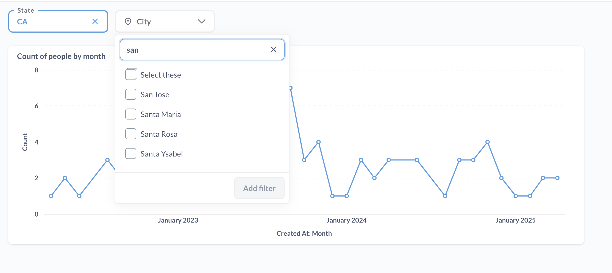
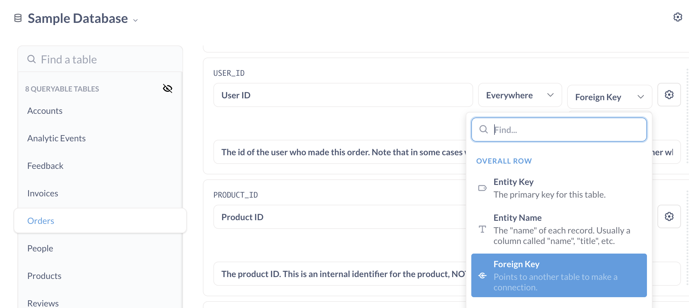

# Linked filters

You can **link filters** on a dashboard so that a child filter limits its values based on the value(s) applied by a parent filter.

For example, let's say you want a filter for the state column to restrict the values available to a filter on the city column, so that if someone selects a state, they'll only be able to select cities in that state. To do this, you can link the city filter (child) to a (parent) state filter.

## Set up tables for linked filters

You can only link dashboard filters that are wired to database columns (not custom columns or summaries) on dashboard cards, because Metabase needs column metadata to create linked filters. Metabase needs to know what values are there in the columns, and how the columns in the parent and child relate to each other.

Filters can only be linked when they're connected to columns that have an explicit relationship in the table metadata. By relationship, we mean that the columns should be either:

- In the same table.
- In two different tables that have a foreign key relationship specified in the [table metadata](../data-modeling/metadata-editing.md).
- In two different tables that have a foreign key relationships to one or more intermediate tables, as specified in the [table metadata](../data-modeling/metadata-editing.md)

If you try to set up linked filters between two columns that aren't connected, Metabase won't show an error, but you'll see that the values in the child filter aren't restricted by the parent filter. For more troubleshooting tips, see [Troubleshooting link filters](../troubleshooting-guide/linked-filters.md).

## Set up linked filters

You can link a child filter to one or more parent filters. The child filter must be either an ID, Location, or Text or Category filter. Parent filters can be any [filter type](./filters.md).

To link a child filter on a dashboard to one or more parent filters:

1. Edit the dashboard by clicking on the pencil icon in the top right of the dashboard.
2. Edit the child filter by clicking on the gear icon in the filter.
3. In the filter settings sidebar, switch to **Linked filters** tab.
4. Select the parent filter(s).

The filter(s) you select in the **linked filters** tab will be the parent filter(s), that is, the filter(s) that limit the values this (child) filter that you're currently editing.

## Limitations of linked filters

### Linked filters ignore relationships defined by models and questions

Linked filters are only "aware" of relationships defined in the table metadata. This constraint lets people connect filters to the same column on multiple dashboard cards (across multiple tabs), but the constraint also means that:

- Linked filters can't see relationships defined by joins in models or questions.
- Linked filters can't use any filter or join logic from any underlying card or model

For example, say you have a table with State and City columns, and you build a model that filters out rows with `City = San Francisco`. You ask a question based on that model, and add it to a dashboard. You add State and City filters to the dashboard, and link them. If you select were to select `State = CA`, the city filter may still show `San Francisco` as option, even though there are no records with `San Francisco` in the question and the underlying model, because the filter only "knows" about the underlying table metadata (which includes sample values for the column).

### Linked filters don't work with custom columns or summaries

Metabase uses database column metadata to populate values for linked filters, which means that linked filters have to be connected to database columns. In particular:

- You can't create linked filters on custom columns

- Native/SQL questions must have a [field filter](../questions/native-editor/sql-parameters.md#the-field-filter-variable-type) variable in order to be linked. Basic SQL variables aren't connected to database columns, so they won't work for linked filters.

- You can't link filters that use "Custom List" or "From another model or question" as their value's source.

## Troubleshooting linked filters

If you're not seeing what you expect with linked filters, make sure that your table relationships are [set up to support linked filters](#set-up-tables-for linked-filters) . See [Troubleshooting linked filters](../troubleshooting-guide/linked-filters.md) for more troubleshooting information.
