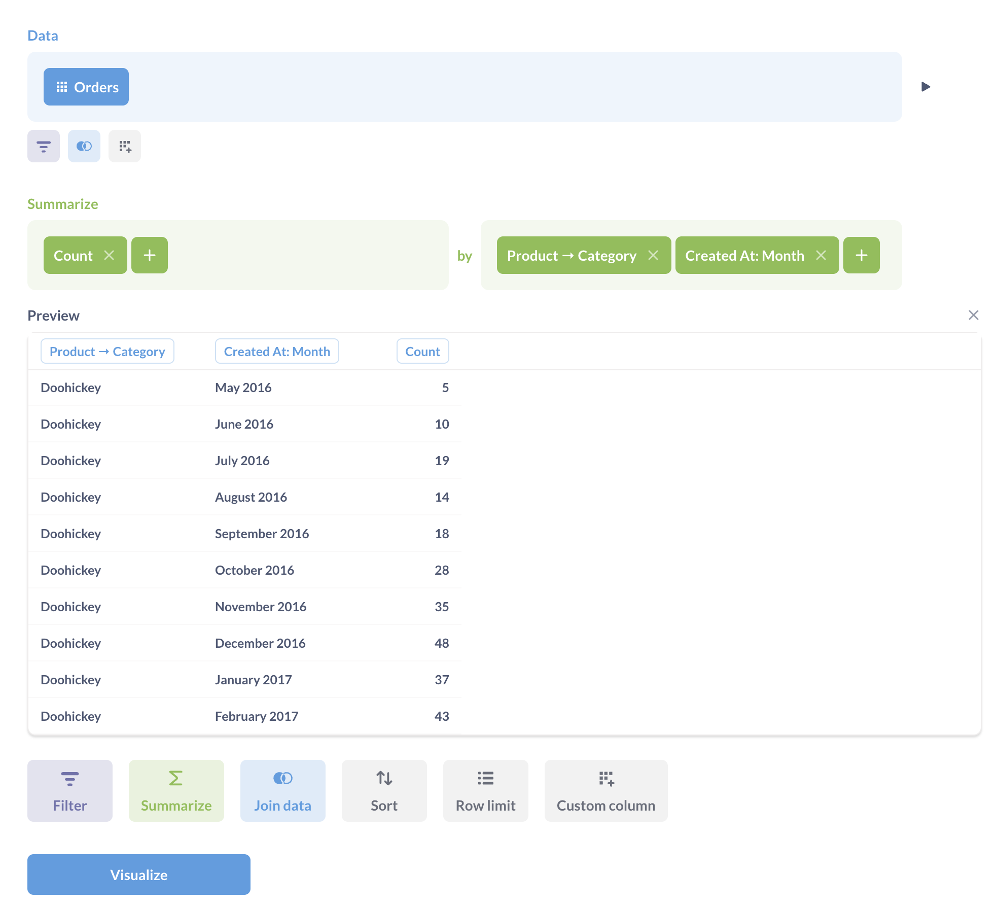
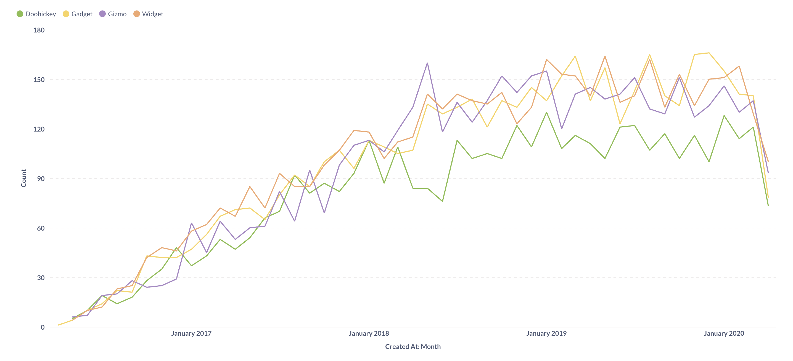
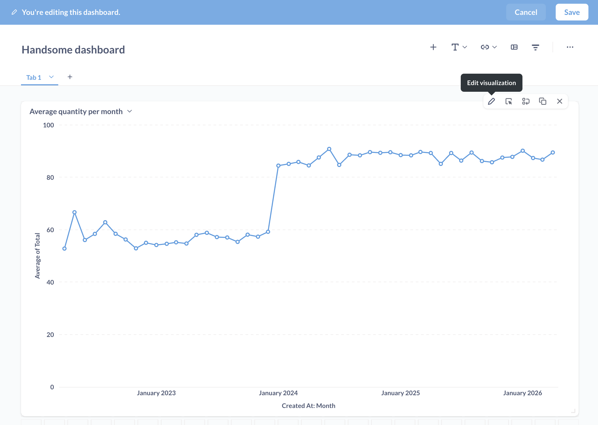
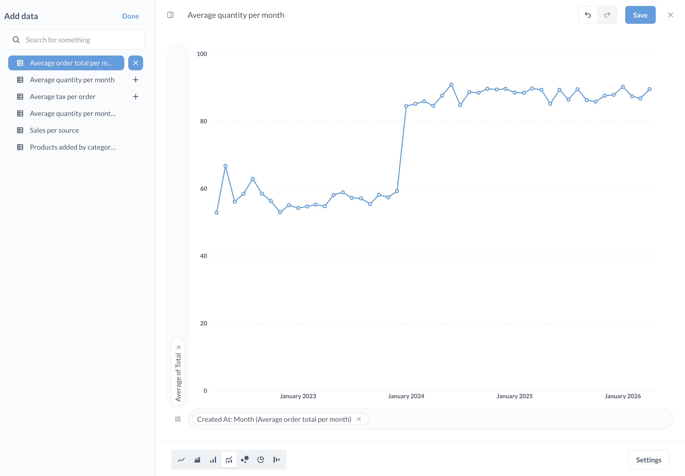
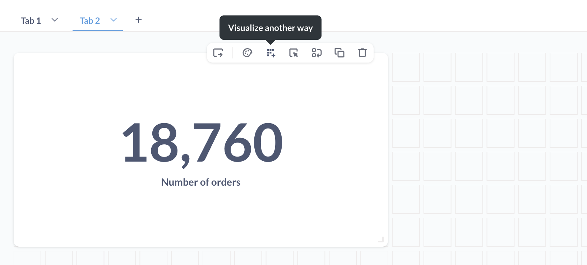
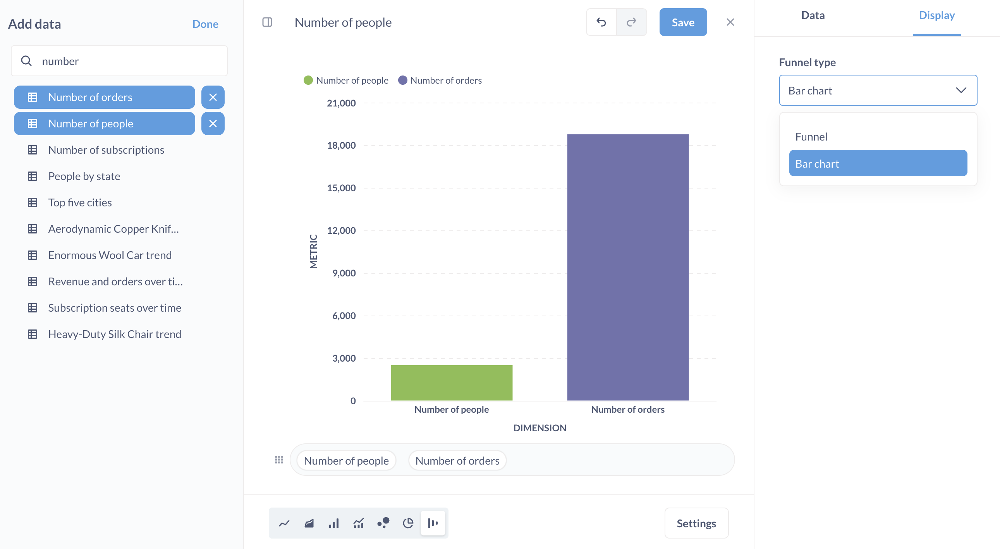
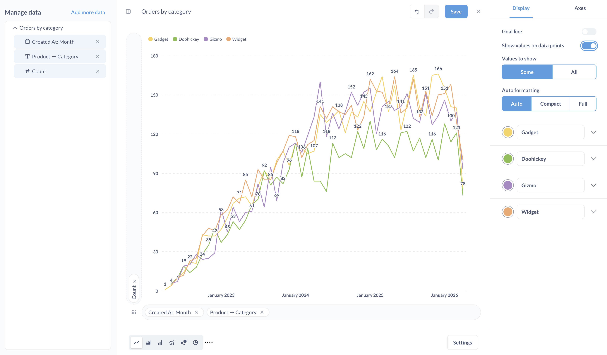

# Charts with multiple series

One of the best ways to add context and clarity when communicating with data is to show data side-by-side with other data. For example:

- Your company's revenue vs. its costs over time
- Average order price this month and user signups for that month
- Orders per day from a few different product lines

## Displaying data side by side

There are two main ways to visualize multiple series in Metabase:

- [**Ask a question that involves multiple dimensions**](#ask-a-question-that-involves-multiple-dimensions) with the query builder (or in SQL, if you're using SQL). For example, the count of users by region over time.
- [**Combine multiple questions on one dashboard card**](#combining-multiple-questions-on-one-dashboard-card) that share a common dimension (like time) on a dashboard. For example, you could look at revenue over time and costs over time together.

## Ask a question that involves multiple dimensions

If you're creating a new question, you can view the results as a multi-series visualization by summarizing your data and grouping it by two or more dimensions.

For example, we might want to see sales by month and product category. In the **Sample Database** that ships with Metabase, you would count the number of rows, then group by the `Product -> Category` and `Created At`:

Metabase will automatically display a multi-series line chart, with each series representing a different category.

Metabase can visualize up to 100 distinct values of a dimension at once, so if you're selecting a field that contains many values, you might need to filter the values.

## Combining multiple questions on one dashboard card

You can layer multiple questions on a single dashboard card. You can even layer questions that query different databases, as long as they share the same datetime dimension.

1. **Create a dashboard and enter dashboard edit mode**. On a dashboard, click the **Pencil** icon to enter editing mode.

2. **Add a question** with a dimension like time or category to a dashboard. In practice, questions you'll typically want to overlay will be line or bar charts.

3. **Edit the card's visualization**. Still in dashboard edit mode, hover over the question's card and click the **Pencil** icon to edit the card's visualization.

4. **Add more data**. In the Manage data sidebar on the left, click on **Add more data**.

Metabase will list questions in the left sidebar. Valid questions that you can plot on the card will have a plus sign **+**. You can also swap out the card's current question for a different question, which may update the list of compatible questions.

If necessary, the X and Y axes will automatically update. Metabase will create a legend using the existing card titles to help you understand which question maps to which series on the chart. Repeat this process as many times as you need.

You can also swap out the chart's original question entirely, for example if you want to start over, or to reset the question's visualization to its original settings.

5. (Optional) **Rename your chart** to reflect the combined data.

6. **Save** your changes.

## Combining number charts

If you need to compare single numbers to get a sense of how they differ, Metabase can turn multiple number charts into a funnel or bar chart.

1. **Add a number chart to a dashboard.**

2. **Visualize as a funnel chart**. (Yes, we know you're going for a bar chart, bear with us, you're going to switch the funnel's type to a bar chart.) In dashboard edit mode, hover over the card and click on **Visualize another way**. Metabase will change the visualization to a funnel chart.

3. **Add more data**. Add another question that returns a single number to the chart.

4. **Set the Funnel type to a bar chart**. Click **Settings** and change **Funnel type** to "Bar chart".

## Multi-series charts, values, and legibility

When displaying multiple series, it's important to keep legibility in mind. Combining many series can sometimes decrease the communication value of the data.

Metabase allows you to add values to multi-series charts, but use this feature sparingly, especially on charts with many data points. Adding values to multiple series, each with many data points, can make charts _more_ difficult to read.

From the **Visualization > Display** options, you can toggle the option: **Show values on data points**. Metabase will do its best to fit as many values as can fit nicely. You can also force Metabase to show values for all data points by setting the **Values to show** to **All**.

Additionally, you can configure the formatting of the values:

- **Auto**: Metabase selects the appropriate style for you
- **Compact**: Metabase abbreviates values, e.g., 1,000 becomes 1K
- **Full**: Values are displayed in their natural form

Now go forth and start letting your data get to know each other!

## Further reading

- [Time series comparisons](https://www.metabase.com/learn/metabase-basics/querying-and-dashboards/time-series/time-series-comparisons)
