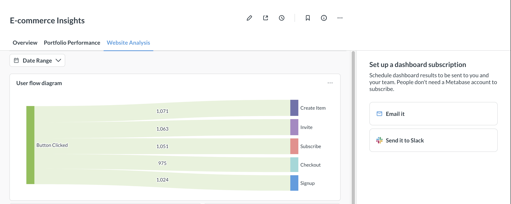
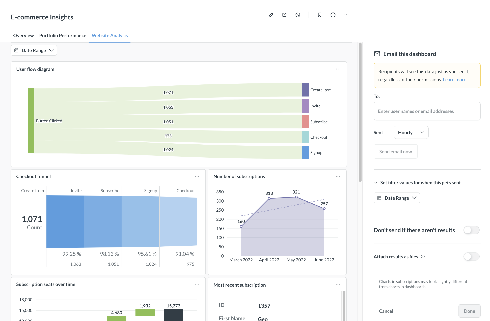
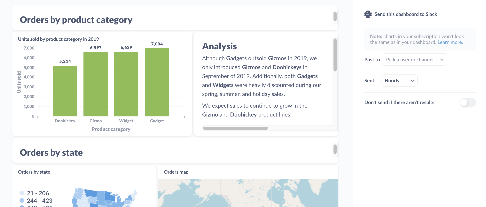
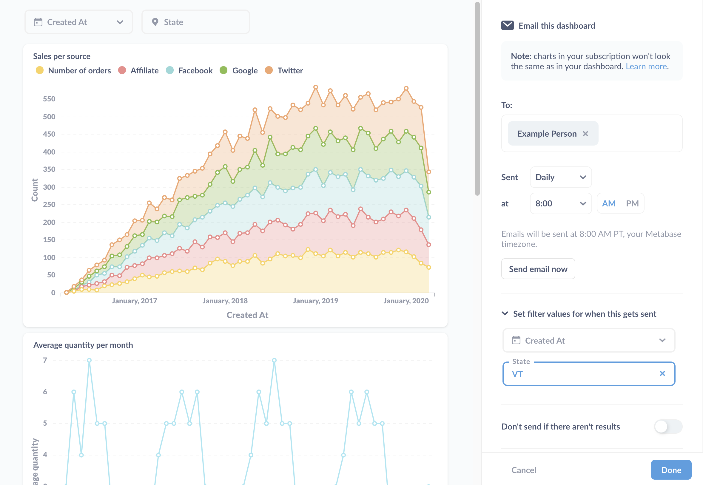

# Dashboard subscriptions

Dashboard subscriptions allow you to send the results of questions on a dashboard to people via email or Slack - even to people who lack an account in your Metabase.

If your Metabase has email or Slack set up, all you need to do is create a dashboard, add subscribers to it, and tell Metabase how often you'd like the send out an update. You can set up as many subscriptions to a dashboard as you like, and if you make any changes to the dashboard, Metabase will update the subscriptions the next time they're delivered.

## Enabling dashboard subscriptions

To enable dashboard subscriptions, your administrators will need to have set up email or Slack for your Metabase. See [Setting up email](../configuring-metabase/email.md) or [Setting up Slack](../configuring-metabase/slack.md).

## Setting up a dashboard subscription

To set up a subscription to a dashboard, click on the **Subscriptions** icon (mail icon with a plus symbol). Metabase will slide out a sidebar on the right, with an option to set up a subscription via email or Slack:

Let's say we want to email a dashboard. We'll click on the **Email it** option in the sidebar, and Metabase will give us some options:

## Email subscription options

For emails, we can:

### Add subscribers

Add email addresses to register subscribers. On Metabase [Pro](https://www.metabase.com/product/pro) and [Enterprise](https://www.metabase.com/product/enterprise), admins can limit email recipients to [approved domains for notifications](../configuring-metabase/email.md#approved-domains-for-notifications) and [configure which recipients Metabase suggests](../configuring-metabase/email.md#suggest-recipients-on-dashboard-subscriptions-and-alerts).

### Determine frequency and timing

Tell Metabase how often it should send the dashboard:

- Hourly
- Daily
- Weekly
- Monthly

And what time of day to send the dashboard.

### Send email now

A button that sends an email to all subscribers each time you touch it.

### Don't send if there aren't results

If there are no results, you can tell Metabase to skip sending the email.

### Set filter values for when this gets sent

Here you can set filters to apply when Metabase sends the subscription.

### Attach results

Tell Metabase if it should attach results to the email as a file, in addition to displaying the table in the email body.

If you've added filters to your dashboard and set default values for those filters, Metabase will apply those default values to your subscriptions, filtering the results of all questions that are connected to those filters when the subscriptions are sent. To learn more, check out [dashboard filters](./filters.md).

#### File format

You can choose between the following file formats:

- .csv
- .xlsx
- .json

#### Use unformatted values in attachments

If you check this box, Metabase will drop any visualization settings applied to the questions' results (e.g., date formatting) and send only the raw, unformatted results.

#### Questions to attach

Here you can specify which questions Metabase should attach results for.

The attached files will include up to 2000 rows by default. If you're self-hosting Metabase, you can adjust this row limit by setting the environment variable [MB_UNAGGREGATED_QUERY_ROW_LIMIT](../configuring-metabase/environment-variables.md#mb_unaggregated_query_row_limit).

## Slack subscription options

For Slack subscriptions, you can set up a subscription for a channel (like #general), or for a single person via their Slack username.

> Note that Slack username can be different from Slack display name.

> If you rename the subscribed channel in Slack, you'll need to update the subscription to point to the new Slack channel name.

You can specify how often Metabase sends a Slack message (hourly, daily, weekly, or monthly), and whether to send a message if the dashboard fails to return results.

### Sending subscriptions to private channels

See [Sending alerts and subscriptions to private Slack channels](../configuring-metabase/slack.md#sending-alerts-and-subscriptions-to-private-slack-channels).

## Adding multiple subscriptions

You can add multiple subscriptions to a single dashboard. To add a subscription, click on the **+** icon in the dashboard subscription panel.

## Deleting a subscription

To remove a subscription from a dashboard, select the subscription you'd like to remove. At the bottom of the sidebar, select **Delete this subscription**. Follow the instructions on the modal that pops up to confirm you'd like to delete the subscription.

## Viewing existing dashboard subscriptions



You can view a list of all alerts and dashboard subscriptions that people have set up in your Metabase in **Metabase analytics** collection. See [Usage analytics](../usage-and-performance-tools/usage-analytics.md).

## Customize filter values for each dashboard subscription



You can customize which filter values to apply to each dashboard subscription. That way you can send different groups of people an email (or Slack message) the contents of the dashboard with different filters applied. You only need to maintain one dashboard, which you can use to send results relevant to each subscriber.

### Setting filter values

You can set values for each filter on the dashboard. If you have any dashboard filters with default values, you can override those defaults for a given subscription, or leave them as-is.

Here's the sidebar where you can set the filter values:

The section to call out here is the **Set filter values for when this gets sent**. Here we've set "VT" as the value for the dashboard's State filter to scope results to records from Vermont. We didn't set a value for the Created_At filter, so the subscription will send the results without a filter applied. If you've set a default value for the filter, the subscription will list the value here.

## How permissions work with dashboard subscriptions

See [Notification permissions](../permissions/notifications.md).

## Further reading

- [Alerts](../questions/sharing/alerts.md)
- [Setting up email](../configuring-metabase/email.md)
- [Setting up Slack](../configuring-metabase/slack.md)
- [Usage analytics](../usage-and-performance-tools/usage-analytics.md)
