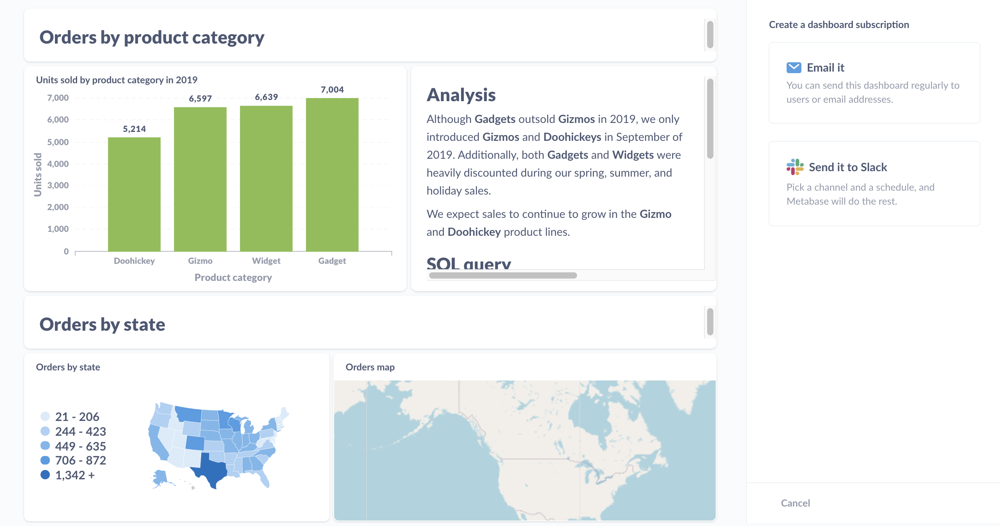
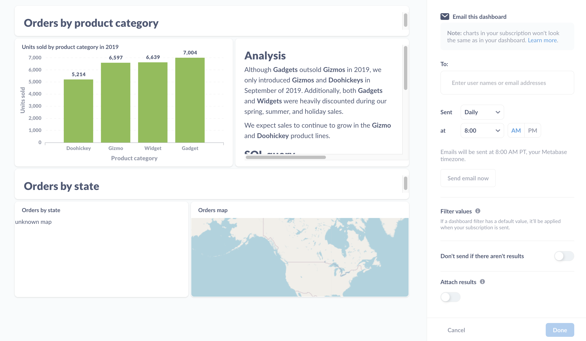

# Dashboard subscriptions

Dashboard subscriptions allow you to send the results of questions on a dashboard to people via email or Slack - even to people who lack an account in your Metabase. 

If your Metabase has email or Slack set up, all you need to do is create a dashboard, add subscribers to it, and tell Metabase how often you'd like the send out an update. You can set up as many subscriptions to a dashboard as you like, and if you make any changes to the dashboard, Metabase will update the subscriptions the next time they're delivered.

## Enabling dashboard subscriptions

To enable dashboard subscriptions, your administrators will need to have set up email or Slack for your Metabase. See [Setting up email](../configuring-metabase/email.md) or [Setting up Slack](../configuring-metabase/slack.md).

## Setting up a dashboard subscription

To set up a subscription to a dashboard, click on the **sharing** icon (the one-way arrow) and select **Dashboard subscriptions**.

Metabase will slide out a sidebar on the right, with an option to set up a subscription via email or Slack:

Let's say we want to email a dashboard. We'll click on the **Email it** option in the sidebar, and Metabase will give us some options:

## Email subscription options

For emails, we can:

- **Add subscribers**. Add email addresses to register subscribers.
- **Determine frequency and timing**. Tell Metabase how often it should send the dashboard (daily, weekly, or monthly), and what time of day to send the dashboard.
- **Send email now** sends an email to all subscribers.
- **Skip updates without results**. If there are no results, we can tell Metabase to skip sending the email.
- **Attach results**. Tell Metabase if it should also attach results to the email (which will include up to 2000 rows of data). You can choose between CSV and XLSX file formats.

If you've added filters to your dashboard and set default values for those filters, Metabase will apply those default values to your subscriptions, filtering the results of all questions that are connected to those filters when the subscriptions are sent. To learn more, check out [dashboard filters](./filters.md).

## Slack subscription options

For Slack subscriptions, you can set up a subscription for a channel (like #general), or for a single person via their Slack username.

You can specify how often Metabase sends a Slack message (hourly, daily, weekly, or monthly), and whether to send a message if the dashboard fails to return results.

## Adding multiple subscriptions

You can add multiple subscriptions to a single dashboard. To add a subscription, click on the **+** icon in the dashboard subscription panel.

## Deleting a subscription

To remove a subscription from a dashboard, select the subscription you'd like to remove. At the bottom of the sidebar, select **Delete this subscription**. Follow the instructions on the modal that pops up to confirm you'd like to delete the subscription.

## Viewing existing dashboard subscriptions



To view a list of all alerts and dashboard subscriptions that people have set up in your Metabase, click on the **gear** icon in the upper right and select **Admin settings** > **Audit** > **Subscriptions & Alerts**. See [Audit logs](../usage-and-performance-tools/audit.md).

## Customize filter values for each dashboard subscription



You can customize which filter values to apply to each dashboard subscription. That way you can send different groups of people an email (or Slack message) the contents of the dashboard with different filters applied. You only need to maintain one dashboard, which you can use to send results relevant to each subscriber.

### Setting filter values

You can set values for each filter on the dashboard. If you have any dashboard filters with default values, you can override those defaults for a given subscription, or leave them as-is.

Here's the sidebar where you can set the filter values:

The section to call out here is the **Set filter values for when this gets sent**. Here we've set "VT" as the value for the dashboard's State filter to scope results to records from Vermont. We didn't set a value for the Created_At filter, so the subscription will send the results without a filter applied. If you've set a default value for the filter, the subscription will list the value here.

## How permissions work with dashboard subscriptions

See [Notification permissions](../permissions/notifications.md).

## Further reading

- [Alerts](../questions/sharing/alerts.md)
- [Setting up email](../configuring-metabase/email.md)
- [Setting up Slack](../configuring-metabase/slack.md)
- [Auditing Metabase](../usage-and-performance-tools/audit.md)
