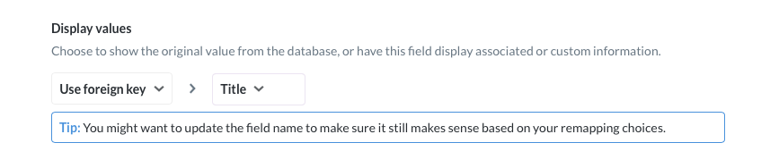

# Admin Data Model

Do you use "count of users", "user count", or "distinct users"? What about "10,000", "10K", or "10000"? When you're [pushing and pulling data](https://www.metabase.com/learn/analytics/push-and-pull) between different teams, you're bound to run into different names or different formats for the same business logic. Adding metadata helps everybody get on the same page, and makes your Metabase feel a lot nicer to use.

To edit the metadata of tables and columns, go to the **Data Model** tab of your **Admin settings**. You'll find a playground of knobs and buttons that'll let you:

- Set display names for tables and columns
- Add descriptions to tables and columns
- Hide outdated or technical data
- Set default formats for numbers and dates
- Change filter types for your columns (for example, from a search box to a dropdown)
- Add links to column values
- Set up reusable [segments and metrics](./segments-and-metrics.md).

## Selecting a database

If you've got more than one database connected to Metabase, click on the database name (for example, "Sample Database") and select another database from the dropdown menu.

## Tables

Once you select a database, its tables will appear in the sidebar. Click on a table name to view the table's display settings in Metabase:

- [Change the display name](#table-display-name)
- [Add or edit the description](#table-description)
- [Show or hide the table across Metabase](#table-visibility)
- [Refresh cached table values](#table-settings)
- [Edit column (or field) display settings](#columns-or-fields)

### Table display name

To edit a table's display name in Metabase, click into the box that contains the current table name. Changes will be saved automatically once you click out of the box.

### Table description

To add a description, click into the box below the table name. Descriptions are displayed in Metabase's [data reference](../exploration-and-organization/data-model-reference) to help people find the right table for their use case.

### Table visibility

| Visibility | [Query builder](../questions/query-builder/introduction.md) | [SQL editor](../questions/native-editor/writing-sql.md) | [Data reference](../exploration-and-organization/data-model-reference.md) |
|------------|-------------------------------------------------------------|---------------------------------------------------------|---------------------------------------------------------------------------|
| Queryable  | ✅                                                          | ✅                                                       | ✅                                                                        |
| Hidden     | ❌                                                          | ✅                                                       | ❌                                                                        |

**Hidden** tables won't show up in the query builder or data refererence, but they're still accessible if someone writes `SELECT * FROM hidden_table` in the SQL editor. To prevent people from writing queries against specific tables, see [data permissions](../permissions/data.md).

### Table settings

To refresh the column values that show up in filter dropdown menus, click the **gear** icon to the top right of the table name (such as "Accounts"). You can:

- **Re-scan this table** to run a manual [scan](../databases/connecting#how-database-scans-work) for new or updated column values.
- **Discard cached field values** to stop displaying cached values in your filters.

### Original schema

To remind yourself of column names and data types as they're stored in your database, click **Original schema** (below **Visibility**).

## Columns or fields

Click on a table's name in the sidebar to bring up basic column display settings:

- Change the display name
- Add or edit the description
- Show or hide the column across Metabase
- Change the column's semantic type

For advanced column settings, click on the **gear** icon for a specific column:

- ...

### Column visibility

By default, users can see every column in a table, but you can select other visibility options:

- **Only in Detail Views**. Sets the visibility to display only when viewing a single **column** record. Useful if you have really long data in certain **columns**, like descriptions or biographies. By default, any column with an average length of longer than 50 characters is assigned this setting.

- **Do Not Include**. This column won't be visible or selectable in questions created with the **notebook editor** (the GUI editor). Useful if you have sensitive or irrelevant columns.

For the **SQL editor**, **Do Not Include** settings only affect visibility in the **data reference** section. Though columns will not be visible in the **data reference** section, users will still be able to query these columns.

### Column name

To change how the column name is displayed, click on the name of the column. For example, if your ORM produces table names like "auth.user", you can replace this with "User" to make the column more readable. This name change only affects how Metabase displays the column; the change does not affect the database itself.

### Column description

You can include a human-readable summary of a column, its source, and use cases. Any caveats about interpretation can go here as well. Descriptions are particularly useful when columns have values that are abbreviated or coded in a particular format.

### Column order

Metabase will default to the column order native to the database.

You can re-order the way Metabase presents columns in menus and other interfaces (without affecting the database) by clicking on the grab bar to the right of each column, and dragging the column to a new position in the order.

You can also select from several options:

- **Database.** (Default) The order of columns as they appear in the database.
- **Alphabetical.** A, B, C... however the alphabet works.
- **Custom.** You choose the order. Metabase will automatically switch to custom if you rearrange any of the columns.
- **Smart.** Metabase chooses for you.

### Field type

You can use the Data Model page to edit field types for fields in your database. Use the **Type** dropdown menu to select from this [list of options](./field-types.md).

In this same menu, you can also designate a column as the table's **primary key** or **foreign key**.

See [Field types](./field-types.md) for more on types and how they function in Metabase.\

### Field settings

...

## Casting to a specific data type

You can manually cast text and number columns to date fields. Casting is useful if your date/timestamps are stored as text or number fields in your database, but you want Metabase to treat them like date values (so it'll do things like present calendar pickers for filters). Casting is different from changing the field type in Metabase, which only modifies semantic information to give people more context about that field, like setting a date field as a "Cancellation date." By contrast, casting changes the underlying type so that, for example, Metabase will interpret a string field as if it were a date.

You can cast text in ISO8601 format and numbers representing Unix epoch to date, datetime, or time types. The exact casting options will differ depending on which kind of database you're connected to, but here are some types you can cast:

- ISO8601->Date
- ISO8601->Datetime
- ISO8601->Time
- UNIXMicroSeconds->DateTime
- UNIXMilliSeconds->DateTime
- UNIXSeconds->DateTime

To cast a field to a different type, click on the gears icon next to the field you want to cast. If the field is a number or text field, you may see an option to **Cast to a specific data type**, with a default option set to "Don't cast." Select the type you want to cast to, and you're good to go. Casting doesn't affect the original data type; just how Metabase interprets that field.

## Remapping column values

One thing that happens commonly in tables is that you'll have a **foreign key column**, like `Product ID`, with a bunch of ID values in it, when what you actually want to see most of the time is the **entity name**, like the `Product Title`. You might also have fields which contain coded values that you'd prefer to show up as translated or readable values in your tables and charts — like changing `0`, `1`, and `2` to `Female`, `Male`, and `Other`.

To remap column values, click on the gear icon to the right of a field's Type dropdown in the Data Model section of the Admin Panel. You'll see a form with these options:

`Visibility` and `Type` are the same as on the main Data Model page, but `Display values` lets you choose to swap out a field's values with something else.

**Foreign key remapping** lets you swap out a foreign key's values with the values of any other field in the connected table. In this example, we're swapping out the `Product ID` field's values with the values in the `Title` field in the Product table:

Another option is **custom remapping**, which is currently only possible for numeric fields. This lets you map every number that occurs in this field to either a different numeric value or even to a text value, like in this example:

## Picking the filter user interface for a column

Metabase will automatically try to pick the best kind of filter interface for each column based on that column's type, and the number of different values in it. Columns with only a few possible choices, like a `Gender` column, will display a dropdown list by default when filtering on them. Columns with more than 100 possible selections will show a search box with autocomplete.

You can manually change the user interface for the filter to:

- Search box
- A list of all values
- Plain input box

## Changing a search box filter to a dropdown filter

1. Go to **Settings** > **Admin settings** > **Data Model**.
2. Select the database, schema, table, and field in question.
3. Click the **gear** icon to view all the field’s settings.
4. Set **Field Type** to “Category”.
5. Set **Filtering on this field** to “A list of all values".

This setting will run a query against your database to get the first 1,000 distinct values (ordered ascending) for that field and cache the first 100kB of text to display in the dropdown menu. If you have columns with more than 1,000 distinct values, or columns with text-heavy data, we recommend setting **Filtering on this field** to "Search box" instead. For more info, see [How database scans work](../databases/connecting.md#how-database-scans-work).

## Further reading

- [Segments and metrics](./segments-and-metrics.md)
- [Models](./models.md)
