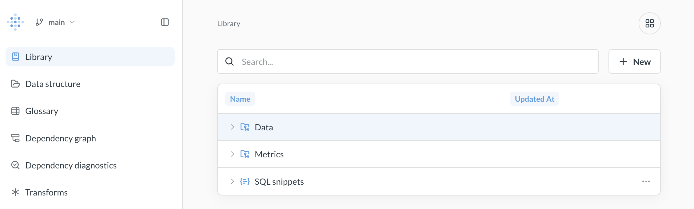

# Data Studio

Data Studio provides tools to shape and track your data so everyone can trust the numbers.

- **Create an easy-to-understand semantic layer** to match how people think about your business.
- **Speed up queries** by transforming tables to anticipate usage patterns.
- **View dependency graphs** to identify and fix problems before they impact reports.

## What's in Data Studio

The first time you open Data Studio, you'll land on the **Guide**: a quick tour of what you can do in Data Studio. You can come back to the Guide any time from the top of the left sidebar.

### Data

- **[Connected data](./metadata/managing-tables.md)**: Add table metadata to make tables easier to work with.
  - **[Segments](./semantic-layer/segments.md)**: Create saved filters on tables so people can use consistent definitions when building queries.
  - **[Measures](semantic-layer/measures.md)**: Create saved aggregations on tables so people can use consistent calculations when building queries.
- **[Data transformation](./transforms/transforms-overview.md)**: Wrangle your data in Metabase, write the query results back to your database, and reuse them in Metabase as sources for new queries.

### Library

- **[Semantic layer](semantic-layer/library.md)**\*: A curated space for your organization's most trusted analytics content—tables, metrics, and SQL snippets that your data team recommends.
- **[Glossary](./semantic-layer/glossary.md)**: Define terms relevant to your business, both for people and agents trying to understand your data.

### Tools

- **[Schema viewer](./tools/schema-viewer.md)**\*: Visualize relationships between tables as an entity-relationship diagram (ERD).
- **[Dependency graph](./tools/graph.md)**\*: A visual map of how your content connects, so you can understand the impact of changes before you make them. To find content with broken dependencies, see [Dependency diagnostics](../monitor/dependency-diagnostics.md).

### Remote sync and settings

- **[Remote sync](../installation-and-operation/remote-sync.md)**\*: Click **Set up remote sync** to connect a Git repository and sync your Library and transforms.
- **Settings**: Turn [transforms](./transforms/transforms-overview.md) on or off for your Metabase. Settings only appear once you've [enabled transforms](./transforms/transforms-overview.md#enable-transforms).

\* Available on [Pro and Enterprise plans](https://www.metabase.com/pricing).

## Permissions for Data Studio

The keys to Data Studio are granted only to people in either the Admin or [Data Analysts](../people-and-groups/managing.md#data-analysts) groups.

There are additional permissions required to run transforms, see [Permissions for transforms](./transforms/transforms-overview.md#permissions-for-transforms).

## Get to Data Studio

1. Click the **grid** icon in the upper right.
2. Select **Data Studio**.

<!-- [test] Test-gate check: a large docs-only change. Not for merge. -->
