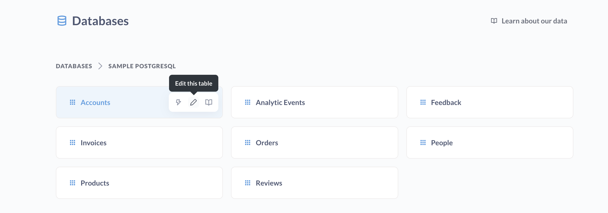
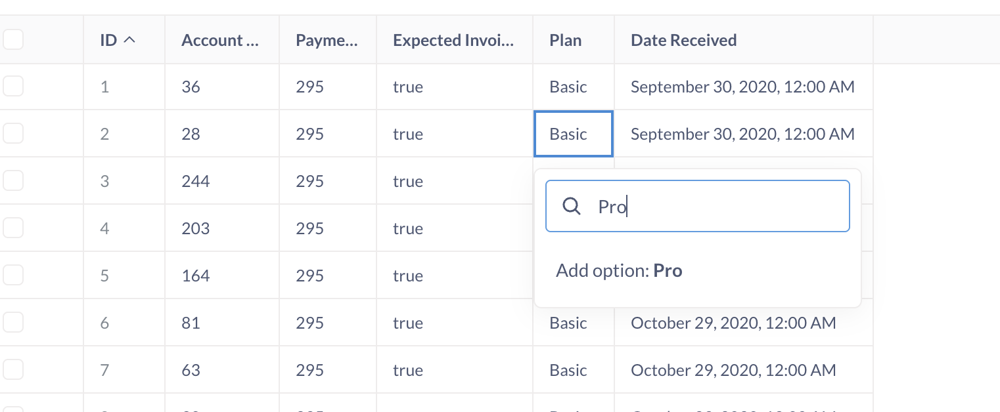
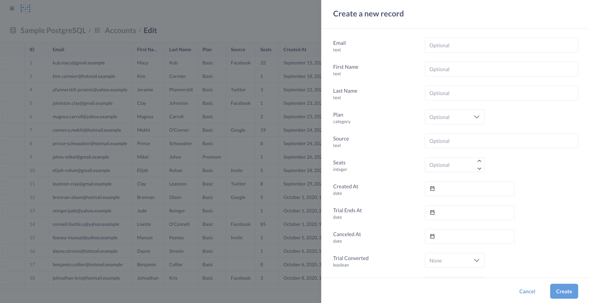

# Editable tables



Admins can enable editable table data in Metabase.

## Databases that support editable tables

Currently, editable tables are available for the following databases:

- PostgreSQL
- MySQL

## Setting up editable tables

To set up table editing, admins can:

1. Click the **gear** icon in the top right.
2. Select **Admin settings**.
3. Click **Databases**.
4. Select your database.
5. Toggle on **Editable table data**.

For this to work, Metabase's connection to your database must support writing back to its tables. See [privileges to enable actions and editable table data](../databases/users-roles-privileges.md#privileges-to-enable-actions-and-editable-table-data).

## Update or delete records in a table

To update or delete records in a table:

1. Open the left sidebar.
2. In the Data section, click **Databases**.
3. Hover over the table you want to edit and click the **Pencil** icon.
4. Edit rows in the table just like you would in a spreadsheet.

Depending on the data in the column, Metabase may show a list of values to choose from. If you need to add an option to that list, simply type out the option and add it (you may need to refresh the browser for the new option to show up in the list).

To remove an option from the list of values, you'll need to change any records with that value to a different value.

## Create a new record

You can add a row to a table by clicking **+ New record** in the top right of the table. Fill out the fields. Metabase will respect field constraints, so if a field is required, Metabase will prevent you from saving the record until you fill in the required field.

## Delete a record

To delete a record, check the box next to the record you want to delete and click **Delete**. Deletion is permanent. Metabase will prompt you to confirm the deletion.

You can also select multiple rows and delete them all at once (nervous sweating).

If you try to delete a row that has foreign key references from other tables, your database may prevent the deletion to maintain referential integrity. You'll see an error message like "Other rows refer to this row so it cannot be deleted." To delete these rows, you'll either need to remove the referencing rows first, or change the foreign key constraints in your database.

## Metabase enforces type constraints

- You can't edit sequential primary keys.
- If you try to add a value of a different type (like changing the number 13579 to the string "Wizard"), Metabase won't allow it.

## Editable table data vs. actions

Metabase offers two ways to modify data in your database: **editable table data** and [actions](../actions/introduction.md).

###  When to use editable table data

Use editable table data to:

- Do data maintenance or cleanup.
- Modify many records at once.
- Get direct access to all table data.
- Do one-off data corrections.

You need to be an admin to edit tables directly.

### When to use actions

Use actions to:

- Create custom forms.
- Give non-admins the ability to modify data.
- Add a button to a dashboard to trigger a form or query.

See [actions](../actions/introduction.md).
