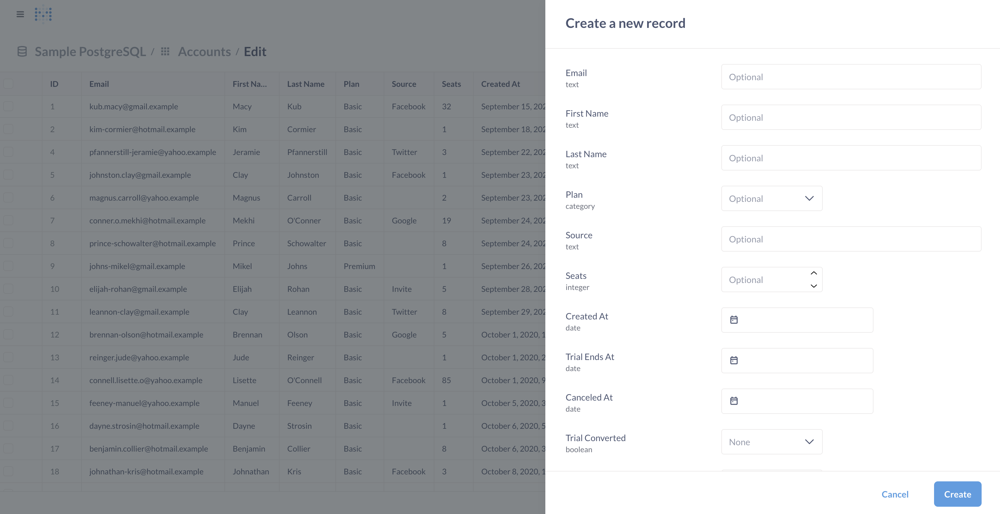

# Editable table data



Admins can enable editable table data in Metabase.

## Setting up editable table data

_Currently, editable table data is only available for PostgreSQL and MySQL._

To set up table editing, admins can:

1. Click the **gear** icon in the top right.
2. Select **Admin settings**.
3. Click **Databases**.
4. Select your database.
5. Toggle on **Editable table data**.

For this to work, Metabase's connection to your database must support writing back to its tables. See [privileges to enable actions and editable table data](../databases/users-roles-privileges.md#privileges-to-enable-actions-and-editable-table-data).

## Edit a table

To edit a table, admins can:

1. Navigate to the left sidebar.
2. In the Data section, click **Databases**.
3. Hover over the table you want to edit and click the **Pencil** icon.
4. Edit rows in the table just like you would in a spreadsheet.

## Create a new record

You can add a row to a table by clicking **+ New record** in the top right of the table. Fill out the fields. Metabase will respect field constraints, so if a field is required, Metabase will prevent you from saving the record until you fill in the required field.

## Delete a record

To delete a record, check the box next to the record you want to delete and click **Delete**. Deletion is permanent and cannot be undone. Metabase will prompt you to confirm the deletion.

You can also select multiple rows and delete them all at once (nervous sweating).

If you try to delete a row that has foreign key references from other tables, your database may prevent the deletion to maintain referential integrity. You'll see an error message like "Other rows refer to this row so it cannot be deleted." To delete these rows, you'll first need to remove the referencing rows, or handle the foreign key constraints in your database appropriately.

## Metabase enforces type constraints

- You can't edit sequential primary keys.
- If you try to add a value of a different type (like changing the number 13579 to the string "Wizard"), Metabase won't allow it.
