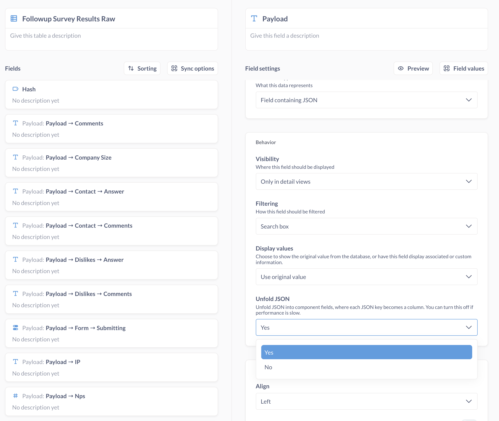

# Working with JSON

## Filtering JSON

In the [query builder](../questions/query-builder/editor.md), Metabase can't parse JSON in columns, so you can only filter by "Is empty" or "Not empty".

## JSON unfolding

With [some databases](#databases-that-support-json-unfolding), Metabase can unfold JSON columns into their component fields, which you can then filter on using the query builder.

Here is a table with a column that contains JSON.

Metabase can unfold that JSON column so that each key in the JSON object gets its own column in the table. Here are the unfolded fields of the table with the JSON column pictured above:

And here are the values as seen in the table:

This unfolding allows you to filter for values found in the original JSON object.

Metabase will prefix the unfolded column names with the name of the original column that contained the JSON. You can change the column names in **Admin settings** > [Table metadata](metadata-editing.md), or by creating a [model](./models.md) and editing the column metadata.

## Toggling JSON unfolding for a database

If you notice a hit to performance from this JSON unfolding, we recommend turning it off.

To turn off JSON unfolding for a database:

1. Click on the **Gear** in the upper right.
2. Select **Admin settings**
3. Visit the **Databases** tab.
4. Select the relevant database.
5. Click **Show advanced options**.
6. Toggle **Allow unfolding of JSON columns**.
7. Scroll down and click the **Save changes** button.
8. Click **Sync database schema**.
9. Click **Re-scan field values**.

## Toggling JSON unfolding for a specific column

If performance degrades, or you'd rather keep the JSON contained in the original column, you can turn off unfolding for individual fields in their settings.

1. Click on the **Gear** in the upper right.
2. Select **Admin settings**.
3. Visit the **Table metadata** tab.
4. Select the database that contains the field you want to update.
5. Select the table that contains the field.
6. Select the field containing the original JSON
7. In the **Behavior** section, locate the **Unfold JSON** option and select **Yes** or **No**. If the column was unfolded, Metabase will have hidden this JSON column from view, so if you want the JSON column to be visible again, you'll need to change the column's visibility to **Everywhere**.
8. Scroll to the top and click the **Filter values** button and select **Re-scan this field**.

## For JSON unfolding to work, the column's data type must be JSON

For example, if you upload a CSV with JSON in it, you might need to update the data/type in the database. Note that you can't edit the data type via Metabase; you can only change its field type. So even if the field type in Metabase is `Field containing JSON`, if the data/type isn't `JSON`, Metabase won't give you the option to unfold the column. You'll need to change the column type in the database itself.

## Databases that support JSON unfolding

- [BigQuery](../databases/connections/postgresql.md): automatically enabled, applies to `STRUCT` types only.
  
  If your data is stored in the [STRUCT data type](https://cloud.google.com/bigquery/docs/reference/standard-sql/data-types#struct_type) in BigQuery, you can query the table's nested fields. This is enabled by default. However, Metabase won't unfold JSON stored in BigQuery as the `JSON` type. This is because in BigQuery, nested fields are _part of the table definition itself_, so when Metabase syncs with your BigQuery database, it'll be able to get metadata about any of your tables, including tables with nested fields. Querying nested fields, however, doesn't extend to arrays (REPEATED (STRUCT)) in BigQuery.
  
- [Druid (JDBC)](../databases/connections/druid.md)
- [MongoDB](../databases/connections/mysql.md): automatically enabled for all nested fields.
- [MySQL](../databases/connections/mysql.md)
- [PostgreSQL](../databases/connections/postgresql.md)

