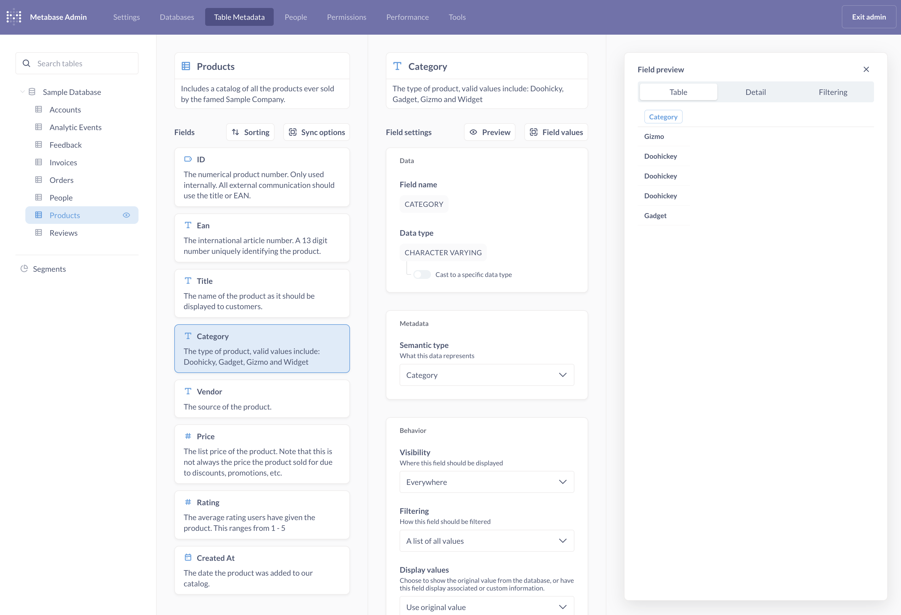
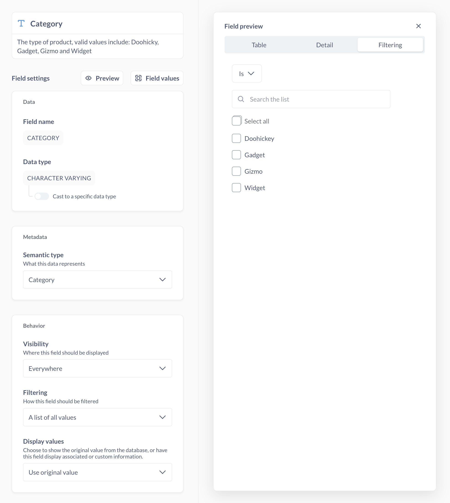

# Table metadata admin settings

_Admin settings > Table metadata_

Metabase lets you add and edit metadata for your tables and columns.

The **Table metadata settings only affect the way Metabase displays the data. None of the settings change the data in your database.**

Admins can grant access to these metadata settings to other groups. See [table metadata permissions](../permissions/data.md#manage-table-metadata-permissions).

## Table settings

_Admin settings > Table metadata > Database > Table_

You can search for tables, or use the tree navigation to find each of your connected databases and their tables.

### Table display name and description

To edit a table's display name or description in the table metadata tab, click into the box that contains the current table name or description and edit it. Changes will be saved automatically once you click out of the box.

Descriptions are displayed in Metabase's [data reference](../exploration-and-organization/data-model-reference.md) and tooltips when view the table. Decscriptions help people find the right table for their use case.

### Table sync options

Actions you can take to refresh the schema or field values. For more, check out [syncs and scans](../databases/sync-scan.md).

#### Sync table schema

If you've made changes to this table in the underlying database that aren't showing up in Metabase yet, re-syncing the table schema can fix that.

To update the values in your filter dropdown menus, refresh or reset the cached values.

#### Scan field values

Metabase uses these values to populate dropdown filters. You can also [scan values for a specific field](#scan-values-for-a-specific-field).

#### Discard cached field values

Clears cached values. Metabase will pull new values for display in your [filter widgets](#filtering).

### Table sorting

You can sort the fields in a table in different ways:

- Automatically (Metabase decides for you)
- By how they appear in the database
- Alphabetically
- Custom order (just drag and drop to rearrange, then click "Done")

### Table visibility

You can toggle the visibility of a table by clicking on the **eye** icon next to the table name in the left sidebar navigation tree in the Table metadata tab.

**Hidden tables** won't show up in the [query builder](../questions/query-builder/editor.md) or [data reference](../exploration-and-organization/data-model-reference.md). **But this is not a permissions feature**: hidden tables can still be used in SQL questions if someone knows the name of the table. For example, `SELECT * FROM table_name` from the [SQL editor](../questions/native-editor/writing-sql.md) would return results. To prevent people from writing queries against specific tables, see [data permissions](../permissions/data.md).

To hide **all of the tables in a database** (say, if you've migrated to a new database), click on the **eye** icon next to the database name in the sidebar.

## Field settings

_Admin settings > Table Metadata > Database > Table > Field_

Fields are also known as Columns (see the [difference between fields and columns](https://www.metabase.com/learn/grow-your-data-skills/data-fundamentals/database-basics#columns-vs-fields)).

## Field name and description

To change the _global_ display name of a column in Metabase, click on the name of the column. For example, you could display "auth.user" as "User" to make the column more readable. People can also use [models](./models.md) to give columns a display name that's local to the model.

To add a description, click into the box below the column name. Descriptions are displayed in the [data reference](../exploration-and-organization/data-model-reference.md) to help people interpret the column's values. You should consider adding a description if your column contains:

- Abbreviations or codes
- Zeroes, nulls, or blank values
- Placeholder values, like `9999-99-99`

## Field preview

Click the preview button to see sample data from that field.

- Table preview
- Detail
- Filtering

## Scan values for a specific field

_Admin settings > Table Metadata > Database > Table > Field_

To scan or discard field values for a specific field, click on the **Field values** button. Metabase uses these values to populate dropdown menus in filter widgets. (Values aren't dropped from your database.)

## Field data

_Admin settings > Table Metadata > Database > Table > Field_

### Field name

This is the name of the field in the database itself. You can't change it in Metabase.

### Data type

This is the data type of the field in the database. You can't change the data type in Metabase, but you can cast certain data types to another data type.

### Cast to a specific data type

If you want Metabase to treat a text or number column as a datetime column, you can cast it to that type. Casting data types won't affect the original data types in your database.

For example, say you have a "Created At" column with a string [data type](https://www.metabase.com/learn/grow-your-data-skills/data-fundamentals/data-types-overview) in your database. If you want to:

- Create relative date filters, such as "Created At = Last week".
- Use "Created At" with formulas like [datetimeAdd](../questions/query-builder/expressions/datetimeadd.md).

You can cast that string to a Date type.

Casting options include:

**Text to datetime casting options**:

- ISO8601->Date
- ISO8601->Datetime
- ISO8601->Time

**Numeric to datetime casting options**:

- UNIXMicroSeconds->DateTime
- UNIXMilliSeconds->DateTime
- UNIXNanoSeconds->DateTime
- UNIXSeconds->DateTime

**Text to numeric casting options**:

- String->Integer
- String->Float

**Other options**:

- Float->Integer
- Datetime->Date

If Metabase doesn't support the casting option you need, you can [create a SQL question](../questions/native-editor/writing-sql.md#starting-a-new-sql-query) that casts the data and [save it as a model](./models.md#create-a-model-from-a-saved-question), or create a view directly in your database.

## Field metadata

_Admin settings > Table Metadata > Database > Table > Field_

### Semantic type

You can change the [semantic type](../data-modeling/semantic-types.md) to give people more context and enable additional functionality, such as displaying text as an image (if the text is an image URL. Another example: you could set an Integer as a "Score" so people have a better idea what those integers indicate.

The semantic types you can choose from depend on the data type. If none of the options describe the values in the column, you can set this setting to "No semantic type".

See [semantic types](../data-modeling/semantic-types.md).

## Field behavior

_Admin settings > Table Metadata > Database > Table > Field_

### Field visibility

- **Everywhere**: By default, users can see all of the columns in a table.
- **Only in detail views**: The detail view is the view you seen when you expand a single row in a table. This will hide lengthy text from question results. This setting is applied by default if a column's values have an average length of more than 50 characters. For example, you could use this setting on a column like "Customer Comments" if you already have a column for "Customer Rating".
- **Do not include**: Columns won't show up in the query builder or data reference. You can set this option on sensitive columns (such as PII) or irrelevant columns. But this visibility option is a simple omit/hide option; **it's not a permissions feature**. These columns are still accessible for people with native query privileges; they can write `SELECT hidden_column FROM table` or `SELECT * FROM table` in the [SQL editor](../questions/native-editor/writing-sql.md) and they'll be able to view these fields and their values.

To restrict what data people can view and query, see [data permissions](../permissions/data.md).

### Filtering

The **Filtering** setting changes a column's default [filter widget](../dashboards/filters.md). Options include:

- **Search box**: Display a search box and suggest autocompletions for values in that column that match the search term(s).
- **A list of all values**: Display a search box, as well as a dropdown menu with checkboxes for values. If the number of distinct values exceeds 1000, however, Metabase will instead display a search box. See [Changing a search box filter to a dropdown filter](#changing-a-search-box-filter-to-a-dropdown-filter).
- **Plain input box**: Display a search box, but don't suggest autocompletions.

The settings here will also affect dashboard filters. For example, if you set this to plain input box, you won't be able to set up a dashboard filter that has a dropdown menu. See [dropdown list](../dashboards/filters.md#dropdown-list).

#### Changing a search box filter to a dropdown filter

The dropdown filter widget can be finicky, because Metabase needs to run a [scan](../databases/sync-scan.md#how-database-scans-work) to get the list of values for the dropdown menu. If you're having trouble:

1. Set the [Semantic type](#semantic-type) to "Category".
2. Set [Filtering](#filtering) to "A list of all values".

When you change a default filter to a dropdown filter, you'll trigger a database query that gets the first 1,000 distinct values (ordered ascending) for that column. Metabase will cache the first 100kB of text to display in the dropdown menu.

If you have columns with more than 1,000 distinct values, or columns with text-heavy data, we recommend setting **Filtering** to "Search box" instead.

### Display values

You can map another column connected by a foreign key relationship, like mapping a `Product_ID` column to instead display the name of the product.

#### Mapping values to foreign keys

You can map another column connected by a foreign key relationship, like mapping a Product_ID column to instead display the name of the product.

#### Mapping numbers to custom values

Say you have a column with values 1, 2, and 3. You could instead display "low", "medium", and "high".

For this option to be available, you'll need to set the [filtering](#filtering) settings to "A list of all values".

Select "Custom mapping" from the dropdown menu. For each value in the column, enter a display value under **Mapped values**.

## Field formatting

_Admin settings > Table Metadata > Database > Table > Field_

See [Field formatting](./formatting.md#field-formatting).

## Unfold JSON

See [Working with JSON](./json-unfolding.md).

## Further reading

- [Keeping your analytics organized](https://www.metabase.com/learn/metabase-basics/administration/administration-and-operation/same-page)
- [Data modeling tutorials](https://www.metabase.com/learn/metabase-basics/getting-started/models)
