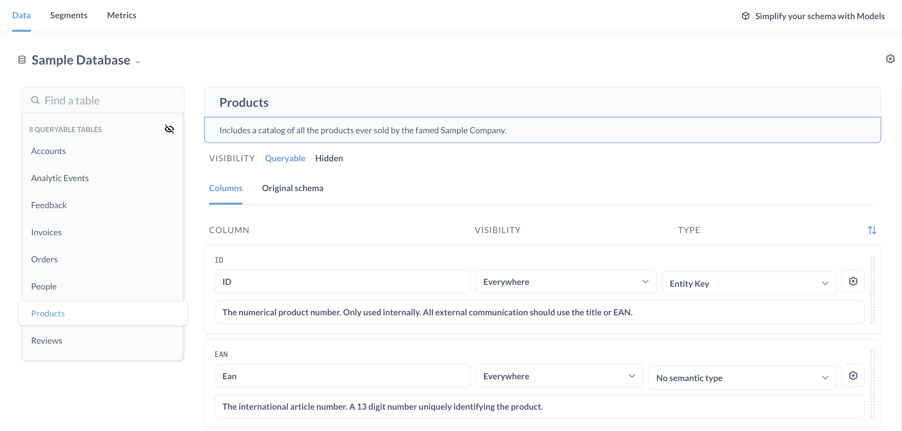
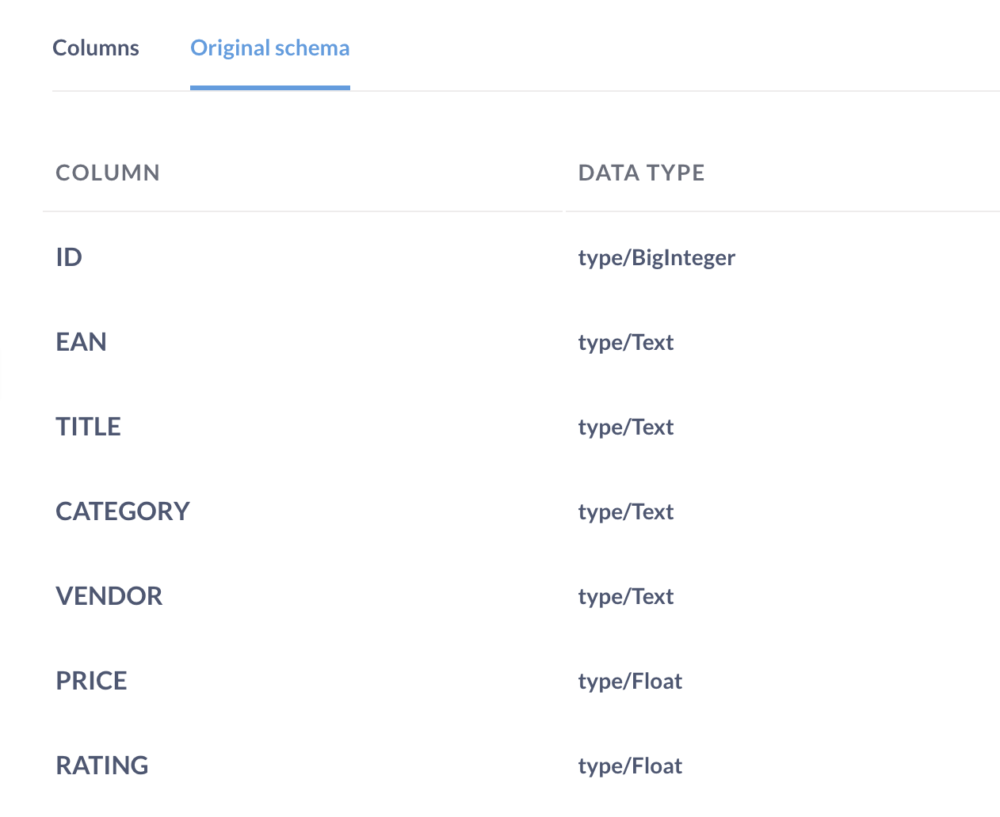
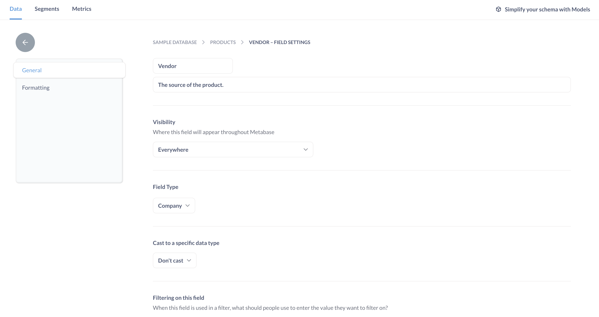
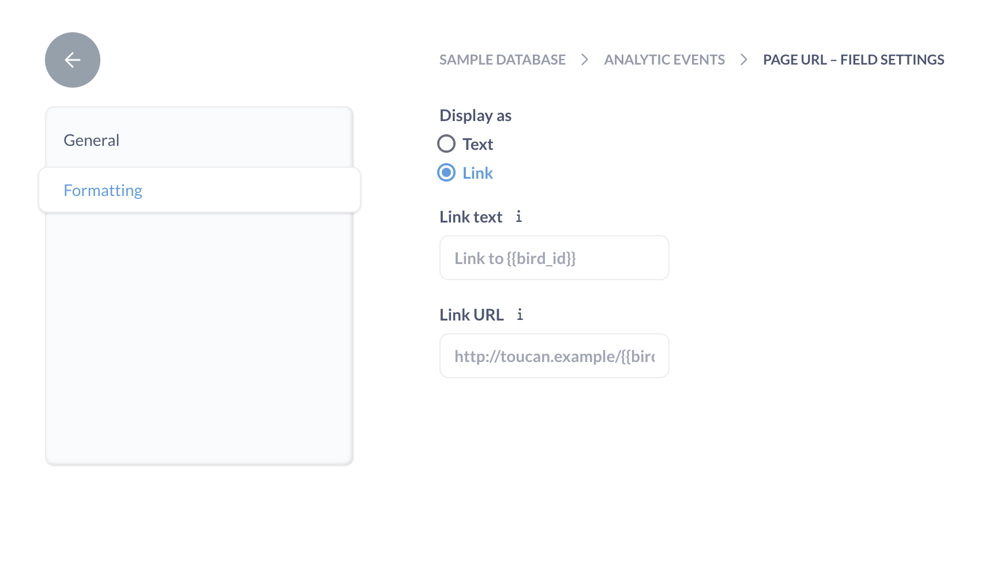

# Table metadata admin settings

Metabase lets you add and edit metadata to your tables and columns so that you can manage your org's business logic as it changes. Go to the **Table Metadata** tab in your **Admin settings** to:

- [Set display names and descriptions](#table-display-name).
- [Hide outdated data](#table-visibility).
- [Cast a text or number column to a date column](#casting-to-a-specific-data-type).
- [Change the style of a filter widget](#changing-the-filter-widget).
- [Display a column as a link](#displaying-a-column-as-a-link).

> The **Table Metadata** admin settings only affect the way data's displayed and interpreted in Metabase. None of the settings will change the data in your database.

## Table settings

Click on a table name in the left sidebar to view the table's settings in Metabase.

If you've got more than one database connected to Metabase, click on the database name (for example, "Sample Database") and select another database from the dropdown menu. Once you select a database, the tables in that database will appear in the sidebar.



- [Change the display name](#table-display-name).
- [Add or edit the description](#table-description).
- [Show or hide the table across Metabase](#table-visibility).
- [View the original schema](#original-schema).
- [Edit column (field) settings](#column-field-settings).

### Table display name

To edit a table's display name in Metabase, click into the box that contains the current table name. Changes will be saved automatically once you click out of the box.

### Table description

To add a table description, click into the box below the table name. Descriptions are displayed in Metabase's [data reference](../exploration-and-organization/data-model-reference.md) to help people find the right table for their use case.

### Table visibility

**Queryable** tables are visible across all of Metabase.

**Hidden** tables won't show up in the [query builder](../questions/query-builder/introduction.md) or [data reference](../exploration-and-organization/data-model-reference.md). But this is not a security feature: hidden tables can still be used in SQL questions if someone writes `SELECT * FROM hidden_table` from the [SQL editor](../questions/native-editor/writing-sql.md). To prevent people from writing queries against specific tables, see [data permissions](../permissions/data.md).

Tip: To hide all of the tables in a database (say, if you've migrated to a new database), click on the **hidden eye** icon beside "# queryable tables" in the left sidebar.

### Original schema

To remind yourself of column names and data types as they're stored in your database, click **Original schema** (below **Visibility**).



## Column (field) settings

Select a database and click on a table's name in the sidebar to bring up basic column display settings:

- [Change the display name](#column-name)
- [Add or edit the description](#column-description)
- [Show or hide the column across Metabase](#column-visibility)
- [Set a default column order](#column-order)
- [Change the column's field type](#field-type)

For extra column settings, click on the **gear** icon at the right of a column's settings box:



- [Cast text or numbers to dates](#casting-to-a-specific-data-type)
- [Change the filter widget](#changing-the-filter-widget) (for example, to a dropdown menu)
- [Remap column values](#remapping-column-values) (for example, from "5" to "Great")
- [Display the column as a link](#displaying-a-column-as-a-link)

### Column name

To change the _global_ display name of a column in Metabase, click on the name of the column. For example, you could display "auth.user" as "User" to make the column more readable. People can use [models](./models.md) to give columns a display name that's local to the model.

### Column description

To add a description, click into the box below the column name. Descriptions are displayed in the [data reference](../exploration-and-organization/data-model-reference.md) to help people interpret the column's values. You should consider adding a description if your column contains:

- abbreviations or codes
- zeroes, nulls, or blank values
- placeholder values, like `9999-99-99`

### Column visibility

**Everywhere**: by default, users can see all of the columns in a table.

**Only in detail views** will hide lengthy text from question results. This setting is applied by default if a column's values have an average length of more than 50 characters. For example, you could use this setting on a column like "Customer Comments" if you already have a column for "Customer Rating".

**Do not include** columns won't show up in the query builder or data reference. You can set "do not include" on sensitive columns (such as PII) or irrelevant columns. But this visibility option is a simple omit/hide option; it's not a security feature. These columns are still accessible for people with native query privileges; they can write `SELECT hidden_column FROM table` or `SELECT * from table` in the [SQL editor](../questions/native-editor/writing-sql.md) and they'll be able to view these fields and their values. To prevent people from viewing certain columns, see [data sandboxing](../permissions/data-sandboxes.md).

### Column order

Metabase defaults to the column order defined in your database schema. To reorder the column display order in question results and menus **manually**, click on the grab bar to the right of each column, and drag the column to a new position.

To sort the columns **automatically**, click on the **sort** icon at the top right of the first column's settings box. The sorting options are:

- **Database.** (Default) The order of columns as they appear in the database.
- **Alphabetical.** A, B, C... however the alphabet works.
- **Custom.** You choose the order. Metabase will automatically switch the sort order to "Custom" if you rearrange any of the columns.
- **Smart.** Metabase chooses for you.

### Field type

To change the [field type](../data-modeling/field-types.md) of a column, click on the **Type** dropdown menu in a column's setting box. You can also use the **Type** dropdown to label a column as an [entity key](https://www.metabase.com/glossary/entity_key) (primary key) or [foreign key](https://www.metabase.com/glossary/foreign_key) in Metabase (with no consequence to your database).

### Casting to a specific data type

If you want Metabase to treat a text or number column as a datetime column:

1. Go to **Admin settings** > **Table Metadata**.
2. Find your database and table.
3. Click on the **gear** icon at the right of a column's settings box.
4. Scroll to **Cast to a specific data type**
5. Select a casting option.

> Metabase currently supports only casting to a datetime type in **Cast to a specific data type**. If you need to cast to a different type (like float), you can [create a SQL question](../questions/native-editor/writing-sql.md#starting-a-new-sql-query) that casts the data and [save it as a model](./models.md#create-a-model-from-a-saved-question), or create a view directly in your database.

**Text to datetime casting options**:

- ISO8601->Date
- ISO8601->Datetime
- ISO8601->Time

**Numeric to datetime casting options**:

- UNIXMicroSeconds->DateTime
- UNIXMilliSeconds->DateTime
- UNIXNanoSeconds->DateTime
- UNIXSeconds->DateTime

Casting is different from setting the [field type](./field-types.md). For example, say you have a "Created At" column with a string [data type](https://www.metabase.com/learn/databases/data-types-overview) in your database. You'll need to cast "Created At" to one of the datetime types above if you want to do things like:

- Create relative date filters, such as "Created At = Last week".
- Use "Created At" with formulas like [datetimeAdd](../questions/query-builder/expressions/datetimeadd.md).

> Casting data types from the **Table Metadata** admin settings won't affect the original data types in your database.

### Changing the filter widget

To change a column's [filter widget](../dashboards/filters.md):

1. Go to **Admin settings** > **Table Metadata**.
2. Find your database and table.
3. Click on the **gear** icon at the right of a column's settings box.
4. Scroll to **Filtering on this field**.
5. Select a filter widget option.

#### Filter widget options

The default behavior for the `Is` filter for the field.

- **Search box**: Display a search box and suggest autocompletions for values in that column that match the search term(s).
- **A list of all values**: Display a search box, as well as a list of checkboxes for values in a dropdown menu that people can select as search terms.
- **Plain input box**: Display a search box, but do NOT suggest autocompletions.

### Changing a search box filter to a dropdown filter

The dropdown filter widget can be finicky, because Metabase needs to run a [scan](../databases/sync-scan.md#how-database-scans-work) to get the list of values for the dropdown menu.

1. Go to **Admin settings** > **Table Metadata**.
2. Find your database and table.
3. Scroll to your column.
4. In the column's settings box, set **Type** to “Category”.
5. Set **Filtering on this field** to “A list of all values".

When you change a default filter to a dropdown filter, you'll trigger a database query that gets the first 1,000 distinct values (ordered ascending) for that column. Metabase will cache the first 100kB of text to display in the dropdown menu. If you have columns with more than 1,000 distinct values, or columns with text-heavy data, we recommend setting **Filtering on this field** to "Search box" instead.

### Remapping column values

Say you have a column with the values 1, 2, and 3, and you want to map each number to the values "low", "medium" and "high". This kind of mapping can be done on columns that have numeric or foreign key [field types](#field-type).

#### Remapping numbers

1. Go to **Admin settings** > **Table Metadata**.
2. Find your database and table.
3. Click **gear** icon at the right of a column's settings box.
4. Scroll to **Display values**.
5. Select "Custom mapping" from the dropdown menu.
6. Enter the display values under **Mapped values**.

#### Remapping foreign keys

1. Go to **Admin settings** > **Table Metadata**.
2. Find your database and table.
3. Click **gear** icon at the right of a column's settings box.
4. Scroll to **Display values**.
5. Select "Use foreign key" from the dropdown menu.
6. Select a column name from the second dropdown menu.

### Displaying a column as a link

1. Go to **Admin settings** > **Table Metadata**.
2. Find your database and table.
3. Click on the **gear** icon at the right of a column's settings box.
4. Select **Formatting** from the sidebar.
5. From **Display as**, select **Link**.
6. Optional: set display text under **Link text**.
7. Enter the URL in the **Link URL** field.
8. Optional: create a dynamic URL by adding the column name as a `{{parameter}}`.



For example, if you set the **Link URL** for an "Adjective" column to:

```
https://www.google.com/search?q={{adjective}}
```

When someone clicks on the value "askew" in the "Adjective" column, they'll be taken to the Google search URL:

```
https://www.google.com/search?q=askew
```

## Refresh or discard cached values

To update the values in your filter dropdown menus, refresh or reset the cached values. **Cache actions** include:

- **Re-scan this table or field** to run a manual scan for new or updated column values. If possible, re-scan the table during off-peak hours, as [scans](../databases/sync-scan.md#how-database-scans-work) can slow down your database.
- **Discard cached field values** to clear cached values and stop them from showing up in your [filter widgets](#changing-the-filter-widget).

### Table cache actions

1. Go to **Admin settings** > **Table Metadata**.
2. Find your database and table.
3. Click the **gear** icon at the top right (below **Exit admin**).
4. Select a cache action.

### Column cache actions

1. Go to **Admin settings** > **Table Metadata**.
2. Find your database and table.
3. Click the **gear** icon at the right of a column's settings box.
4. Scroll to **Cached field values**.
5. Select a cache action.

## Unfold JSON

If Metabase supports JSON unfolding for your database, you can decide whether to unfold JSON into component fields, where each JSON key becomes a column. You can turn this off if performance is slow.

1. Go to **Admin settings** > **Table Metadata**.
2. Find your database and table.
3. Click the **gear** icon at the right of a column's settings box.
4. Scroll to **Unfold JSON**.
5. Toggle JSON unfolding.

## Further reading

- [Segments and metrics](./segments-and-metrics.md)
- [Keeping your analytics organized](https://www.metabase.com/learn/administration/same-page)
- [Data modeling tutorials](https://www.metabase.com/learn/data-modeling/models)
