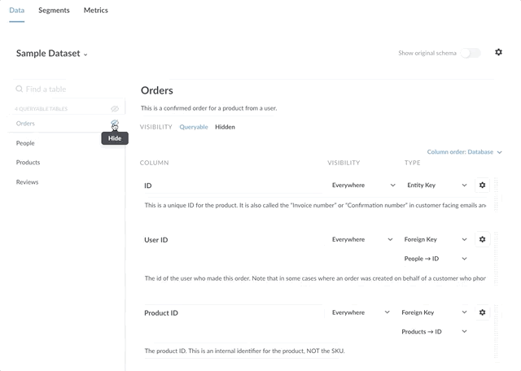
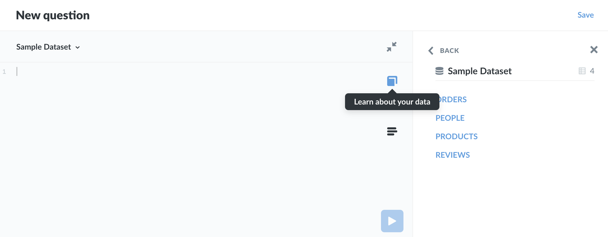
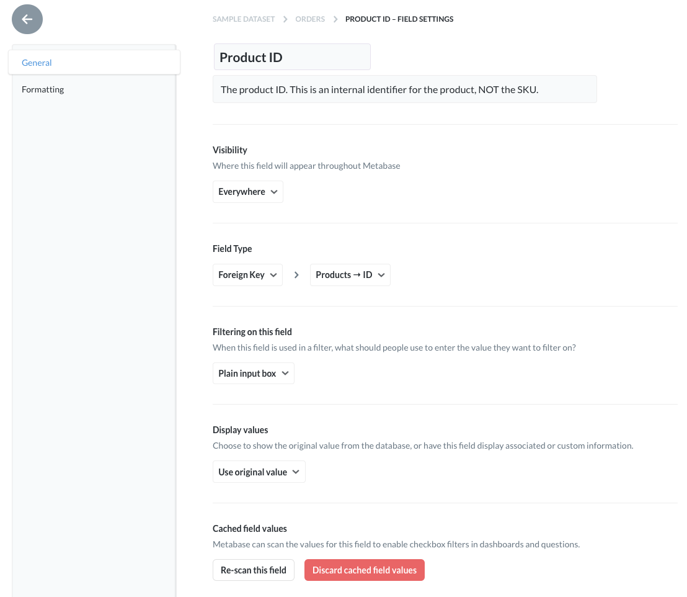
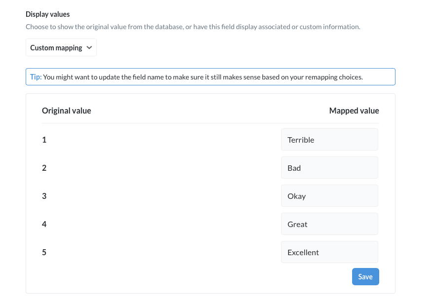
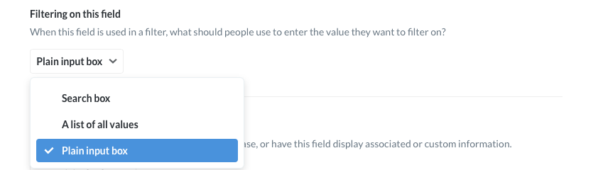
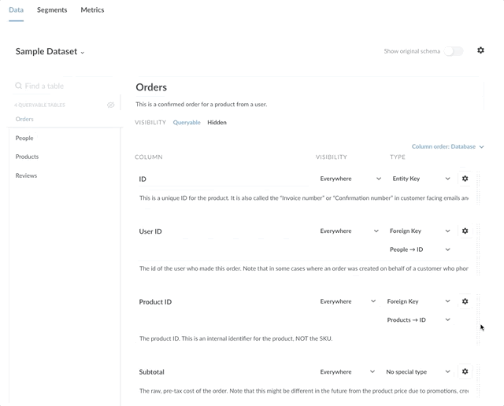

# The Data Model page

Metabase allows admins to annotate the data in your database. Annotations can give Metabase a better understanding of what the data actually means, which allows Metabase to make more intelligent decisions when processing and displaying that data.

The **Data Model** section of the **Admin Panel** contains settings to edit metadata for:

- **Tables**
- **Columns**
- **Segments**
- **Metrics**

This page focuses on editing table and column metadata; another page covers [segments and metrics](./segments-and-metrics.md).

Or are you instead looking for docs on [models](./models.md)?

## Accessing the Data Model page

At the top right of the screen, click on **gear** icon > **Admin** > **Data Model**.

In the sidebar on the left, you can choose which database to configure. Next, select the table to view and edit its metadata.

## Metadata for tables

For table metadata, you can:

- Change [table **visibility**](#table-visibility).
- Change [table **name** and **description**](#table-name-and-description).
- View the [original **schema**](#original-schema).

### Table visibility

You can set tables to be **Queryable** or **Hidden**. Setting table visibility can be especially useful if you have a lot of tables in your database but your users will only be interested in a subset of those tables. Table visibility can help keep your Metabase instance tidy by hiding unnecessary tables out of the user interface.

Visibility settings are distinct from **permissions**. Users can still query hidden tables using the **SQL editor**. See [**permissions**](../administration-guide/05-setting-permissions.md) for controlling access to data.

**Queryable tables** can be selected from the **notebook editor**, and all of the data in the table can be displayed (unless certain columns are excluded — more on that below).

**Hidden tables** can’t be selected from the **notebook editor**, and their data can’t be accessed anywhere in Metabase except in the **Admin Panel** and the **SQL Editor**.

Here's a gif showing how to hide and unhide tables:

### Table name and description

You can change the **name** and **description** of your tables. Note that the underlying database won’t be affected; changes will only update the name of the table in Metabase.

You can add descriptions to tables to let people know the type of data a table contains. Descriptions are displayed when browsing data (click on the book icon), as well as in the Data Model Reference Panel in the SQL Editor, which you can open by clicking on the book icon to the right of the editing panel.

### Original schema

If you ever want to see the original underlying schema for a given table, just click the **Show original schema** toggle in the top-right of the screen.

## Metadata for columns

Metabase automatically attempts to classify your columns and assign them a type, but you can also edit the metadata yourself. If Metabase misclassified any columns, you can correct those inaccurate classifications here.

For each column, you can edit its:

- Name
- Description
- Visibility
- Type

### Column name

To change how the column name is displayed, click on the name of the column. For example, if your ORM produces table names like "auth.user", you can replace this with "User" to make the column more readable. This name change only affects how Metabase displays the column; the change does not affect the database itself.

### Column description

You can include a human-readable summary of a column, its source, and use cases. Any caveats about interpretation can go here as well. Descriptions are particularly useful when columns have values that are abbreviated or coded in a particular format.

### Column visibility

By default, users can see every column in a table, but you can select other visibility options:

- **Only in Detail Views**. Sets the visibility to display only when viewing a single **column** record. Useful if you have really long data in certain **columns**, like descriptions or biographies. By default, any column with an average length of longer than 50 characters is assigned this setting.

- **Do Not Include**. This column won't be visible or selectable in questions created with the **notebook editor** (the GUI editor). Useful if you have sensitive or irrelevant columns.

For the **SQL editor**, **Do Not Include** settings only affect visibility in the **data reference** section. Though columns will not be visible in the **data reference** section, users will still be able to query these columns.

### Field type

You can use the Data Model page to edit field types for fields in your database. Use the **Type** dropdown menu to select from this [list of options](./field-types.md).

In this same menu, you can also designate a column as the table's **primary key** or **foreign key**.

See [Field types](./field-types.md) for more on types and how they function in Metabase.

### Casting to a specific data type

You can manually cast text and number columns to date fields. Casting is useful if your date/timestamps are stored as text or number fields in your database, but you want Metabase to treat them like date values (so it'll do things like present calendar pickers for filters). Casting is different from changing the field type in Metabase, which only modifies semantic information to give people more context about that field, like setting a date field as a "Cancellation date." By contrast, casting changes the underlying type so that, for example, Metabase will interpret a string field as if it were a date.

You can cast text in ISO8601 format and numbers representing Unix epoch to date, datetime, or time types. The exact casting options will differ depending on which kind of database you're connected to, but here are some types you can cast:

- ISO8601->Date
- ISO8601->Datetime
- ISO8601->Time
- UNIXMicroSeconds->DateTime
- UNIXMilliSeconds->DateTime
- UNIXSeconds->DateTime

To cast a field to a different type, click on the gears icon next to the field you want to cast. If the field is a number or text field, you may see an option to **Cast to a specific data type**, with a default option set to "Don't cast." Select the type you want to cast to, and you're good to go. Casting doesn't affect the original data type; just how Metabase interprets that field.

## Remapping column values

One thing that happens commonly in tables is that you'll have a **foreign key column**, like `Product ID`, with a bunch of ID values in it, when what you actually want to see most of the time is the **entity name**, like the `Product Title`. You might also have fields which contain coded values that you'd prefer to show up as translated or readable values in your tables and charts — like changing `0`, `1`, and `2` to `Female`, `Male`, and `Other`.

To remap column values, click on the gear icon to the right of a field's Type dropdown in the Data Model section of the Admin Panel. You'll see a form with these options:

`Visibility` and `Type` are the same as on the main Data Model page, but `Display values` lets you choose to swap out a field's values with something else.

**Foreign key remapping** lets you swap out a foreign key's values with the values of any other field in the connected table. In this example, we're swapping out the `Product ID` field's values with the values in the `Title` field in the Product table:

Another option is **custom remapping**, which is currently only possible for numeric fields. This lets you map every number that occurs in this field to either a different numeric value or even to a text value, like in this example:

## Picking the filter user interface for a column

Metabase will automatically try to pick the best kind of filter interface for each column based on that column's type, and the number of different values in it. Columns with only a few possible choices, like a `Gender` column, will display a dropdown list by default when filtering on them. Columns with more than 100 possible selections will show a search box with autocomplete.

You can manually change the user interface for the filter to:

- Search box
- A list of all values
- Plain input box

## Column order

Metabase will default to the column order native to the database.

You can re-order the way Metabase presents columns in menus and other interfaces (without affecting the database) by clicking on the grab bar to the right of each column, and dragging the column to a new position in the order.

You can also select from several options:

- **Database.** (Default) The order of columns as they appear in the database.
- **Alphabetical.** A, B, C... however the alphabet works.
- **Custom.** You choose the order. Metabase will automatically switch to custom if you rearrange any of the columns.
- **Smart.** Metabase chooses for you.
