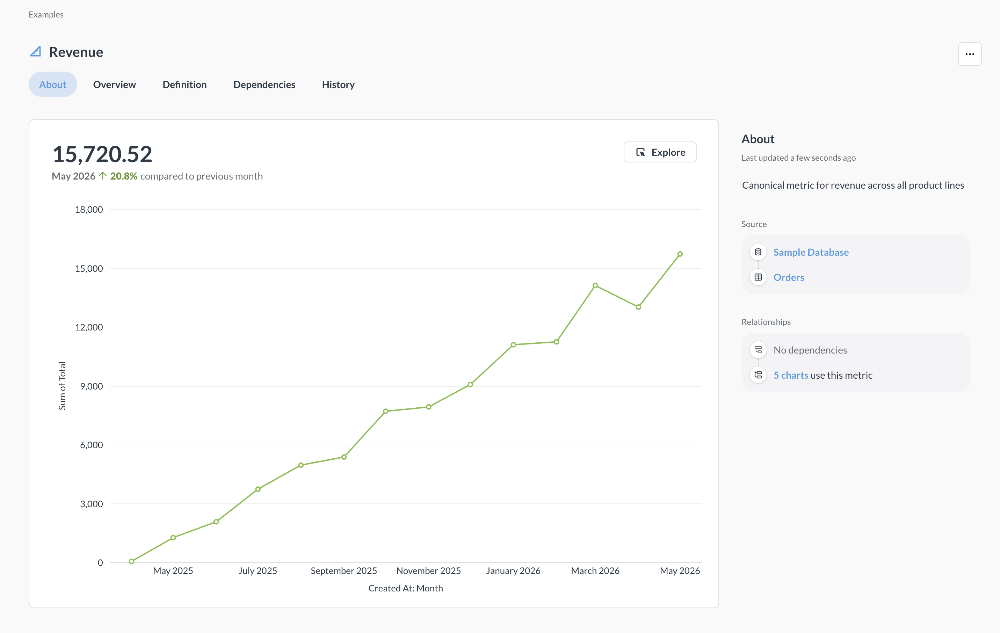
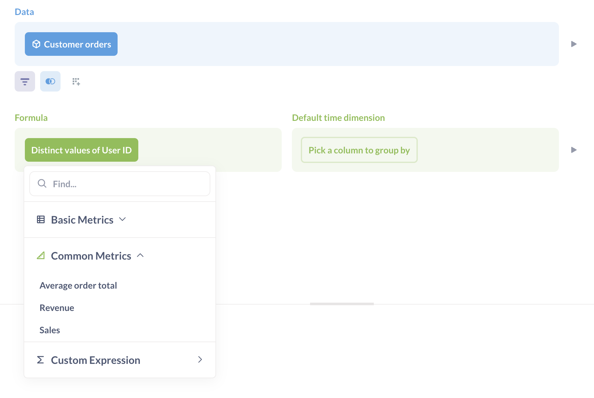
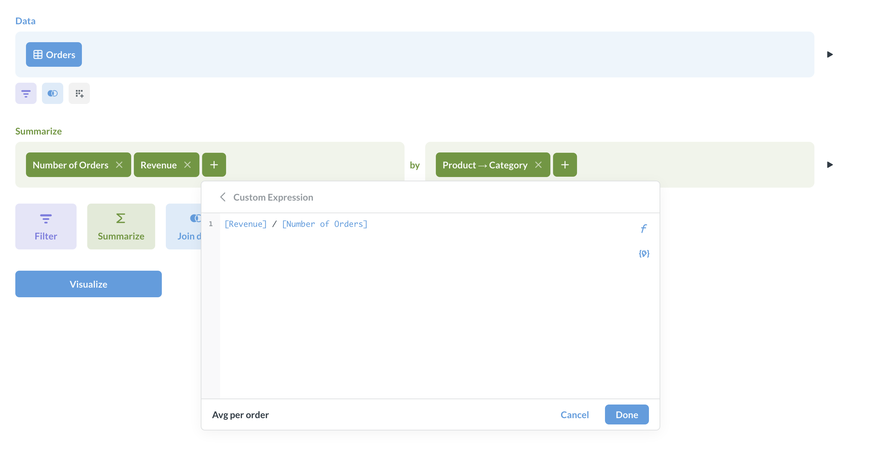
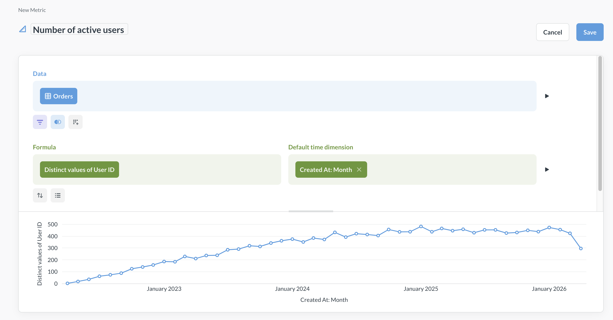
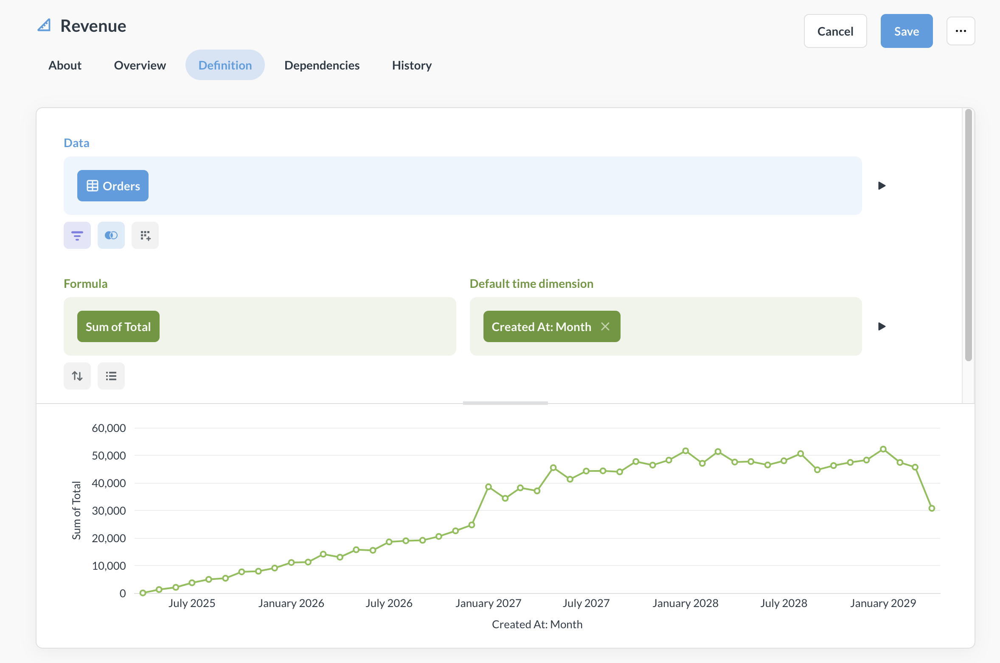
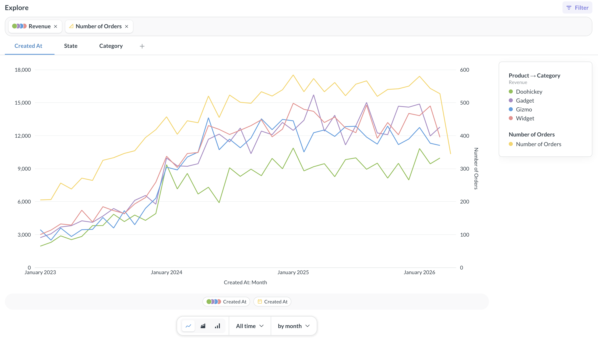
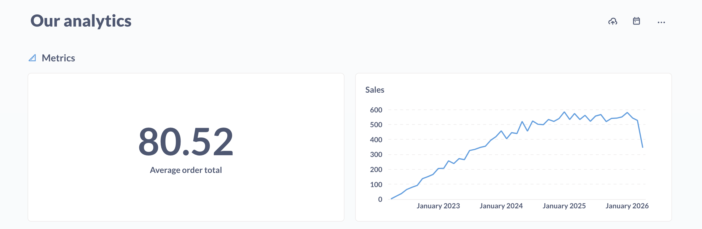

# Metrics

Metrics define the official way to calculate important numbers for your team.



Metrics are like pre-defined calculations: create your aggregations once, save them as metrics, and use them whenever you need to analyze your data.

For example, you may want to create a metric that calculates revenue, so people can refer to revenue in their own questions. That way you standardize how revenue is calculated (so you don't end up with five different calculations for the revenue).

## How metrics work

Think of a metric like a reusable formula. For example, you can create a metric on a `Survey` table that calculates `(CountIf([Score] >= 9) - CountIf([Score] <= 6)) / Count()` (a.k.a. Net Promoter Score). Now other people in your Metabase, instead of writing their own version of NPS, can simply look up that agreed-upon NPS metric, or refer to it in the [query builder](../questions/query-builder/editor.md) when creating new questions.

Metrics have three components:

- [**Data source**](#metric-data-sources): metrics are associated with a specific data source and can be used in any question built on that data source.
- [**Formula**](#metric-formula): the aggregation's definition.
- [**Optional default time dimension**](#metric-default-time-dimension): a default time dimension to be used when displaying the metric as a standalone card on a dashboard or a pinned item in the collection. This time dimension doesn't affect how the metric is computed.

Metabase will show the metrics as an option in the query builder along with the basic aggregations like Count or Sum.

If you use a metric as you aggregation, Metabase will replace the metric with the saved formula behind the scenes. See [Use metrics in the query builder](#use-metrics-in-the-query-builder).

Metrics live in collections. You can save metrics into the [Library](../data-studio/library.md) collection to surface your org's official curated metrics and encourage people to use them for their own questions.

## Use metrics in the query builder

When you start a question on a [data source that has a metric defined](#metric-data-sources), Metabase will show you metrics on that data source in the **Summarize** block under **Metrics**.



Custom metrics work just like built-in metrics (Count, Sum etc): you can break out metrics by dimensions, include multiple metrics, and refer to metrics in custom expressions.



You can also pick a metric as a data source when creating a new question. If the metric has a time dimension, Metabase will include the time dimension as a grouping. You can change the groupings to break out the metric by other dimensions.

## Create a metric

A metric consists of three parts: the data source, the formula that defines how a metric is computed, and an optional time dimension.

To create a metric:

1. Bring up the command palette with cmd/ctrl + k (that’s cmd + k for Macs, or ctrl + k for Windows PCs) and search for **New metric**

   You can also create a new metric by going to **Browse > Metrics** in the navigation sidebar and clicking on **+**.

   If you're creating a [Library metric](../data-studio/library.md#metrics), you can also [navigate to the Library](../data-studio/library.md) and click **+ New > Metric**.

2. Select your starting data. You can start from a table, saved question, model, or another metric.

   Metric will be usable only on the data source you defined it on.

3. Define your metric. The metric editor is similar to the regular query builder, with two key differences:

   - The [**Formula**](#metric-formula) block is where you define your aggregation. You can use [custom expressions](../questions/query-builder/expressions.md) to write the formula, for example `SumIf([Total], [Plan] != 'free')`.
   - The [**Default time dimension**](#metric-default-time-dimension) is where you can optionally include a default way for Metabase to group the metric by time when displaying the metric on a dashboard, document, or collection card. This time dimension isn't used for computing the metric (you can specify any other dimension when actually using the metric).

   

   Only the data and formula steps are required to define a metric. You can join and filter data before the formula step, and set a default time dimension to group by.

4. Click **Save**. Metrics live in collections, so you'll need to pick a collection for the metric to save.

## Edit a metric

To edit a metric:

1. Navigate to the metric you want to edit.

   You can visit metric in its collection, find it in the [metrics browser](#see-all-metrics), or search for it.

2. To edit the metric's definition, switch to the **Definition tab**.

   

   If you edit the metric's definition, all questions that use the metric will immediately start using the new definition.

3. Save your changes.

## Explore and compare metrics

You can explore metrics, break them out by different dimensions, and compare metrics and [measures](../data-studio/data-structure.md#measures) to each other in the [Metrics Explorer](../questions/metrics-explorer.md).



To see a metric in the Metrics Explorer, visit the metric and click **Explore** in the top right corner. You can add more metrics, breakouts, and filters to compare metrics along different dimensions.

## Metric data sources

Metrics are attached to a specific data source. This means that if you define a "Net Promoter Score" metric on the `Survey` table, you will be able to use the metric in any question that is build on the `Survey` table, but _only_ in questions that are built on the `Survey` table (and not, for example, any model or saved question that itself uses the `Survey` table).

You can build metrics on tables, saved questions, models, and other metrics.

We don't recommend using joins in metric definitions. If you need to build a metric that uses information from multiple tables, consider making a [transform](../data-studio/transforms/transforms-overview.md) to join those tables, _then_ create a metric on the table the transform creates.

## Metric formula

The formula is the core of the metric. It's the thing you are aggregating, and it's required when defining a metric.

You can use [custom expressions](../questions/query-builder/expressions.md) to define a metric, for example:

```
 (CountIf([Score] >= 9) - CountIf([Score] <= 6) ) / Count() * 100
```

Metric formula must be an _aggregation_  of a column, meaning you can have a formula like `Sum([Price])` which will add up all the values in the `Price` column across all records, but you can't have a formula like `[Price] + [Tax]` which adds two values on a per-record basis. If you need to create a "calculated" column, consider using [transforms](../data-studio/transforms/transforms-overview.md) or [models](../data-modeling/models.md) instead.

We don't recommend adding filters into the metric definition to avoid filter conflicts when using metrics in the query builder. You can use conditional custom expressions like [`CountIf`, `SumIf`, and `DistinctIf`](../questions/query-builder/expressions-list.md#aggregations) to create conditional aggregations.

You can reference other metrics when defining the formula for your metric.

## Metric default time dimension

You can optionally set a default time dimension for the metric. Metabase will use this default time dimension when the metric is opened or displayed on a card in a collection or dashboard. In the image below that shows two pinned metrics at the top of a collection, the left metric lacks a default time dimension, so Metabase displays the metric as a number chart. The right metric has a default time dimension, so Metabase displays it as a line chart.



Setting a time dimension doesn't lock the metric to that specific dimension. If someone uses the metric in a question or dashboard, they'll be able to group by other time dimensions and granularities as well.

For example, you could calculate revenue and set a default time dimension of `Created At` by month, but if someone added that metric to a dashboard, they could group revenue by a different time granularity (e.g., by quarter). This is just an FYI so that you don't name a metric "Monthly Revenue" and think that by setting a default time dimension to "month", Metabase will prevent people from slicing revenue by other time granularities.

## See all metrics

You can see all metrics on your instance:

- Open the left navigation sidebar and select **Metrics** under **Data**.
- Alternatively, bring up the command palette with cmd/ctrl + k (that’s cmd + k for Macs, or ctrl + k for Windows PCs) and search for **Browse metrics**.

## Metric permissions

Because metrics live in collections, are attached to a data source, and define a query, permissions for metrics are determined by a combination of [collection permissions](../permissions/collections.md), ["View data" permissions](../permissions/data.md#can-view-data-permission), and ["Create queries" permissions](../permissions/data.md#create-queries-permissions).

| Metric action \ Permissions       | View data     | Create queries           | Collection |
| --------------------------------- | ------------- | ------------------------ | ---------- |
| **Create** or **edit** definition | Not "Blocked" | At least "Query builder" | Curate     |
| **View**                          | Not "Blocked" | Any                      | View       |
| **Use** in the query builder      | Not "Blocked" | At least "Query builder" | View       |

Anyone who has these permissions will be able to interact with the metric: for example, anyone with curate permissions to a collection, and "Create queries" permission on a data source will be able to create metrics in the collection that they can curate.

## Metrics in the Library

By adding metrics to your Library, the query builder will display the metrics more prominently in menus. See [Library metrics](../data-studio/library.md#metrics).

## Verifying a metric

On [Pro](https://www.metabase.com/product/pro) and [Enterprise](https://www.metabase.com/product/enterprise) plans, you can [mark metrics as verified](../exploration-and-organization/content-verification.md).

Prefer using the [Library](../data-studio/library.md#metrics) to let people know which metrics they should use.

## Limitations

- For now, metrics are associated with a specific data source, and can't be used on any other data source, including on data sources derived from metric's original data source.
- Metrics are only available to the query builder. For defining reusable bits of SQL, check out [Snippets](../questions/native-editor/snippets.md).
- You can't limit people from creating metrics on data sources they otherwise have permissions to query.

## Further reading

- [Measures](../data-studio/data-structure.md#measures)
- [Models](./models.md)
- [Segments](./segments.md)
- [SQL Snippets](../questions/native-editor/snippets.md)
