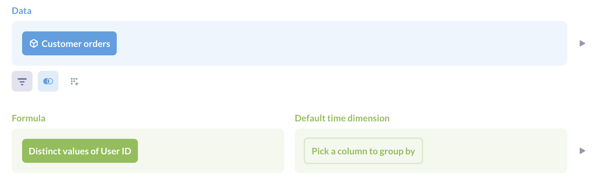

# Metrics

Create metrics to define the official way to calculate important numbers for your team.

Metrics are like pre-defined calculations: create your aggregations once, save them as metrics, and use them whenever you need to analyze your data.

For example, you may want to create a metric that calculates revenue, so people can refer to revenue in their own questions. That way you standardize how revenue is calculated (so you don't end up with five different calculations for the revenue).

## Using metrics

You can:

- Save metrics to [collections](../exploration-and-organization/collections.md).
- Add metrics to [dashboards](../dashboards/introduction.md).
- View metrics in the [data browser](../exploration-and-organization/exploration.md#browse-your-data).
- Pick metrics as aggregation columns in the Summarize block when creating questions, modify them or combine.
- [Pro](https://www.metabase.com/product/pro) and [Enterprise](https://www.metabase.com/product/enterprise) plans include the ability to mark metrics as verified.

### Metrics in the query builder

When asking questions in the query builder, you can find metrics that your team created in the summarization section under **Common metrics**. You can pick multiple metrics and they will be calculated independently and joined automatically along the chosen dimensions.

You can also pick a metric as a data source when creating a new question. If the metric has a time dimension, Metabase will include the time dimension as a grouping. You can change the groupings to break out the metric by other dimensions.

You can use custom expressions to combine multiple metrics, or perform calculations on top of metrics.

## Creating a metric

You can create a metric by clicking on the **+ New** menu and selecting **Metric**.

Select your starting data. You can start from a model, metric, table, or saved question.

You can only use the query builder to define a metric.

The metric editor is similar to the regular query builder, with two key differences:

- The aggregation section is called [**Formula**](#metric-formula)
- The group by section is called the [**Default time dimension**](#metric-default-time-dimension). You can only group by a single time dimension.

Only the data and formula steps are required to define a metric. You can join and filter data before the formula step, and set a default time dimension to group by.

## Metric formula

The formula is the core of the metric. It's the thing you are aggregating, and it's required when defining a metric.

You can build metrics on top of existing metrics.

## Metric default time dimension

You can optionally set a default time dimension for the metric. Metabase will use this default time dimension when the metric is opened or displayed on a card in a collection or dashboard. In the image below that shows two pinned metrics at the top of a collection, the left metric lacks a default time dimension, so Metabase displays the metric as a number chart. The right metric has a default time dimension, so Metabase displays it as a line chart.

Setting a time dimension doesn't lock the metric to that specific dimension. If someone uses the metric in a question or dashboard, they'll be able to group by other time dimensions and granularities as well.

For example, you could calculate revenue and set a default time dimension of `Created At` by month, but if someone added that metric to a dashboard, they could group revenue by a different time granularity (e.g., by quarter). This is just an FYI so that you don't name a metric "Monthly Revenue" and think that by setting a default time dimension to "month", Metabase will prevent people from slicing revenue by other time granularities.

## Editing a metric

To edit a metric, click on the three dot menu (**...**) and select **Edit metric definition**.

Do your thing, and save your changes.

When you click on a metric, Metabase will assume that you're using that metric as the starting point for a new question. You can save any changes you make as a new question, but these changes won't affect the metric's definition.

## Further reading

- [Models](./models.md)
- [Segments](./segments.md)
