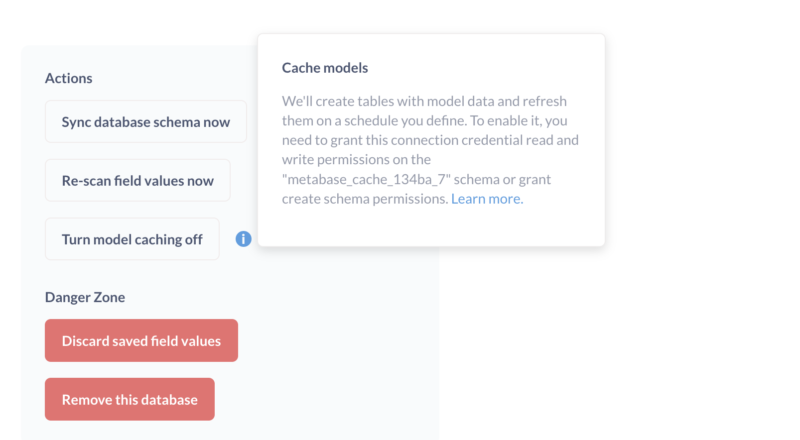
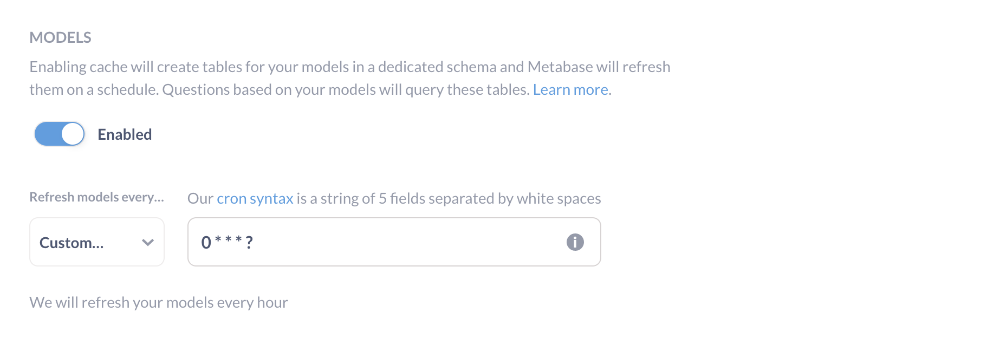

# Models

Models are a fundamental building block in Metabase. Models curate data from another table or tables from the same database to anticipate the kinds of questions people will ask of the data. You can think of them as derived tables, or a special kind of saved question meant to be used as the starting point for new questions. You can base a model on a SQL or query builder question, which means you can include custom, calculated columns in your model.

Models:

- Let you update column descriptions and customize metadata to create great starting points for exploration.
- Show up higher in search results and get highlighted when other users start new questions to promote reuse.
- Live in collections to keep them separate from messy database schemas.

For a deep dive on why and how to use models, check out our [Learn article on models][learn-models].

## How to use models

You can use models to:

- Create, uh, models, with model here meaning an intuitive description of some concept in your business that you codify as a set of columns. An example model could be a "customer", which is a table that pulls together customer information from multiple tables and adds computed columns, like adding a lifetime value (LTV) column. This model represents the [measures and dimensions][measures-dimensions] that you think are relevant to your understanding of your customers.
- Create summary tables that aggregate data from multiple tables.
- Clean up tables with unnecessary columns and rows filtered out.

The idea with models is to give other people a good "starting point table" that makes it easier to answer any questions they have about the subject being modeled.

## Create a model

First, search for models that already exist. If you can't find one that meets your needs, you can create a model like so:

1. [Ask a question][question] using either the query builder or the SQL editor.
2. Save the question.
3. Click on the **...** > **Turn this into a model**.


## Add metadata to columns in a model

Metadata is the secret sauce of models. When you write a SQL query, Metabase can display the results, but it can't "know" what kind of data it's returning (like it can with questions built using the query builder). What this means in practice is that people won't be able to drill-through the results, because Metabase doesn't understand what the results are. With models, however, you can tell Metabase what kind of data is in each returned column so that Metabase can still do its drill-through magic. Metadata will also make filtering nicer by showing the correct filter widget, and it will help Metabase to pick the right visualization for the results.

If you only set one kind of metadata, set the **Column type** to let Metabase know what kind of data it's working with.

### Display name

What people will see as the column's name.

### Description

A place to write helpful context for the column.

### Database column this maps to

For models based on SQL queries, you can tell Metabase if the column has the same type as an existing database column.

### Column type

You can set the [column type][column-type]. The default is "No special type". Be sure to set the Column type so people can interact with the results.

## This column should appear in...

You can specify whether a column should appear in the table view, or just in a detail view (when you click on the entity/primary key for the row).

- Table and detail views
- Detail views only

### Display as

- Text
- Link (it's a URL people should be able to click on)

### Editing the model's query

You can edit the model's query by clicking on the down arrow next to the model's name and clicking on **Edit query definition**. When you're doing editing, be sure to save your changes. Unlike questions, which prompt you to save as a new question, any changes here will overwrite the existing model. If you want to create a new model from an existing model, select **Duplicate this model** from the model sidebar (the icon of two overlapping squares).

## Start a question from a model

See [asking questions][question].

## [Refer to a model in the SQL query editor](../questions/native-editor/referencing-saved-questions-in-queries.md)

You can refer to a model in a SQL query just like you can refer to a saved question:

```

SELECT * FROM {{#1}}

```

Or as a [common table expression (CTE)][cte]:

```

WITH model AS {{#3807}}
SELECT *
FROM model;

```

## Model history

Just like with saved questions, you can click on the model name with the down arrow to bring up the model's sidebar, then click on **History** at the bottom to bring up a list of the changes made to the model over time, and by whom.

## Verifying a model



Just like with a question, admins can verify models. Verifying a model will give it a check mark to let others know an admin vetted the model. If anyone makes any changes to the model, the check mark will disappear. An admin will have to verify the question again to restore the check mark.

## Model caching

_Currently available for PostgreSQL, MySQL, and Redshift_.

Metabase can cache the results of your models so that the models load faster. Metabase caches models by creating tables in a bespoke schema in your data warehouse, and saves the results of the queries that underlie your models in those tables. When people ask questions based on your models, Metabase will substitute those cached results in place of running the model's query.

### Enable model caching for a database

There are two steps to enabling model caching for your database.

1. [Create a schema in your database to store cached models](#1-create-a-schema-in-your-database-to-store-cached-models)
2. [Enable model caching in your Metabase](#2-enable-model-caching-in-your-metabase)

#### 1. Create a schema in your database to store cached models

To create the schema in your database, in your Metabase click on the **gear** icon in the upper right and select **Admin settings** > **Databases**, then select the relevant database connection. On the right, click on **Turn model caching on**.



If the credentials you've given Metabase to connect to your database are permissive, Metabase should do all the work for you: Metabase will check if the schema exists, or otherwise attempt to create it. 

If the connection's credentials lack the necessary permissions to create the schema in your database, you'll need to create the schema in the database yourself. Click on the info button to view the name of the schema that you'll need to create in your database to store your cached models. In the above image, the schema name is "metabase_cache_134ba_7", but your schema name will differ. Once you've created that schema, ensure that the credentials Metabase uses can manage and write to that schema. Make sure that you name the schema exactly as the tooltip in Metabase suggests.

#### 2. Enable model caching in your Metabase

Once you've completed step one, return to the **Admin settings** > **Settings** > **Caching**.



You can set models to refresh based on one of the default frequencies, or select the **Custom** option to use [cron syntax](https://www.quartz-scheduler.org/documentation/quartz-2.3.0/tutorials/crontrigger.html) to specify your own caching update frequency. We recommend scheduling the cache to refresh on a frequency that makes sense with how often your source tables update with new data.

If someone changes the query definition of a model, any question based on that model will skip the cache until the next cache refresh.

### Refreshing a model's cached results

To refresh a model's cached results, go to the model and click on the **i** info icon. In the info sidebar that opens, you'll see a note about when Metabase last refreshed the model's cache, and an icon to refresh the cache.

### View model caching logs

You can view the logs for model caching by clicking on the **gear** icon in the upper right and selecting **Admin settings** > **Tools** > **Model caching logs**. See [Admin tools](../enterprise-guide/tools.md).

### Caching individual models



On some paid plans, you can also toggle caching on or off for individual models. When viewing a model, click on the **...** in the upper right and select **Turn model caching on/off**.

## Further reading

- [Models in Metabase][learn-models]

## Need help?

If you're having trouble with your model, go to the [Models troubleshooting guide][troubleshooting-models].

[column-type]: ./field-types.md
[cte]: https://www.metabase.com/learn/sql-questions/sql-cte
[measures-dimensions]: https://www.metabase.com/learn/databases/dimensions-and-measures
[question]: ../users-guide/04-asking-questions.md
[learn-models]: /learn/getting-started/models
[troubleshooting-models]: ../troubleshooting-guide/models.html
