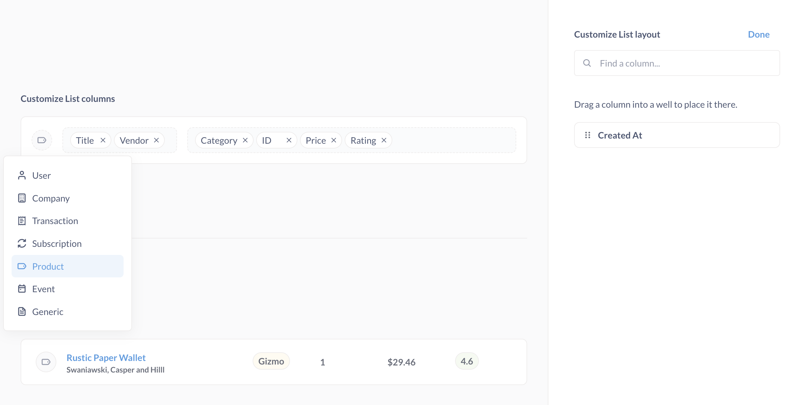

# Models

Models are a fundamental building block in Metabase. Models curate data from another table or tables from the same database to anticipate the kinds of questions people will ask of the data. You can think of them as derived tables, or a special kind of saved question meant to be used as the starting point for new questions. You can base a model on a SQL or query builder question, which means you can include custom, calculated columns in your model.

Models:

- Let you update column descriptions and customize metadata to create great starting points for exploration.
- Show up higher in search results and get highlighted when other users start new questions to promote reuse.
- Live in collections to keep them separate from messy database schemas.
- Can [surface individual records in search results](#surface-individual-records-in-search-by-matching-against-this-column).
- Can be [persisted for faster loading](./model-persistence.md).

For more on why and how to use models, check out our [Learn article on models][learn-models].

## How to use models

You can use models to:

- Create, uh, models, with model here meaning an intuitive description of some concept in your business that you codify as a set of columns. An example model could be a "customer", which is a table that pulls together customer information from multiple tables and adds computed columns, like adding a lifetime value (LTV) column. This model represents the [measures and dimensions][measures-dimensions] that you think are relevant to your understanding of your customers.
- Let people explore the results of SQL queries with the query builder (provided you [set the column types](#column-type)).
- Create summary tables that pull in or aggregate data from multiple tables.
- Clean up tables with unnecessary columns and rows filtered out.

The idea with models is to give other people a good "starting point table" that makes it easier to answer any questions they have about the subject being modeled.

## Create a model

First, search for models that already exist. If you can't find one that meets your needs, you can create a model:

- [from scratch](#create-a-model-from-scratch), or
- [from a saved question](#create-a-model-from-a-saved-question).

Models you create are automatically [pinned to the current collection](../exploration-and-organization/collections.md#pinned-items).

### Create a model from scratch

- Navigate to the Models tab in the sidebar. You might have to open it using the button in the top left, then scroll down to the section labeled **Data**, and pick **Models**. Then click on the **+** button in the top right.
- Or open the [command palette](https://www.metabase.com/docs/latest/exploration-and-organization/exploration#command-palette) and type "model." Then click on the **New model** action.

Now choose either the query builder or a native query (if you want to use SQL). The advantage of using the query builder is that Metabase will be able to fill out some of the metadata for you; if you use SQL, you'll have to fill out that metadata manually.

Next, select your data, create your query, and save it.

Models you create are automatically [pinned to the current collection](../exploration-and-organization/collections.md#pinned-items).

### Create a model from a saved question

1. [Ask a question][question] using either the query builder or the SQL editor, or select an existing saved question that you want to convert to a model.
2. Save the question.
3. Click on the **...** > **Turn this into a model**.


## Model details

To view a model's details, visit the model and click on the **info** button in the upper right. Here you'll see several tabs:

- **Overview**: Includes the description, Creator and Last Editor, and the list of fields included in the model. As well as the model's [Entity ID](../installation-and-operation/serialization.md#metabase-uses-entity-ids-to-identify-and-reference-metabase-items).
- **History**: Lists changes to the model, and by whom.
- **Relationships**: Lists which questions use the model, and which tables the model is linked to.
- **Actions**: Lists actions created based on the model.
- **Insights**: Info about the [model's usage](../usage-and-performance-tools/usage-analytics.md). Only visible to admins on a [Pro or Enterprise plan](https://www.metabase.com/pricing/).

## Add metadata to columns in a model

Metadata is the secret sauce of models. When you write a SQL query, Metabase can display the results, but it can't "know" what kind of data it's returning (like it can with questions built using the query builder). What this means in practice is that people won't be able explore the results with the query builder, because Metabase doesn't understand what the results are. With models, however, you can tell Metabase what kind of data is in each returned column so that Metabase can still do its query magic. Metadata will also make filtering nicer by showing the correct filter widget, and it will help Metabase to pick the right visualization for the results.

If you only set one kind of metadata, set the **Column type** to let Metabase know what kind of data it's working with.

### Display name

What people will see as the column's name.

### Description

A place to write helpful context for the column.

### Database column this maps to

For models based on SQL queries, you can tell Metabase if the column has the same type as an existing database column.

### Column type

You can set the [column type][column-type]. The default is "No special type".

If your model is based on a SQL query and you want people to be able to explore the results with the query builder, you'll need to set the [column type](./semantic-types.md) for each column in your model.

### This column should appear in...

You can specify whether a column should appear in the table view, or just in a detail view (when you click on the entity/primary key for the row).

- Table and detail views
- Detail views only

### Display as

- Text
- Link (it's a URL people should be able to click on)

### Surface individual records in search by matching against this column

For string fields in records with integer entity keys, Metabase will give you the option make the values in that field show up when people search your Metabase. Essentially, Metabase will index these values and make them available to Metabase's search engine. This option is handy when people often want to jump straight to an individual record in your model.

For example, if you have a model with accounts, you could turn on this option for a column listing the account's name or email so that people can quickly search for specific accounts in the model from anywhere in your Metabase. When people click on a record in the search results, Metabase will jump straight to the model and the object detail for that record.

There are some limitations to this indexing:

- The indexed field must be a text/string type.
- The record containing the field must have an integer entity key.
- To keep your search speedy, Metabase will only index 5000 unique values from that field, so this option isn't the best choice to turn on for tables with a ton of records.

## Edit a model's query

You can edit a model's query by clicking on the down arrow next to the model's name and clicking on **Edit query definition**. When you're doing editing, be sure to save your changes. Unlike questions, which prompt you to save as a new question, any changes here will overwrite the existing model. If you want to create a new model from an existing model, select **Duplicate this model** from the model sidebar (the icon of two overlapping squares).

### Checking for breaking changes



When you save changes to a model, Metabase will try to detect whether your changes would break any other entities that depend on that model. For example, if you remove a column from the model, but other questions based on that model rely on that column, Metabase will warn you that those downstream questions will break.


Currently, Metabase will look for broken column references. If you rename or remove a column, Metabase will likely flag the change as breaking downstream entities. But Metabase can't detect other types of changes like changing the column type or computation logic as breaking changes.

## Model list view


List view helps you explore records one by one instead of sorting through big tables. You can customize the layout to highlight the most important fields.

To view a model as a list:

1. Visit the model.
2. Click the three-dot menu.
3. Select **Edit metadata**.
4. Navigate to the **Settings** tab.
5. Under "What should the default view of this data be?", toggle to **List**.


### Customize model list view



You can customize how the data appears by clicking **Customize the List layout**.

Each item in the list has:

- **An entity icon.** If the record has an image link, it shows the image, which you can hide anytime.
- **A left column** showing the title or primary identifier.
- **A right column** for up to 5 additional columns.

You can:

- **Search for columns** using the "Find a column..." search box.
- **Drag columns** from the available list into either the left column or right columns areas.
- **Reorder columns** by dragging them within their respective areas.
- **Remove columns** by clicking on the X on the column.

You can see a preview on the bottom with sample data from your model.

Click **Done** to save your changes.

## Start a question from a model

See [asking questions][question].

## [Refer to a model in the SQL query editor](../questions/native-editor/referencing-saved-questions-in-queries.md)

You can refer to a model in a SQL query just like you can refer to a saved question:

```sql

SELECT * FROM {{#1-customer-model}}

```

Or as a [common table expression (CTE)][cte]:

```sql

WITH model AS {{#3807-invoice-model}}
SELECT *
FROM model;

```

Simply typing `{{#}} ` will allow you to search for models (for example, you could type in `{{#customer}}` to search models, questions, and tables with the word "customer" in the title.

You can also use the data reference sidebar to browse the models available. To open the data reference sidebar, click on the **book** icon.

## Model version history

For [questions](../questions/start.md), [dashboards](../dashboards/start.md), and models, Metabase keeps a version history for the previous fifteen versions of that item. You can view changes and revert to previous versions.

See [History](../exploration-and-organization/history.md).

## Delete a model

You can move outdated or unneeded models to trash, or delete them permanently. Deleting a model will affect questions that use it as a data source.

See [Deleting and restoring items](../exploration-and-organization/delete-and-restore.md).

## Verifying a model

See [content verification](../exploration-and-organization/content-verification.md).

## Model persistence

See [Model persistence](./model-persistence.md)

## Further reading

- [Models in Metabase][learn-models]
- [Troubleshooting models][troubleshooting-models].

[column-type]: ./semantic-types.md
[cte]: https://www.metabase.com/learn/sql/working-with-sql/sql-cte
[measures-dimensions]: https://www.metabase.com/learn/grow-your-data-skills/data-fundamentals/dimensions-and-measures
[question]: ../questions/start.md
[learn-models]: https://www.metabase.com/learn/metabase-basics/getting-started/models
[troubleshooting-models]: ../troubleshooting-guide/models.md
