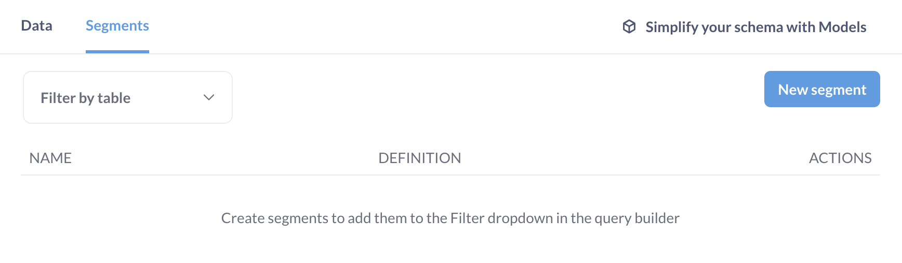
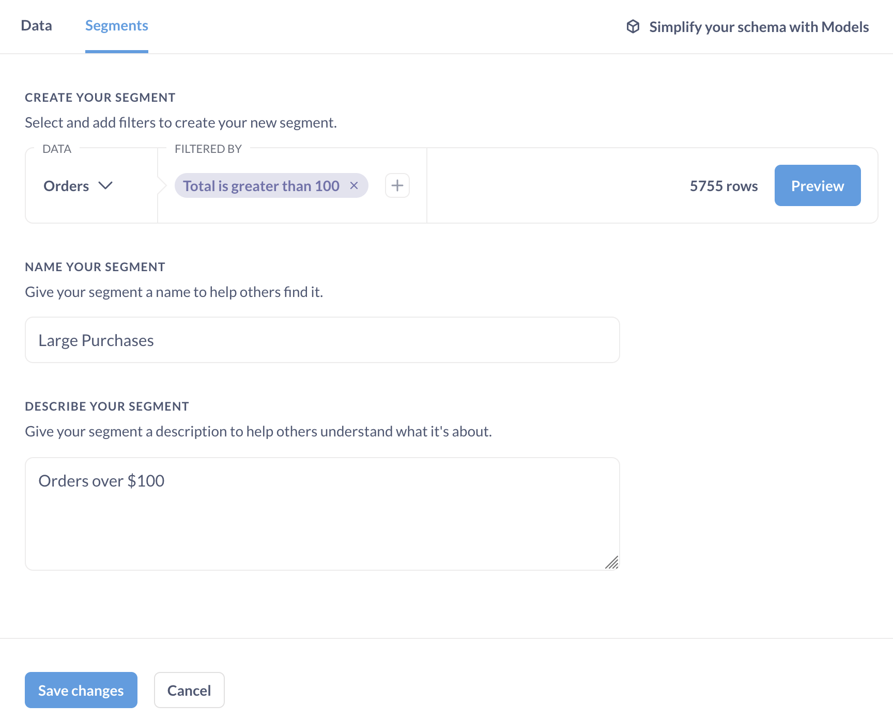
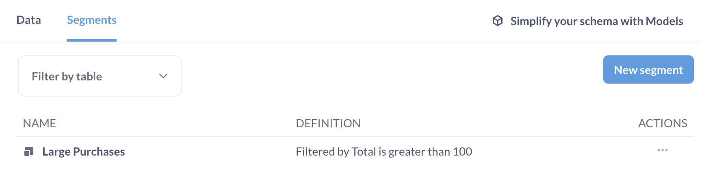
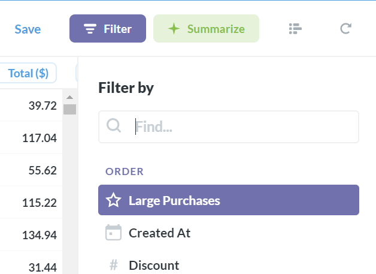
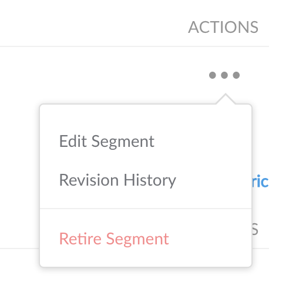
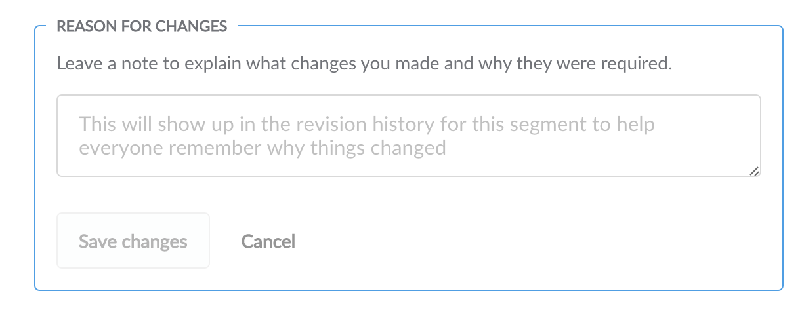

# Segments

Metabase allows admins to create segments so people can quickly and easily reference them in the query builder. Just head over to the **Admin Panel** and select **Table Metadata** from the top menu.

## Creating a Segment

A segment is just a special named filter or set of filters. You can create these to make sure that there is an official definition of a subset of customers, users, or products that everyone on your team can refer to consistently. For example, you might create a segment called “Active Users” that contains all the filters that are needed to correctly select active users.

To start, select the **Segments** tab, followed by the **New segment** button on the right side of the screen. Choose the appropriate table and filters for your new segment and add a title and description. When you’re done, this segment will be accessible from the filter list in the query builder when viewing this table (the segment will not be automatically applied to the table).

Now you’ll be looking at the segment builder, which is a limited version of the query builder, with only the option to add filters. Add your filter(s) as you would in the query builder, and then give your segment a name and a description (these will be visible in the query builder filter dropdown after you’ve saved). If you want to test out your segment in the query builder before you save it, just click the Preview button, which will open a new query builder window with your segment applied.

Once you’re done, click **Save changes**. Now your new segment will appear in the segments list of your table.

If you exit the Admin Panel and try asking a new question, then click on the button to add a filter, you’ll see your segment at the top of the list.

## Editing and retiring segments

You can edit and retire segments from the Table Metadata screen in the Admin Panel. Select the table with the segment you’re looking for, and click the ellipsis (…) icon to the right of that segment.

When editing a segment, you’ll be required to leave a note about why you’re changing it, just so everyone can understand why things are different. If any user is the creator of a saved question or dashboard that utilized the segment you’ve edited, they’ll receive an email letting them know that things have changed, along with the explanation that you write in this box.

Retiring a segment will make it no longer selectable from the query builder. However, **it won’t break existing saved questions that depend on that segment**.

Lastly, you can also view the revision history for each segment from the actions list.
