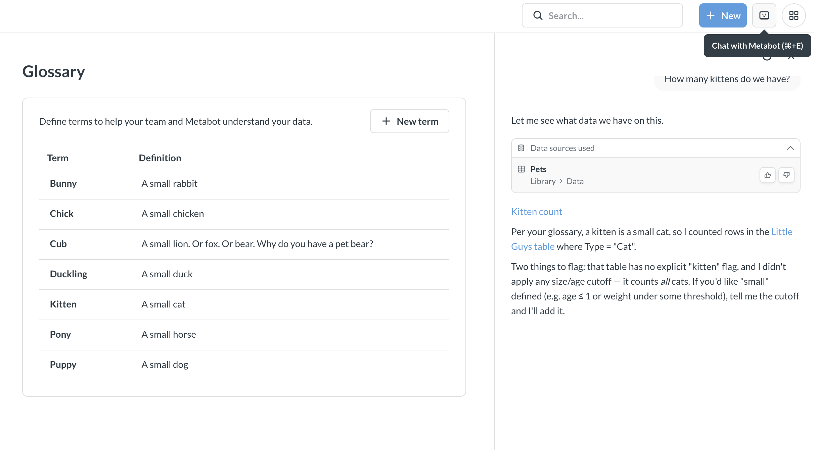
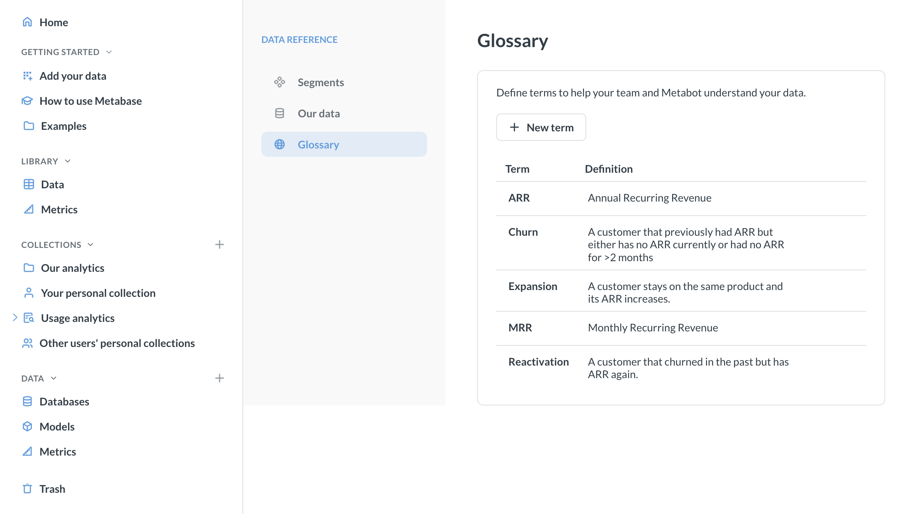

# Glossary

The glossary is a place where anyone can define terms relevant to your data,

## Use the glossary to give Metabot context

The glossary is particularly useful for [Metabot](../../ai/metabot.md). When Metabot gets a prompt, it can look up glossary terms to understand your request. For example, if you define "MRR" as "Monthly Recurring Revenue" in your glossary, Metabot will know what you mean when you ask "What's our MRR for Q4?"

## Manage the glossary

You can manage the glossary in [Data Studio](../data-studio.md). You need to be an admin or in the Data Analyst group to access Data Studio.

1. Click on the **grid** icon in the top right and select **Data Studio**.
2. In the left sidebar, click on **Glossary**.
3.  To add a new term, click **+ New term**. Add the term name and its definitions, then click the checkmark to save the term to the glossary.

    To remove a glossary term, hover over it and click on the **X** icon.

    To edit a glossary term or definition, click on the term or definition.

Metabot will start using glossary terms automatically.

## Glossary outside Data Studio

In addition to Data Studio, everyone in your Metabase can browse and add terms to the glossary if they have access to [Data Reference](../../exploration-and-organization/data-model-reference.md).

To see the glossary in Data Reference:
1. If the left navigation sidebar is hidden, open it by clicking on the **three lines** icon in top left.
2. In the left navigation sidebar, click **Databases**.
3. Click "Learn about our data" above the list of databases. This will open [Data Reference](../../exploration-and-organization/data-model-reference.md).
4. In Data Reference, click **Glossary** in the left sidebar.

    

