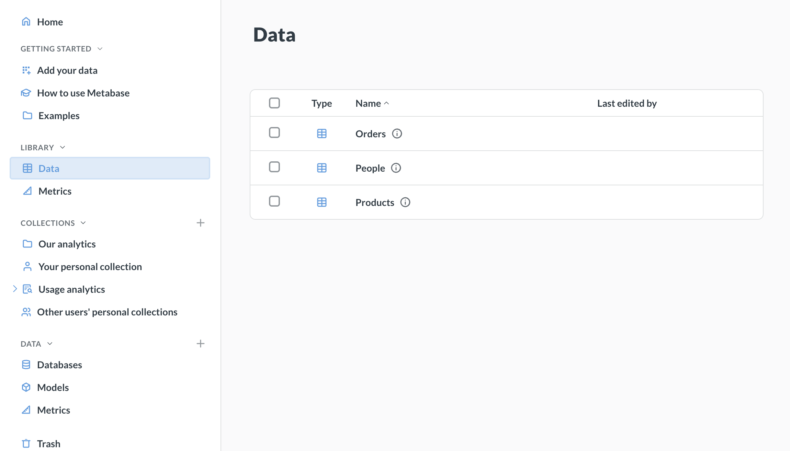
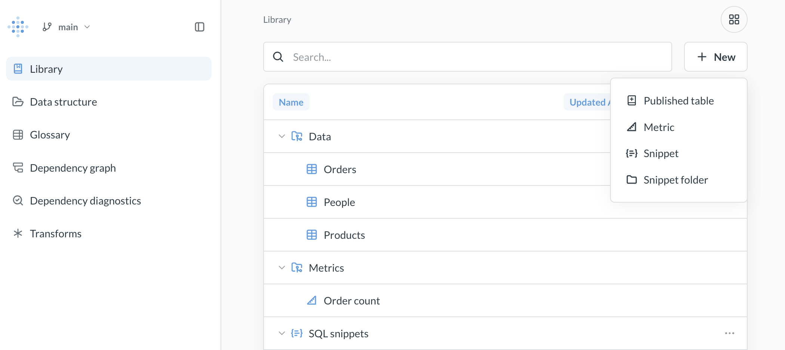
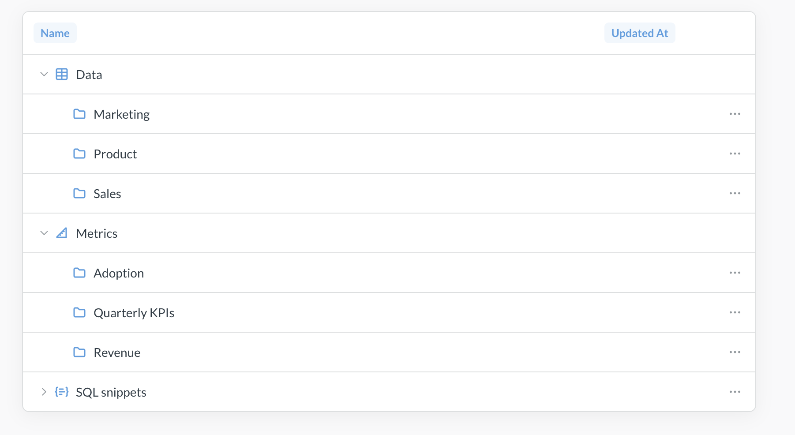
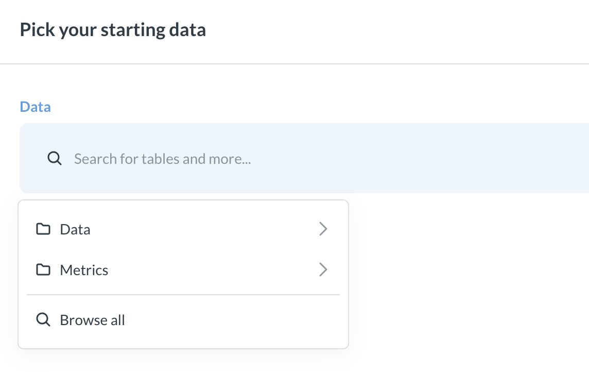
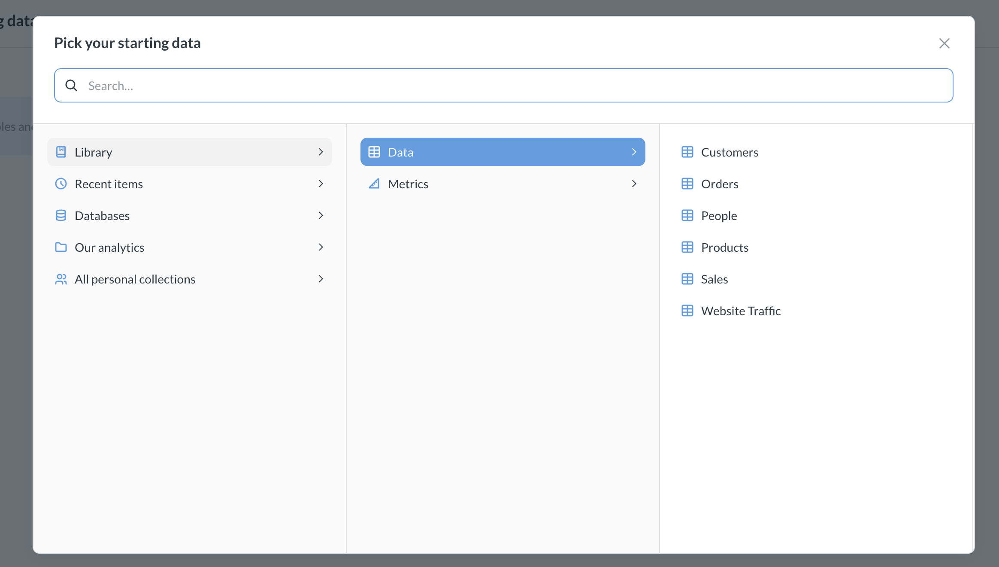
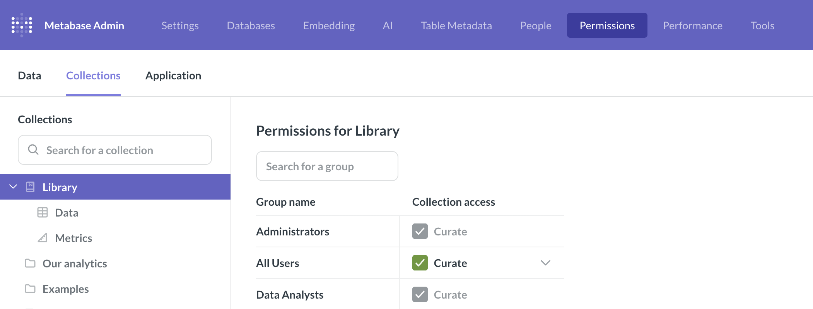

# Library



"I have always imagined that Paradise will be a kind of library."

― Jorge Luis Borges

The Library helps you create a source of truth for analytics by providing a centrally managed set of curated content and shared definitions. Use the Library to separate authoritative, reusable components from ad-hoc analyses and definitions.

## How the Library works

The Library has two parts, both of which you manage in [Data Studio](../data-studio.md):

- **[Semantic layer](#semantic-layer)**: Curated tables, metrics, and SQL snippets.
- **[Glossary](#glossary)**: Definitions of your business terms.

Once you [create the Library](#create-the-library):

- A **Library** section appears in the navigation sidebar of the main app, listing the tables and metrics in your semantic layer.
- The data picker in the query builder defaults to showing tables and metrics from the Library to encourage people to use your vetted content.
- If you turn on Metabot's [Verified or curated content](../../ai/settings.md#verified-or-curated-content) setting, Metabot will only use content that's verified, in an official collection, or published to the Library.
- You can [sync the Library to Git](#versioning-the-library) to version your semantic layer and glossary.

### Semantic layer

_Data Studio > Semantic layer_

The semantic layer is a collection of curated tables (together with their [segments](segments.md) and [measures](measures.md)), [metrics](metrics.md), and [SQL snippets](../../questions/native-editor/snippets.md) that people and AI can use to build authoritative questions and dashboards.

The semantic layer is what people see in the **Library** section of the main app's navigation sidebar, and in the data picker.

### Glossary

_Data Studio > Glossary_

The [Glossary](glossary.md) is a place for your team to define revelant business terms.

## Create the Library

Before you can add items to the semantic layer, you'll need to create the Library:

1. Click the **grid** icon in the upper right and select **Data Studio**.
2. In the left sidebar, click **Semantic layer**.
3. Click **Create my semantic layer**.

Metabase will create the Library with its **Data**, **Metrics**, and **Dashboards** collections. By default, everyone can view the Library, and people in the Data Analysts group can curate it. See [Library permissions](#library-permissions).

If you try to [publish a table](published-tables.md) from **Connected data** before you've created the Library, Metabase will ask you to create the Library first.

## Adding items to the Library

To add items to the Library:

1. Click the **grid** icon in the upper right and select **Data Studio**.
2. In the left sidebar, click **Semantic layer**.
3. Click **+ New**.

The **+ New** menu has options to:

- **Published table**: [Publish a table](published-tables.md#publish-a-table-from-the-semantic-layer) to the Library.
- **Metric**: [Create a metric](#metrics) in the Library.
- **Dashboard**: Create a dashboard in the Library's **Dashboards** collection.
- **Snippet**: [Create a SQL snippet](#sql-snippets).
- **Collection**: [Create a subcollection or snippet folder](#library-organization).

To manage the glossary, see [Glossary](glossary.md).

## Library organization

The semantic layer lives in a special collection called Library, which has four root sections:

- **Data**: For [published tables](published-tables.md).
- **Metrics**: For [official metrics](#metrics).
- **Dashboards**: For official dashboards. This collection holds only dashboards, so questions on these dashboards are saved to the dashboard itself rather than to a collection.
- **SQL snippets**: For all the [SQL snippets](#sql-snippets) on your instance.

These root sections are predefined. You can't rename or archive them, but you can use [permissions](#library-permissions) to control who sees them.

Each of these sections can have subcollections. For example, if your Metabase has a lot of published tables, you might want to organize the **Library > Data** collection into "Sales", "Marketing", and "Product" subcollections.

To create a subcollection in one of the Library's sections:

1. Go to **Data Studio > Semantic layer**.
2. Click **+ New** and select **Collection**.
3. Under **Collection it's saved in**, select the parent collection.
4. Add the name and description for the collection and click **Create**.

## Publishing tables

Tables published to the Library appear first in the Data section when people choose data sources, nudging them toward trusted data.

You must explicitly publish tables to the Library. We use the word "publish" to suggest that the tables you include in your Library are meant to be finished, polished tables. If your tables need to be cleaned or combined before they're ready for analytical queries, check out [transforms](../transforms/transforms-overview.md).

See [Published tables](published-tables.md).

## Metrics

[Metrics](./metrics.md) are standardized calculations that people can trust.

Metrics can live in any collection, but metrics in the Library will be prioritized in navigation, search, the query builder, and other places. Use the Library as a place for curated, "official" metrics, like your company's revenue.

To add an already existing metric to the Library, move the metric to the **Library > Metrics** collection (or any of its subcollections).

To create a new Library metric, go to **Data Studio > Semantic layer** and select **+ New > Metric**. See [creating metrics](./metrics.md#create-a-metric) for more on building metrics.

## SQL snippets

[SQL snippets](../../questions/native-editor/snippets.md) are reusable bits of code. All snippets in your Metabase are available to the library, including snippets created elsewhere in your Metabase. You can also create snippet folders in the Library.

## Versioning the Library

You can [sync Library content to version control](../../installation-and-operation/remote-sync.md), giving you change history and the ability to publish content across environments. When you sync the Library, Metabase also syncs your SQL snippets and [glossary](glossary.md) terms.

## Library permissions

The semantic layer lives in a special collection called Library. Metabase uses the standard [collection permissions](../../permissions/collections.md) to determine who can view and edit items in the Library collection, with some caveats. Library collection permissions are only relevant to the Data and Metrics collections. Snippets permissions are handled by [permissions for snippet folders](../../permissions/snippets.md). Collection permissions don't apply to the [glossary](glossary.md#manage-the-glossary).

To configure permissions for the library:

1. Go to **Admin > Permissions**.
2. Switch to **Collections** in the left sidebar.
3. Select **Curate**, **View**, or **No access** permissions for the Library and its subcollections.

   See below for the access that each permission level provides for each part of the Library.

### Curate permissions

- **Data** collection and its subcollections: The group can view tables in the Data collection, provided they have [data permissions](../../permissions/data.md) for the tables. But they can't add, edit, or remove tables. The Admin and Data Analyst groups are the _only_ groups that can publish tables to the Library.
- **Metrics** collection and its subcollections: the group can add, edit, and archive metrics. Groups don't need access to Data Studio to curate metrics.

### View permissions

Controls whether a group can view the Library and its items.

- **Data** and its subcollections: The group can view tables in the Data collection, provided they have [data permissions](../../permissions/data.md) for the tables.
- **Metrics** and its subcollections: the group can view the metrics and use them in their queries.

### No access

Groups with **No access** won't even see the Library (including in the navigation sidebar and the query builder).

The group may still have access to tables published to the Library, if they have [data permissions](../../permissions/data.md) to those tables. Do not use collection permissions to **Library > Data** to block access to tables - use [data permissions](../../permissions/data.md) instead.

### Permissions to edit the Library

Admins and people in the Data Analyst group always have Curate access to the Library.

There are some caveats though, depending on which part of the Library you're working with.

- **Data** (published tables):

  - Only [admins and data analysts](../../people-and-groups/managing.md) can publish tables to the Data section of the Library;
  - Even if you give "Curate" permissions to **Library > Data** or its subcollections to a non-admin and non-analyst group, people in that group will **not** be able to publish tables. People can only publish tables if they have access to Data Studio, and only admins or data analysts can access Data Studio.

- **Metrics**:

  - [Admins and data analysts](../../people-and-groups/managing.md) can always manage metrics in the Library and its subcollections;
  - If you give "Curate" permissions to **Library > Metrics** or its subcollections to a non-admin and non-analyst group, people in that group will be able to save or move metrics to those subcollections from the main app only. "Curate" permissions to **Library > Metrics** or subcollections do _not_ give access to Data Studio.

- **Snippets**

  - Snippet management is controlled by [snippet permissions](../../permissions/snippets.md) - not regular collection permissions.

The root sections (Data, Metrics, SQL snippets) have fixed properties and can't be renamed or deleted. Subcollections you create follow the normal collection permission rules.

## Permissions to use Library content

People who have View or Curate collection permissions to the **Library** subcollections will be able to use the content in their queries - with some caveats

- **Data** (published tables):

  - People who have View or Curate collection permissions to **Library > Data** or its subcollections will be able to see published tables in the navigation sidebar, see the published tables in the query builder, and search for published tables (all restricted to subcollections they have access to, of course).

  - **Don't use collection permissions on the Data subcollections for restricting access to tables**. Use [Data permissions](../../permissions/data.md) to control access to tables. Collection permissions on **Library > Data** subcollections only control what people see in navigation and data picker, but do not restrict data access. Collection permissions on Data subcollections are useful when you want to declutter the UI for your users - like removing Sales tables from the default view for Marketing group, without necessarily forbidding Marketing from accessing Sales tables altogether.

  - Use [Data permissions](../../permissions/data.md) - not Library collection permissions to control access to the actual data in the tables published to **Library > Data**. Data permissions work the same way in the Library as everywhere else in Metabase.

  - Like with models, if you publish a table to the Library, it will grant query access to a group with view access to the database, even if their group has Create Queries set to No in [data permissions](../../permissions/data.md) for that particular table.

- **Metrics**:

  - Only people who have View or Curate collection permissions to **Library > Metrics** or its subcollections will be able to use the metrics from the appropriate collections. Removing collection access to a **Library > Metrics** subcollection also blocks any usage of metric there.

- **Snippets**:

  - Snippet access is controlled by [snippet permissions](../../permissions/snippets.md) - not regular collection permissions.

## Further reading

- [Published tables](./published-tables.md)
- [Glossary](./glossary.md)
- [Dependency graph](../tools/graph.md)
- [Remote sync](../../installation-and-operation/remote-sync.md)
- [Metrics](./metrics.md)
- [Snippets](../../questions/native-editor/snippets.md).
