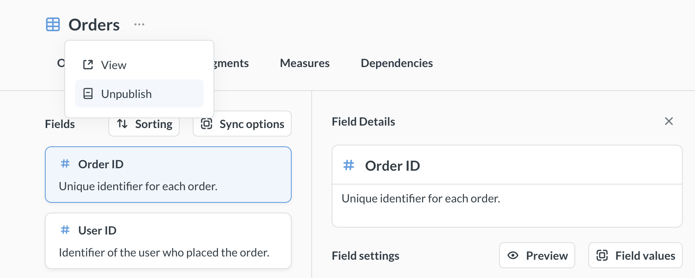

# Published tables

_Data Studio > Semantic layer_



Published tables are the tables you add to your [semantic layer](library.md#semantic-layer). They live in the **Data** collection.

Published tables also show up in the **Library** section of the main app's navigation sidebar. When people pick data for a new question, Metabase shows published tables first. You can also tell [Metabot](../../ai/metabot.md) to only use [curated content](../../ai/settings.md#verified-or-curated-content) like published tables, and you can [sync published tables to Git](library.md#versioning-the-library), along with their metadata, segments, and measures.

We use the word "publish" because the tables in your Library should be finished, polished tables. If your tables need to be cleaned or combined before they're ready for analytical queries, check out [transforms](../transforms/transforms-overview.md).

## Publish a table from the semantic layer

1. Click the **grid** icon in the top right and select **Data Studio**.
2. In the left sidebar, click **Semantic layer**.
3. Click **+ New** and select **Published table**.
4. Pick the table you want to publish and click **Publish**. Tables that are already published are grayed out.
5. In the publishing modal, under **Publish to**, pick **Data** or one of its subcollections. By default, Metabase publishes tables to **Library > Data**.
6. Click **Publish this table**.

If you haven't created the Library yet, see [Create the Library](library.md#create-the-library).

## Publish tables from Connected data

To publish a single table:

1. In Data Studio, click **Connected data** in the left sidebar.
2. Select the table.
3. On the table's **Details** tab, click **Publish**.

To publish several tables at once, check the boxes next to the tables (or whole schemas or databases) in **Connected data**, then click **Publish** in the right sidebar.

If you haven't created the Library yet, Metabase will ask you to create it first. See [Managing tables](../metadata/managing-tables.md) for more on Connected data.

## Organize published tables

You can only put published tables in the **Data** section of the semantic layer. To keep a lot of published tables organized, you can create subcollections in **Data**, like "Sales", "Marketing", and "Product". Go to **Data Studio > Semantic layer**, click **+ New**, and select **Collection**. See [Library organization](library.md#library-organization).

Once you've created subcollections, you can publish tables to them, or [move published tables](#view-and-edit-published-tables) into them.

## Published tables can't have dependencies outside of the Library

Tables published to the Library can't depend on any tables outside of the Library. If, for example, you want to publish a table that includes data from another table, such as a [foreign-key remapping](../../questions/visualizations/table.md#foreign-key-remapping), Metabase will publish those tables as well. The publishing modal lists the tables that Metabase will publish along with your table.

## View and edit published tables

To see a published table in Data Studio, go to **Data Studio > Semantic layer**, expand **Data** (and any subcollections), and click the table. The table's page has tabs for:

- **Overview**: The table's description and attributes like its owner and source. On Metabase Cloud, or if your plan includes [usage analytics](../../usage-and-performance-tools/usage-analytics.md), the overview also shows who published the table and when.
- **Fields**: The table's [field metadata](../metadata/metadata-editing.md).
- **Segments**: [Segments](segments.md) defined on the table.
- **Measures**: [Measures](measures.md) defined on the table.
- **Dependencies**: The table's [dependency graph](../tools/graph.md).

To query a published table, click the **three-dot** menu next to the table's name and select **View**. Metabase will open the table in the query builder in a new tab.

To move a published table to a different subcollection in **Data**, click the **three-dot** menu next to the table's name and select **Move**.

## Unpublish tables

To unpublish a table:

1. Go to **Data Studio > Semantic layer** and find the table under **Data**.
2. Click the **three-dot** menu next to the table's name.
3. Click **Unpublish**.

You can also unpublish tables:

- **In bulk from the semantic layer**: Check the boxes next to the tables, then click **Unpublish**.
- **From Connected data**: Select the table and click **Unpublish** on its **Details** tab, or check the boxes next to several tables and click **Unpublish** in the right sidebar.

If other tables depend on the table you want to unpublish, Metabase will unpublish those tables as well. You'll get a confirmation message explaining which tables Metabase would unpublish.

Unpublishing a table just removes the table from the Library. That table will still be available via the data browser and data pickers.

**Archiving a subcollection unpublishes its tables.** If you archive a Data subcollection, Metabase will automatically unpublish all tables inside it, including tables in any nested subcollections.

## Published table permissions

- **Who can publish**: Only [admins and data analysts](../../people-and-groups/managing.md) can publish and unpublish tables.
- **Collection permissions control what people see, _not_ what data they can query**: Collection permissions on **Library > Data** and its subcollections only control where people see published tables (in the navigation sidebar, the data picker, and search). To restrict access to the data in a table, use [data permissions](../../permissions/data.md).
- **Publishing a table can grant query access**: Like with models, publishing a table gives query access to that table to groups with view access to the database, even if those groups have **Create queries** set to **No** for that table.

See [Permissions to use Library content](library.md#permissions-to-use-library-content).

## Further reading

- [Library](./library.md)
- [Managing tables](../metadata/managing-tables.md)
- [Library permissions](./library.md#library-permissions)
