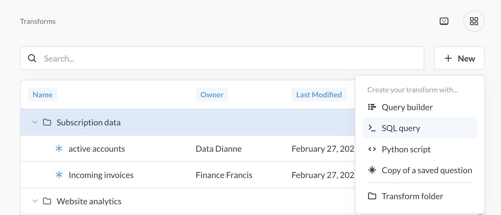
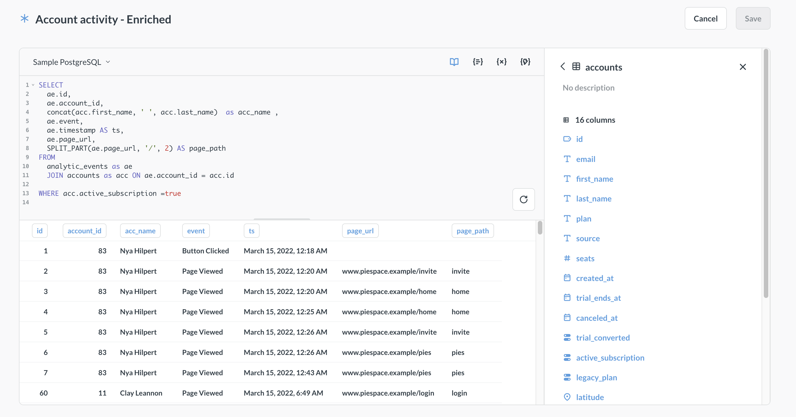
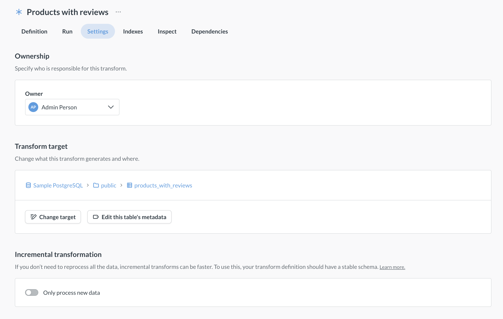
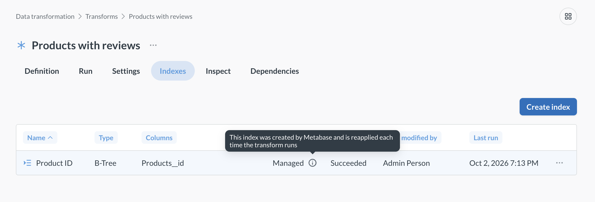
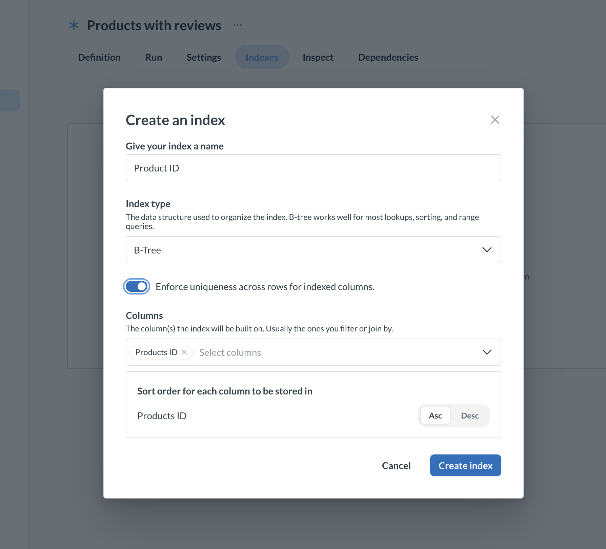
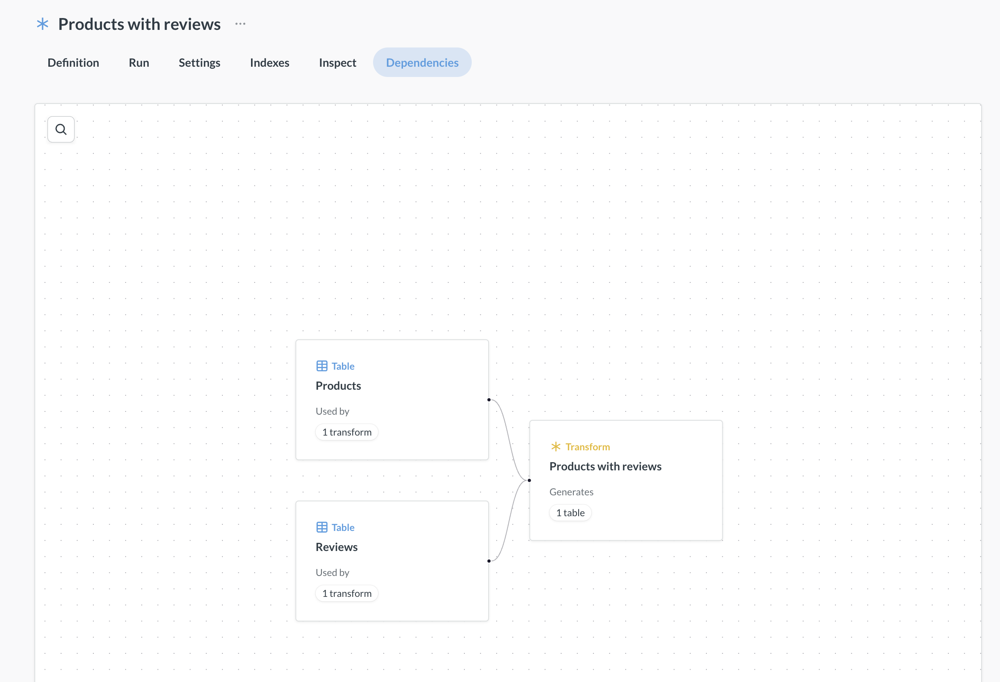
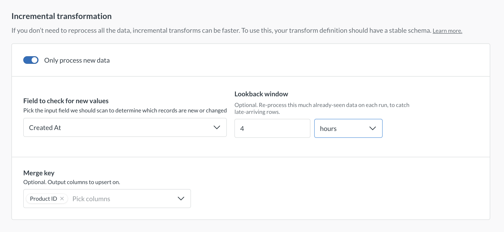

# Transforms

_Data Studio > Data transformation_

Transforms can be used to, well, transform your data - do stuff like preprocessing, cleaning, joining tables, pre-computing metrics. Transforms give you the ability to do the "T" of "ETL" within Metabase.

You'll write a query or a Python script in Metabase, a transform will run this query or script, create a table in your target database containing the results, and sync that table to Metabase, so it can be used as a data source for questions or other transforms.

## Transforms overview

- **Transforms** are queries (created either with SQL or the query builder) or Python scripts that write back to your database and create a new, persistent table. Use transforms to clean, join, or pre-aggregate data.
- Transforms are scheduled and organized using **tags** and **jobs**.
  - You assign tags (e.g., daily, hourly) to group your transforms.
  - A job runs on a schedule (e.g., every day at midnight) and executes all transforms that have been assigned a specific tag.
- Each execution of a transform is a **run**. A run replaces the target table with fresh results. You can review the history of runs to monitor their success or failure.
- You can **inspect** a transform to analyze its data flow, join behavior, and column distributions. See [Transform inspector](inspector.md).

## Databases that support transforms

Currently, Metabase can create transforms on the following databases:

- BigQuery
- ClickHouse (only ClickHouse Cloud)
- MySQL/MariaDB
- PostgreSQL
- Redshift
- Snowflake
- SQL Server

You can't create transforms on databases that have [Database routing](../../permissions/database-routing.md) enabled, or on Metabase's Sample Database (which is SQLite).

Transforms will create tables in your database, so the database user you use for your connection must have [appropriate privileges](../../databases/users-roles-privileges.md). We suggest using a [Writable connection](../../databases/writable-connection.md) for your database.

## Types of transforms

Metabase supports two types of transforms: query-based transforms and Python transforms. You can write query-based transforms in SQL or Metabase Query builder, and they will run in your database. Python transforms are written in (unsurprisingly) Python and will run in a dedicated execution environment. For more details:

- [How query-based transforms work](query.md#how-query-based-transforms-work)
- [How Python transforms work](python.md#how-python-transforms-work)

## Permissions for transforms

Permission configuration for transform depends on your plan.

- **Metabase Open Source/Starter**: Admins (and only Admins) can see and run transforms.

- **Metabase Pro/Enterprise** comes with additional permission controls for transforms: a special [Data Analysts](../../people-and-groups/managing.md) group for non-Admins with potential transform access, and granular transform permissions for each database:

  - To **see** the list of transforms on your instance, people need to be able to access Data Studio, so they need to be either an Admin or a member of the special [Data Analyst group](../../people-and-groups/managing.md).
  - To **execute** transforms on a database, people need to be either Admins or belong to the [Data Analyst group](../../people-and-groups/managing.md). Data Analysts also need [Transform permissions](../../permissions/data.md) for that database.

## Set up transforms on a self-hosted Metabase

If you run Metabase yourself, here's the path to working transforms:

1. **Check your plan.** [Basic transforms](addons.md#basic-transforms) (query-based) are included on self-hosted Metabase. [Advanced transforms](addons.md#advanced-transforms) — Python transforms, the [transform inspector](inspector.md), and [writable connections](../../databases/writable-connection.md) — need a self-hosted Pro or Enterprise plan with the Advanced transforms add-on.
2. **Connect a database that can write.** Transforms create and replace tables in your database, so the database user needs create, drop, and write privileges. See [Database users, roles, and privileges](../../databases/users-roles-privileges.md). For cleaner isolation, point the transform at a [writable connection](../../databases/writable-connection.md). Only some databases [support transforms](#databases-that-support-transforms).
3. **For Python transforms, set up a runner.** Query-based transforms need nothing extra — they run inside your database. Python transforms run in a separate execution environment, so you'll point Metabase at a [self-hosted Python runner](python-runner.md) backed by S3-compatible storage (AWS S3, MinIO, and so on).
4. **[Enable transforms](#enable-transforms)** in Data Studio.
5. **Create and run a transform.** [Create a query-based transform](query.md#create-a-query-based-transform) or a [Python transform](python.md#create-a-python-transform), run it manually, and check the result under **Runs**. Once it works, [schedule it with jobs](jobs-and-runs.md).

## Enable transforms

Before you can start writing transforms, you'll need to enable transforms in your Metabase instance.

If you're on a Metabase Cloud plan, only admins can enable basic transforms, because transforms incur a cost per run on Metabase Cloud.

To enable transforms:

1. Navigate to [**Data Studio**](../data-studio.md) by clicking the **grid icon** in the top right corner of your Metabase and selecting **Data Studio**.
2. Click **Data transformation**.
3. Click **Enable transforms**. On Metabase Cloud, you'll then need to agree to the Basic transforms add-on pricing.

Once you've enabled transforms, you can [configure permissions](#permissions-for-transforms) and start [creating transforms](#create-a-transform).

### Turn transforms off

_Data Studio > Settings_

Admins can turn transforms off with the **Transforms** toggle. While transforms are off, **Data transformation** disappears from Data Studio and no transforms run, manually or on a schedule. Metabase keeps your transforms, jobs, and tables.

If you've set [`MB_TRANSFORMS_ENABLED`](../../configuring-metabase/environment-variables.md#mb_transforms_enabled), the environment variable wins: you can still flip the toggle, but it won't do anything.

## Create a transform

_Data Studio > Data transformation_

> If you're using remote sync, you won't be able to create transforms if your instance is in ["read-only" sync mode](../../installation-and-operation/remote-sync.md).

See [permissions needed to create transforms](#permissions-for-transforms).

To create a transform:

1. [Enable transforms](#enable-transforms).
2. Click the **grid** icon on top right and go to **Data Studio**.
3. Click **Data transformation**.
4. Click **+ New** and select a source for your transform.

   

   You can create your transform using Metabase's [graphical query builder](../../questions/query-builder/editor.md), SQL, or Python.

   For more information on transforms built with the query builder or SQL, see [query-based transforms](query.md). For more information on Python transforms, see [Python transforms](python.md).

   

   If you select **Copy of a saved question** for the transform's source, you can copy the query of an existing Metabase question (either a SQL question or a query builder question) into your transform query. Metabase will only _copy_ the question's query. Later edits to that original question won't affect the transform's query.

5. Create the query or script for your transform.

   See [query-based transforms](query.md) and [Python transforms](python.md) for more information. You can reference target tables of other transforms when writing your transform.

   If you're writing a SQL transform, variables _must_ be wrapped in optional blocks (`[[ ]]`), or given a default value. See [variables in SQL transforms](query.md#variables-in-sql-transforms) for more details.

6. Click **Save** in the top right corner and fill out the transform information:

   - **Name** (required): The name of the transform.
   - **Schema** (required): Target schema for your transform. This schema can be different from the schema of the source table(s). You create a new schema by typing its name in this field. You can only transform data _within_ a database; you can't write from one database to another.
   - **Table name** (required): Name of the target table. Metabase will write the results of the transform into this table, and then sync the table in Metabase.
   - **Folder** (optional): The folder where the transform should live. Click on the field to pick a different folder or create a new one.
   - **Incremental transformation** (optional): see [Incremental query-based transforms](query.md#incremental-query-transforms) or [Incremental Python transforms](python.md)

7. Optionally, once the transform is saved, assign tags to your transform. Tags are used by [jobs](./jobs-and-runs.md) to run transforms on schedule.

## Edit a transform

_Data Studio > Data transformation_

You can edit the transform's name and description, query/script, target table, and incremental settings. You can edit the transform even if it already ran or is scheduled to run.

If you're using remote sync, you won't be able to edit transforms if your instance is in ["read-only" sync mode](../../installation-and-operation/remote-sync.md).

### Edit transform's query or script

_Data Studio > Data transformation > [transform name] > Definition_

See [permissions to edit transforms](#permissions-for-transforms).

To edit the transform's query or script:

1. Go to **Data Studio > Data transformation**.
2. Find the transform you'd like to edit and click on **Edit definition** above the transform definition.
3. Edit the query or script.

   See [query-based transforms](query.md) and [Python transforms](python.md) for more information.

Once you change the transform's query or script, the next transform run (manual or scheduled) will use the updated query and write the results into the target table. If you've changed the table's columns, and you have questions that query the table, they might break. For example, if your new transform query no longer includes a column that a downstream question was relying on, that question will break.

### Edit transform's target

_Data Studio > Data transformation > [transform name] > Settings_

To edit transform's target table, i.e., the table where the query results are written, go the transforms **Settings** tab and click on **Change target**. You'll need to select whether you want to keep the old target table, or delete it. Deletion can't be undone.

**Questions built on the old target will _not_ be transferred to the new target table.** If you delete the old target table, any questions using the old transform target table will break. If you keep the old target around, the questions built on it won't break but they will _not_ use the new target table, and so will become outdated.

## Run a transform

You can run a transform manually or schedule the transform using tags and jobs.

- To run a transform manually, open the transform in **Data Studio > Data transformation**, go to its **Run** tab, and click **Run now**.

- To schedule a transform, you'll need to assign one or more tags to it, then create a [scheduled job](./jobs-and-runs.md) that picks up those tags.

Running a transform for the first time will create and sync the table created by the transform, and you'll be able to edit the table's [metadata](../metadata/metadata-editing.md) and [permissions](../../permissions/data.md). Subsequent runs will drop and recreate the table, unless you use [Incremental transforms](#incremental-transforms).

You can see the time and status of the latest transform run on the transform's page, or in the [Runs view](./jobs-and-runs.md). The time of the run is given in the system's timezone.

For Python transforms, you'll also see the transform's execution logs.

## Add indexes to a transform's table

_Data Studio > Data transformation > [transform name] > Indexes_

Indexes can speed up queries on a transform's table. Metabase saves the indexes you add here and recreates indexes whenever the transform rebuilds its table. Indexes created directly in your database show as **Unmanaged**: you can't edit or delete them in Metabase, and they disappear the next time the transform rebuilds its table. To keep an index, add it here.

To add an index:

1. Run the transform at least once, so its table exists.
2. On the transform's **Indexes** tab, click **Create index**.
3. Pick an index type and the columns to index. Types depend on your database: for example, B-Tree indexes on PostgreSQL, sort keys on Redshift, clustering keys on Snowflake, or clustering on BigQuery.

   

4. Run the transform (or wait for its next scheduled run).

Index edits and deletions take effect on the next run. On an incremental transform, the next run after _any_ index change _rebuilds the whole table_.

If Metabase can't create an index, the index shows as **Failed** and the run usually fails too. Every run retries the index until it succeeds, or until you edit or delete it. On an incremental transform, each of these runs rebuilds the whole table.

## Inspect a transform

_Data Studio > Data transformation > [transform name] > Inspect_

> Transform inspector requires the [Advanced transforms add-on](addons.md)

The [transform inspector](./inspector.md) lets you poke at the input and outputs of your transform.

## Transform dependencies



_Data Studio > Data transformation > [transform name] > Dependencies_

Transform queries can use the data from other transforms, and query-based transforms can also reference Metabase questions and models. For example, you can have a transform that uses data from a `raw_events` table and writes to a `stg_events` table, and then create another transform that uses data from the `stg_events` table and writes to an `events` table.

Metabase will track transform dependencies and execute transforms in a reasonable order. So for example, if transform B relies on a table created by transform A, Metabase will run transform A first, then run transform B.

If a job includes a transform that depends on a table created by another transform, then the job will run all the tagged transforms, plus any of their [dependencies that aren't already up to date](jobs-and-runs.md#jobs-include-all-dependent-transforms).

## Incremental transforms

_Data Studio > Data transformation > [transform name] > Settings_

Incremental transforms only process the data that's new since the previous transform run. For example, you might have new transaction data coming in every day, and run the transform nightly. With each run, the incremental transform would only handle the rows added after the previous run the night before.

By default, Metabase appends those rows to the target table. If your source tables track changes to a record over time, you can use an incremental strategy by setting a [merge key](#add-merge-keys-to-upsert-rows) so that Metabase updates the existing rows instead of adding duplicate rows.

In this case, the checkpoint field decides which rows count as new, and the merge key decides whether Metabase appends those rows or updates the matching ones.

### Prerequisites for incremental transforms

- There is a column in your data that Metabase can check for new values to determine which data is new. We'll refer to this as a "Checkpoint" column.
- The checkpoint column has to have increasing values, like a sequential ID or timestamp column. Metabase will determine what "new" data is by looking for values that are _greater than_ already-written checkpoint values. Columns that only store a time of day can't be checkpoints, since their values start over every day.
- Your schema is stable, meaning that the structure of the tables is not going to change from run to run.

### Add merge keys to upsert rows

By default, Metabase will append rows when outputting a transform. You can add a merge key to upsert (update or append) instead.

Why you'd want to add a merge key: some source tables get a new row each time a record changes. So for example the same order shows up once as `created`, again as `paid`, and again as `shipped`. If you append those rows, you end up with three rows for the same order. That may be what you want. But if instead you want to update these records in place, you can select one or more columns as merge keys, like an order ID column. If a merge key is set, Metabase will first try to update existing records that match the key. If no match is found, Metabase will append a new record.

To add a merge key:

1. Go to the transform's page in **Data Studio > Data transformation**.
2. Switch to the **Settings** tab and turn on **Only process new data**.
3. In **Merge key**, choose the columns that identify a record. If the target table already exists, you'll pick from a list of its columns. If the transform hasn't run yet, there's no table to pick from, so type each column name and press comma or enter. In that case, type the column's name in the database, which may differ from the display name you'd see in the list.

The merge key refers to columns in the _target_ table (the columns your transform outputs), not columns in the _source_ tables. If identifying a record requires a combination of columns, like an `id` plus a `region`, pick more than one column as merge keys.

Merge keys need a checkpoint field that increases every time a row is written, like an `updated_at` timestamp, otherwise the transform never sees the change.

### Catch late-arriving rows with a lookback window

If, for example, a row stamped 9:55 is added to a table _after_ a transform run has already processed everything through 10:00, later runs won't pick up the row. To catch late-arriving rows, set a lookback window, so each run also reprocesses some data it's already seen.

To set a lookback window:

1. Go to the transform's **Settings** tab and turn on **Only process new data**.
2. In **Field to check for new values**, pick a date or datetime column, like `updated_at`. The **Lookback window** field only shows up for date or datetime checkpoint columns, not number columns like IDs.
3. In **Lookback window**, enter a number and pick a unit, like 4 hours. Each run then also reprocesses rows from the four hours before the checkpoint. Date-only columns can't use units smaller than days.

   

If you later switch the checkpoint to a column that doesn't support a lookback, Metabase clears the lookback window. If you switch to a date-only column, Metabase changes a minutes or hours unit to days, so a 4-hour window becomes 4 days.

You should pair a lookback window with a [merge key](#add-merge-keys-to-upsert-rows). Otherwise, every run appends the reprocessed rows again as duplicates.

### Reprocess all data to rebuild the target table

Once an incremental transform has run, its **Settings** tab shows **Last processed [checkpoint field]**, followed by the highest checkpoint value Metabase has written so far. That value is how Metabase knows where to pick up, since each run only handles rows past it.

To clear that value and reprocess all rows, click **Reprocess all data**. The next run will then rebuild the target table from scratch, processing every row instead of only the new ones. The run doesn't start right away; you'll need to run the transform manually, or wait for the transform's next scheduled run.

Changing the checkpoint field also resets the stored value, so a transform will rebuild from scratch on its next run after you pick a different field to use for checkpointing.

### Make a transform incremental

Incremental transforms work differently for query-based transforms and Python transforms, so see [incremental query transforms](query.md#incremental-query-transforms) and [incremental Python transforms](./python.md#incremental-python-transforms) for more information.

## Versioning transforms

_Admin > Settings > Remote sync_



You can check your transforms into git with [Remote Sync](../../installation-and-operation/remote-sync.md). If you enable transform sync, Metabase will serialize transforms as YAML files and push them to your specified GitHub repo branch.

To enable git sync of transforms:

1. Go to Admin settings by clicking the **grid** icon in top right and select **Admin**.
2. On the **Settings** tab, pick **Remote sync** in the left sidebar.
3. Follow the steps to [Set up Remote Sync](../../installation-and-operation/remote-sync.md), and toggle **Transforms** sync on.

Keep in mind that this setting only controls whether transforms are checked _into_ the git repo. The transform sync setting does _not_ affect how the instance behaves in read-only mode. If your instance is in read-only mode, you will not be able to create or edit transforms.

## Transforms vs models

Transforms are similar to models with model persistence turned on, but there are a few crucial differences:

- Transforms can only be created by [analysts with transform permissions](../../permissions/data.md). Models can be created by anyone with permissions to create queries on the data source (but only admins can enable model persistence on an instance).
- You can choose the target schema and tables for transforms. Model persistence will create its own schema and tables.
- Transforms support more databases than model persistence.
- You can use Python to create transforms.

Use models to enable non-admins to create their own datasets within Metabase, and to add context like field descriptions and semantic types. Use transforms to create persisted datasets in your database and reuse them across Metabase. In future versions of Metabase, model persistence will be deprecated in favor of transforms.

On Metabase Pro/Enterprise plans, you can convert Metabase models to transforms in bulk, see [Convert models to transforms](query.md#convert-models-to-transforms)
